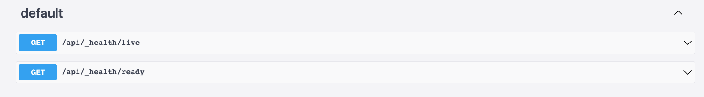

# API Health Checks

An app health check is a monitoring process that continuously checks the status of a running app.

Amplication performs Liveliness and Readiness checks:

- **Liveness** -  indicates whether or not the app is running.
- **Readiness** - indicates whether or not all dependencies are available and the application in a state to perform the expected functions

Amplication uses an http type health check. The http health check works by performing a GET request to the configured HTTP endpoint on the app’s default port. When the health check receives an HTTP 204 response, the app is declared healthy.

## Coordinate with Infrastructure

Amplication includes two API endpoints who's function is to coordinate the generated app with the infrastructure. Examples of infrastructure include a load balancer such as Amazon Elastic Load Balancing, an orchestrator, such as Kubernetes, or a service such as Pingdom.
The APIs perform a health check and communicate the  status of the app to  infrastructure, notifying the app administrator. 

## Internal Operations Management 

The Amplication API also  provides health check endpoints for the internal operations management.
Each API should provide a health, liveness and readiness check status.
For example, under the URLs `/healthz`, `/healthz/liveness` and `/healthz/readiness`. 

