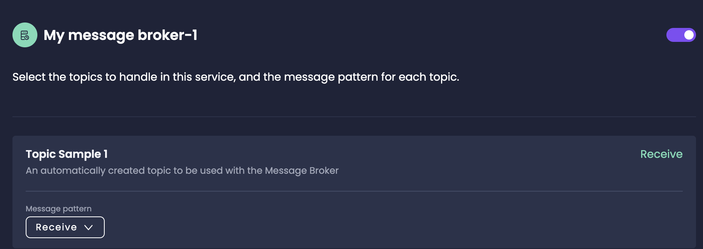

# Event-Driven Architecture with Amplication

Event-driven architecture is a design pattern that enables loose coupling between microservices. In an event-driven system, services communicate with each other by producing and consuming _events_. This allows for real-time processing and reaction to events.

Amplication provides built-in support for event-driven architectures through the use of _message brokers_ and _topics_. By leveraging these features, you can easily build scalable and responsive microservices.

:::tip
Amplication's [Break The Monolith](/break-the-monolith) feature lets you easily update monolithic architectures into a modern, scalable, and maintainable microservice architecture.
:::

## Key Concepts

Before getting started, let's define some important concepts and terms related to event-driven architecture:

- **Microservice**: A microservice is a small, independent service that focuses on a single business capability. Microservices are designed to be loosely coupled, allowing them to be developed, deployed, and scaled independently. In an event-driven architecture, microservices communicate with each other through events and message brokers.

- **Message Broker**: A message broker is a software component that facilitates communication between services in an event-driven architecture. It receives messages from producers, stores them, and routes them to the appropriate consumers based on predefined rules or subscriptions.

- **Topic**: A topic is a named stream or category of events. Producers publish messages to topics, and consumers subscribe to topics to receive messages. Topics provide a logical grouping and enable multiple consumers to independently process events from the same topic.

- **Producer**: A producer is a service or component that generates and publishes events to one or more topics. Producers are responsible for creating messages and sending them to the message broker.

- **Consumer**: A consumer is a service or component that subscribes to one or more topics and processes the received events. Consumers read messages from the subscribed topics and perform actions based on the content of the messages.

## Enabling Event-Driven Microservices

To implement event-driven architecture in your Amplication project, you'll need to:

1. Create a message broker resource
2. Define topics
3. Install a message broker plugin
4. Connect services to the message broker and relevant topics
5. Implement event production and consumption logic

:::info
For a step-by-step guide on building an event-driven application with Amplication and Kafka, refer to the blog post: [Building Real-time Applications with Amplication and Kafka](https://amplication.com/blog/building-real-time-applications-with-amplication-and-kafka).
:::

## Step 1: Create a Message Broker

In your Amplication project, navigate to "Add Resource" and select "[Message Broker](/how-to/create-message-broker)". This will lead you to the Message Broker Creation Wizard. 

After creating the message broker, you'll be able to configure the settings by installing and configuring the appropriate [message broker plugin](#supported-message-brokers).

## Step 2: Define Topics

Create topics that represent the different event categories in your system. Topics act as communication channels between services. They can be created under the "Topics" section of your message broker configuration in Amplication.

## Step 3: Install Message Broker Plugin

Amplication supports using Kafka, MQTT, Redis Message Broker, and various others as your message broker. To find the one most suitable to your project visit the **Plugins** tab and then click on the _Message broker_ category.

To use it, install the [message broker plugin](/getting-started/plugins) in each service that will be producing or consuming messages.

## Step 4: Connect Services

For each service that needs to interact with the message broker, enable the message broker integration in your service's _Connections_ tab. Specify whether the service should act as a producer or consumer for each relevant topic.

## Step 5: Implement Event Production and Consumption

In your producer services, add logic to publish events to the appropriate topics when certain actions or conditions occur. Use your chosen message broker client to send messages to the desired topics.

In your consumer services, define event handlers that process the messages received from the subscribed topics. You can use decorators like `@EventPattern()` to map event handlers to specific topics and handle incoming messages accordingly.

## Conclusion

By leveraging event-driven architecture, you can build microservices that are scalable, responsive, and adaptable to changing requirements. Amplication's built-in support for message brokers and easy integration with various message broker plugins makes it straightforward to implement event-driven communication between your microservices.

## Further Reading

For a more detailed walkthrough and practical implementation of event-driven architecture using Amplication and Kafka, be sure to check out the blog post: [Building Real-time Applications with Amplication and Kafka](https://amplication.com/blog/building-real-time-applications-with-amplication-and-kafka). It provides a comprehensive guide on setting up and using event-driven communication in your Amplication projects.