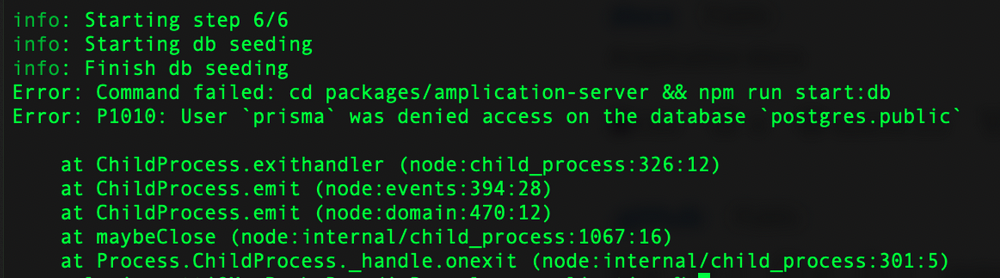

## Overview
`npm run setup:dev` failed on step 6 with the following message:

## Symptoms 
Access to the db was denied while trying to start the db.
Docker is running.

## Cause

This error and similar errors (related to accessing db) is usually caused by another PostgreSQL process that runs on the same port (5432).

## Resolution

Stop the other process that runs on port 5432 or change the port on the Amplication generated app.

## Related Issue

N/A

## Additional Information

N/A

