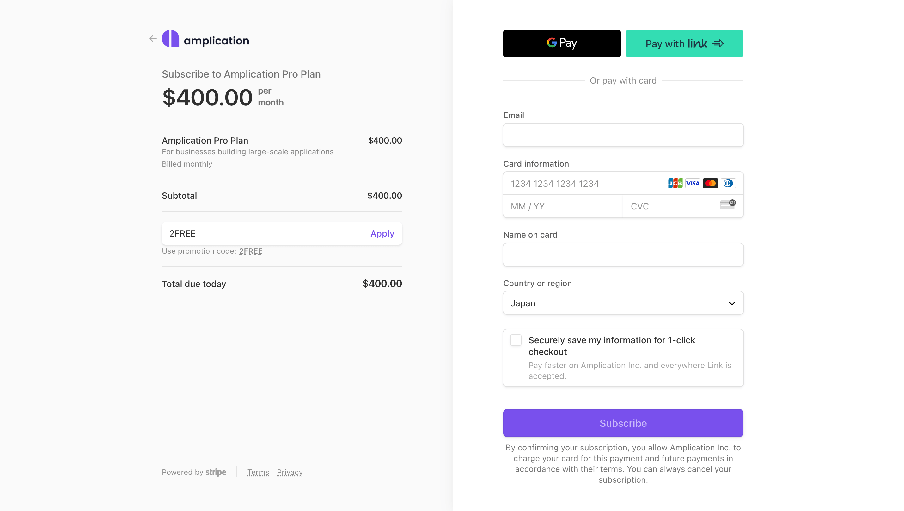

# Get 2 months of the Pro plan for FREE

For a limited time, Amplication is offering 2 months of the Pro plan, for FREE. You get access to features like the following:

- [Smart Git Sync](http://localhost:3000/sync-with-github/)
- Custom Git Base Branch
- Unlimited Services
- Unlimited Entities per Service
- Up to 5 team members

Are you serious about streamlining your development?
Well then, supercharge your projects with 2 free months of Amplication. Use the code `2FREE` during checkout.

## How to activate your coupon code

1. Visit your project's dashboard in Amplication.
2. In the top right corner, click the **Upgrade** button. This will take you to the [pricing page](https://amplication.com/pricing).
3. On the pricing page, click the **Upgrade Now** button under the Pro plan. This will take you to a Stripe payment page.
4. On the Stripe payment page, click **Add Promotion Code** on the left.

5. Enter the code `2FREE` in the text field. The price will update to $0.00.
6. Enter your payment information, using the email associated with your Amplication account.
7. Click **Subscribe** to complete the checkout with the 2 month free trial activated.

:::note
Give Pro a spin, risk-free, for 2 months.
Your provided credit card will be charged for full Pro access after 2 months.
Downgrading is easy if you change your mind before that time.
:::

## Next Steps

Visit the [Git Sync Plan Differences](/sync-with-git-differences-between-plans) page to learn more about the specific differences between the Free, Pro, and Enterprise plans.
If you have any additional questions, you can always [contact us](https://amplication.com/contact-us) directly.
