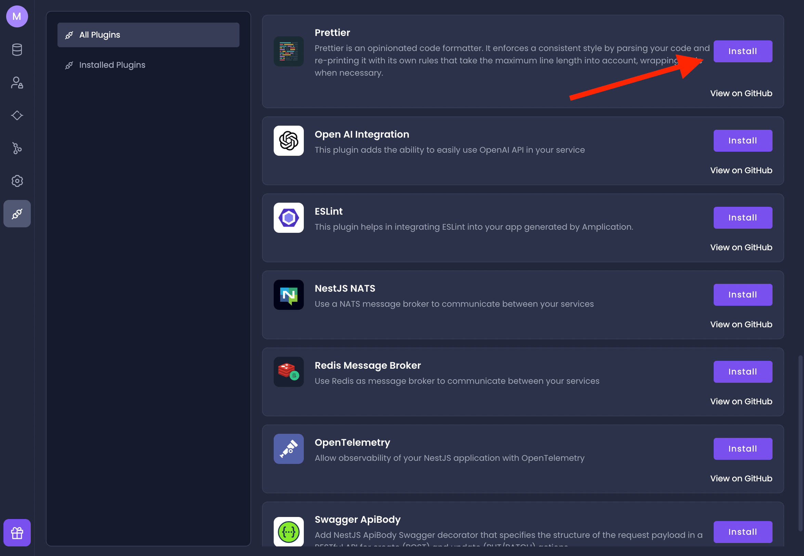
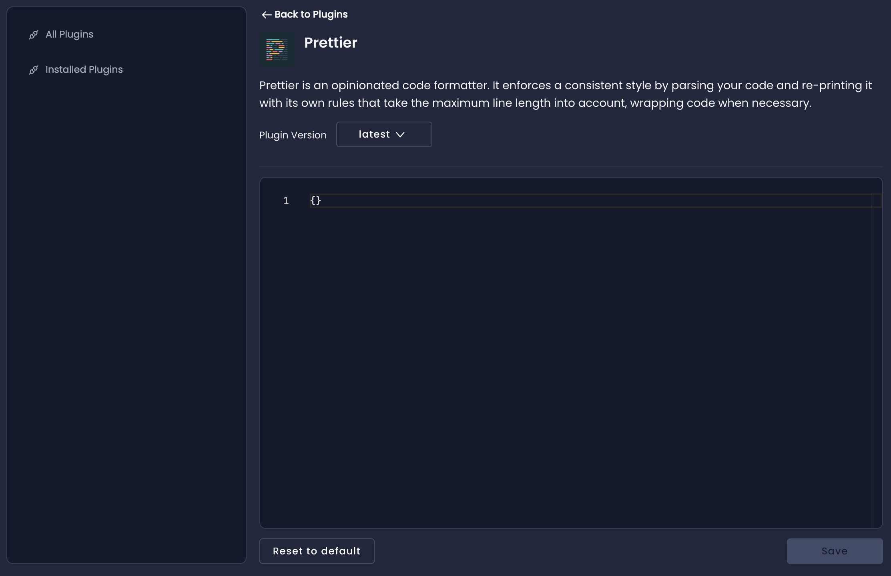
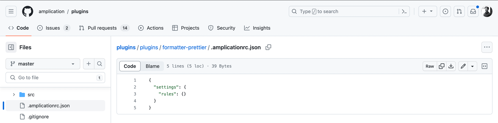
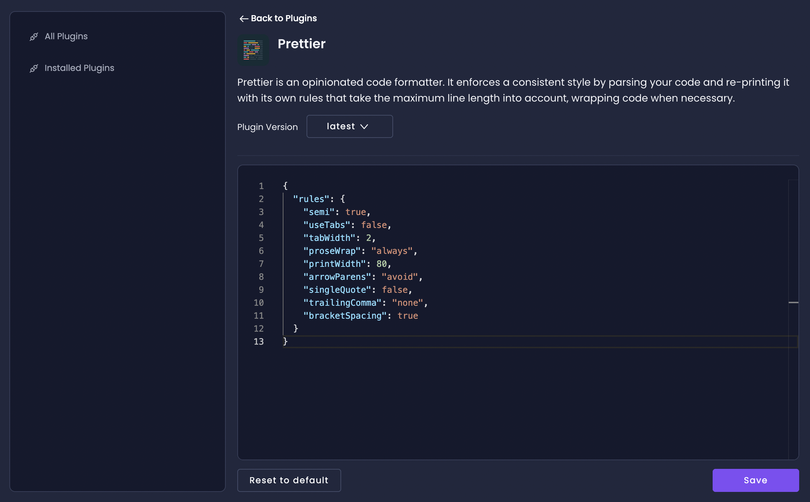
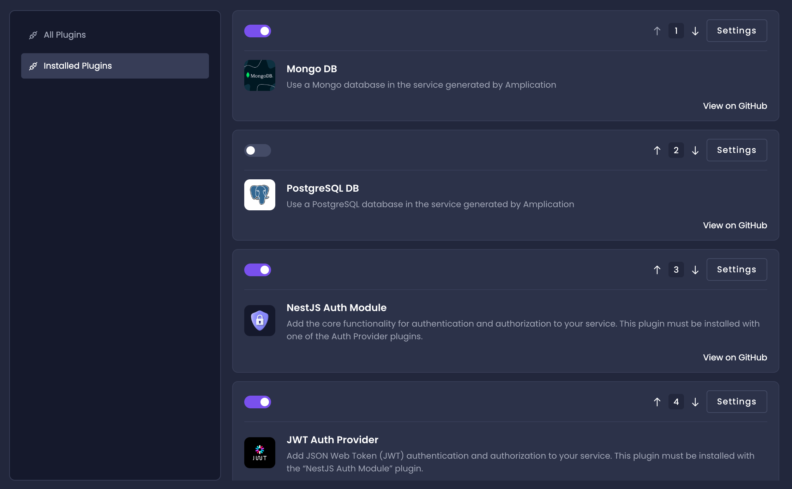

# Add Plugins To Your Service

Amplication's plugin system allows you to easily extend the capabilities of your service with new features, making it much faster to build the exact backend you want.

For example, the GitHub Actions plugin adds an actions workflow to the service for building and testing on GitHub. The OpenAI plugin allows you to integrate with the OpenAI API. 

Much of the functionality that you enabled while creating your service is provided by plugins too.

PostgreSQL is a specifc plugin to provide you with database functionality.
Authentication is a collection of plugins to provide you with auth functionality.

Let's walk through the process of adding a new plugin to your service.
You'll see how fast and seamless the process is.

## Add the Prettier Plugin

Prettier is a code formatter that automatically formats your code to ensure adherence to a consistent style.

Let's install and configure Prettier so that your service's generated code is formatted exactly how you want.

1. Visit your service's Plugins page and proceed to the **All Plugins** tab.
2. Find the **Prettier** plugin and click the **Install** button.

### Customize a Plugin's Settings

Once installed, the button will change into a **Settings** button.
Click on it to access the _Plugins Settings_ page.

Each plugin's settings page provides a text box where you can adjust its configuration using JSON.

More information about a plugin's settings and necessary JSON properties are available in its GitHub repository.

### Access the Plugin's GitHub Repository

1. From the _Plugin Settings page_, click on the **Back to Plugins** link at the top.
2. Click on the **View on GitHub** link under the plugin's Install button from the All Plugins tab.
3. Once there, open the `.amplicationrc.json` file to view the JSON properties that you can customize for that specific plugin.

In the Prettier plugin's case, you will need to provide a `rules` property with a JSON object of rules.
This JSON object corresponds to a Prettier configuration file.

After determing your Prettier rules, write them in the text box in the _Plugin Settings_ page.
Here's how those settings could look:

## Switch Your Database Plugin (Optional)

Amplication does not lock you into any specific database.
You can quickly switch your preferred database in just a few clicks with another plugin.

For example, if you enabled PostgreSQL when you created your service, you can easily switch to MongoDB later.

Here are the steps to do that:

1. Visit the **Installed Plugins** tab and disable the PostgreSQL database plugin with the _slider toggle_.
2. Visit the **All Plugins** tab and install the Mongo DB database plugin.
3. Go back to the **Installed Plugins** tab and move the Mongo DB plugin to the first position with the arrows.
4. [Commit your changes](/how-to/commit-changes/).

Done in just a few clicks.
How much time would it have tkane to change an entire database without Amplication?

## You're Done

Great work!
You just enabled a new plugin to add more funtionality to your service.
You also optionally switched your database in just a few clicks.

Amplication truly does save you a lot of time, and our plugin system is designed to help save even more time and customize your service exactly how you need.

## Next Steps

- [How To Use Plugins](/getting-started/plugins)
- [Custom Plugin Development](/plugins/how-to-create-plugin/)

Amplication provides many more plugins plugins for you to use with your service.
We're always working on releasing more.
Visit the [How To Use Plugins](/getting-started/plugins/) page to learn more about which ones are available.

If none of the official plugins fit your use case, Amplication allows you to [develop your own custom plugins](/plugins/how-to-create-plugin/).
These custom plugins give you extsensive access to the code creation lifecycle so you can customize your service however you like.
We have detailed guides on that on our documentation.
