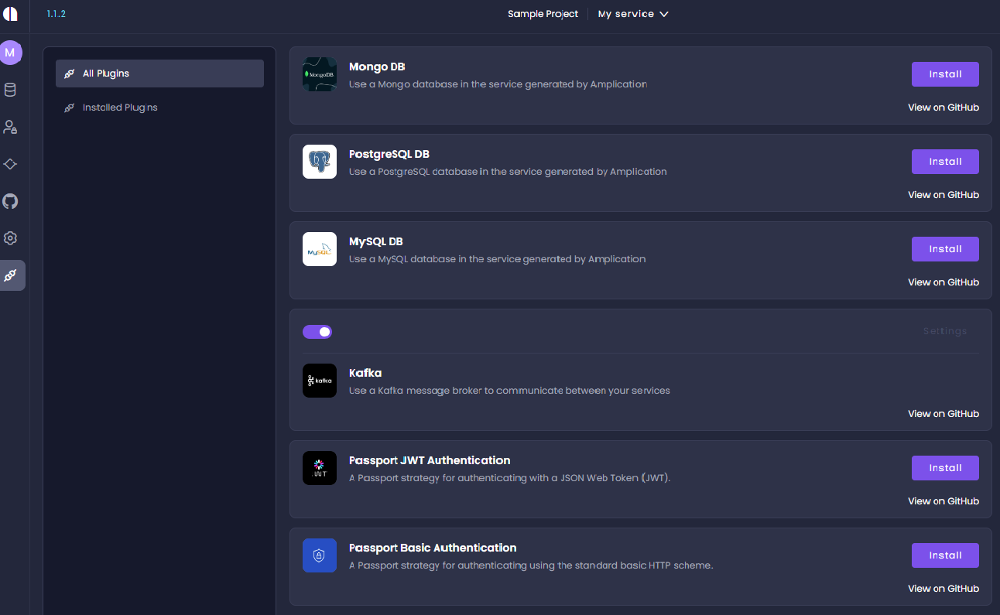

## Overview 
Use  plugins to add new features to the Amplication developer platform.
Some plugins are included in Amplication by default. To add more functionality, you can develop your own plugins, or can use plugins developed by the community, as they become available. 

The published plugins are available on the _All Plugins_ screen.
The installed plugins are shown on the _Installed Plugins_ screen.

## Available Plugins

The following plugins are included in Amplication by default. 

- PostgreSQL 
- MYSQL DB
- Kafka
- Password JWT Authentication
- Password Basic Authentication
 

:::tip
If you or your organization require a specific function, install an existing plugin (if it exists), or develop one to perform your required tasks.
:::

## Installing addons
 To install an addon:
 1. In the _All Plugins_ page, click **Install** for the required addon. 

2. Go to the _Installed Plugins_ page. The installed plugins are listed. 

3. To see the plugin on gitHub, select **View on GitHub**.

:::note
The plugins are executed when Amplication generates code, according to their order on the _Installed Plugins_ page.
:::

3. To change the order of the installed plugins, click the up or down arrow to the right of the plugin bar.
4. To activate or deactivate the plugin, click the toggle switch. 

