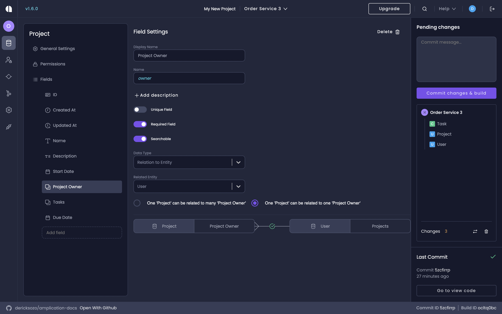
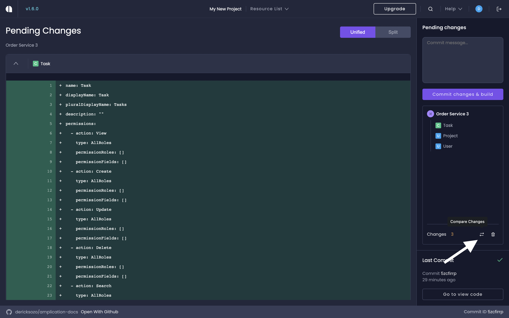
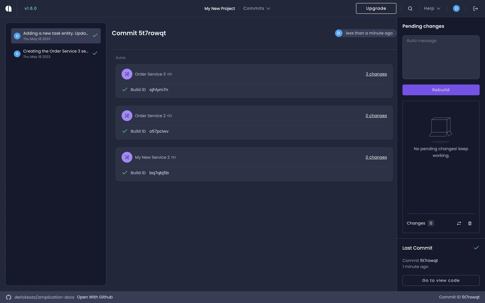

# Commit and Build New Versions Of Your Service

One of Amplication's core features is the ability to automatically sync changes to your service to a git provider.

Changes are saved automatically, but are not committed until you explicitly click **Commit changes and build** in the right sidebar.
Only committed changes will be included in the next version of your generated service.

In this guide, you'll learn how to commit changes to your git provider and build new versions of your service.

:::tip
[Amplication's AI](/amplication-ai) can help you build new versions of your service and create commit messages with a single request.

Ask Jovu: `Can you build and commit my pending changes with the message "Added Task entity and updated Project entity"?`
:::

## Prerequisites

In order to proceed with this guide, please ensure you have completed at least the following:

1. [Set up your service](/first-service/) with our service creation wizard.
2. [Set up entities and entity fields](/set-up-entities/) for your service.

## Step 1: Make Your First Commit

In the _Pending Changes_ control in the right sidebar you can see the list of pending changes that are waiting to be committed.

We'll now make our first commit.

In this page, you can see that the creation of the _Project_ entity hasn't been committed.

1. In the _commit message_ dialog, write a description of the changes you're committing. For example: "Added Project Entity and Manager and Admin roles".
2. Click **Commit Changes**. All changes are committed. A build of the first version of your service is automatically created!

:::tip
Use Code View to view and explore the generated code. You can see the updated code before it is synced with GitHub. Click the [View Code](/getting-started/view-generated-code/) icon to view the generated code.
:::

3. After the build process completes, you will see a new pull request created on the GitHub repo you associated with your service. You can review the pull request and after merging the generated code will be in repo using the folder structure you picked when you created your service.

## Step 2: Make Changes and Create a New Entity

Let's add another entity to your service called _Task_.

1. On the _Overview_ page, click **Go to Entities**, or from the main menu (left sidebar) click the **Entities** icon.
2. Click **Add entity**.
3. In the _New Entity_ dialog, type in _Task_.
4. Click **Create Entity**.
5. The entity comes with a few default fields. We'll add some more fields as follows.

| Field Name        | Data Type          | Properties                                                                              |
| ----------------- | ------------------ | --------------------------------------------------------------------------------------- |
| Title             | Single Line Text   | Required                                                                                |
| Estimation (days) | Whole Number       |                                                                                         |
| Start Date        | Date Time          |                                                                                         |
| Status            | Option Set         | Required, 4 options: <ul><li>New</li><li>Pending</li><li>Ongoing</li><li>Done</li></ul> |
| Project           | Relation to Entity | Related to: Project                                                                     |
| Assigned To       | Relation to Entity | Related to: User                                                                        |

The Task's field list should now look like this:

:::info
Refer back to the [Set Up Entities On Your Service](/set-up-entities) guide for specific steps on setting up an entity on your service.
:::

## Step 3: Update the Project Entity

We'll now make a few changes to the _Project_ entity.

1. On the _Overview_ page, click **Go to Entities**, or from the main menu (left sidebar) click the **Entities** icon.
2. Select the _Project_ entity.
3. Add a new field called **Due Date** and set its data type to "Date Time".
4. Select the existing _Owner_ field and change its _Display Name_ to "Project Owner".

## Step 4: Compare Pending Changes Before Commit

It's always good to check what was changed before you commit to verify that these changes were intentional.
To do so:

1. Click **Compare Changes**. (Note: **Compare Changes** icon is next to **Delete** icon)
2. The _Pending Changes_ page opens and indicates what was changed and what was added.

- The _Task_ entity was created
- The _Project_ entity was updated

3. Since these changes were intentional and we're happy to commit them, write a new commit message in the text box at the top of the _Pending Changes_ sidebar.

4. Click **Commit changes and build**.

## You're Done

Great! You just made some new changes to your service, built it, and Amplication automatically created a new pull request with those changes to GitHub. Great work!

