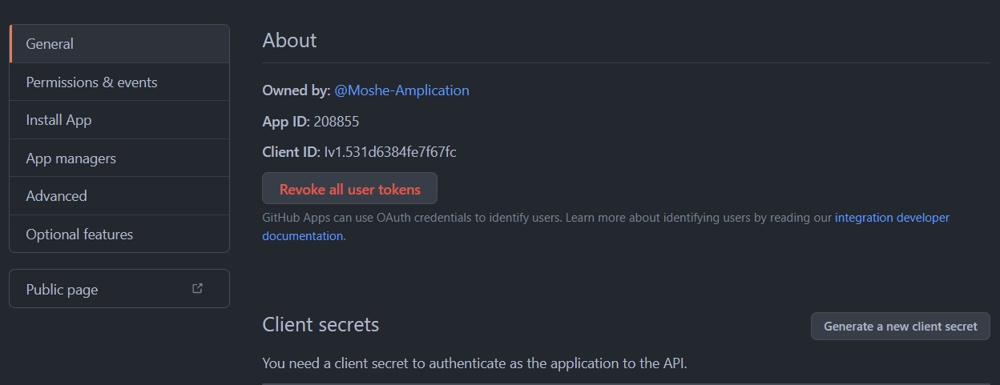

# Connect Amplication server to GitHub

Amplication already provides built-in integration with GitHub to push the generated application to a GitHub repository.

When running a local Amplication server you first need to configure the server to integrate with a new GitHub app, following the steps below.

:::info
When using the hosted service on https://app.amplication.com, the integration is pre-configured and you just need to follow [this guide](/docs/sync-with-github) to sync your application with GitHub.
:::

## Step 1:  Create a new GitHub App

1. Go to https://github.com/settings/apps
2. Click **OAuth Apps**
3. Click **Register a new application**


4. Enter the fields as follows: 
    - **Application name** - give the application any name
    - **Homepage URL** - full URL to your app homepage
    - **Application description** - optional
    - **Authorization callback URL** - set to **http://localhost:3001**. If you are hosting the Amplication server on any other address, use the specific address.

5. Click **Register application**



6. Click **Generate a new client secret**


6. Copy and save the **Client secret** and **Client ID** of your new GitHub application.

## Step 2: Configure Amplication server to work with the new GitHub app

1. Go to  

```
../packages/amplication-server/

```

2. Add the `.env.local` file to the root of the server directory.

```
../packages/amplication-server/.env.local
```

3. Add the following content to the file

```
GITHUB_APP_CLIENT_SECRET = [use-secret-manager]
GITHUB_APP_CLIENT_ID = [github-app-client-id]
GITHUB_APP_APP_ID = [github-app-app-id]
GITHUB_APP_PRIVATE_KEY = [github-app-private-key]
GITHUB_APP_INSTALLATION_URL = [github-app-installation-url]
```

4. Replace `[use-secret-manager]` with the **Client secret** of the new GitHub application.
5. Replace `[github-app-client-id]` with the **Client ID** of the new GitHub application.

6. Restart Amplication server.
