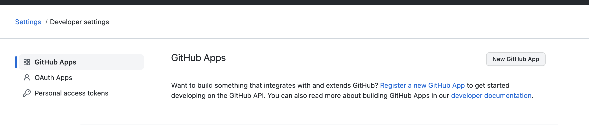

# Connect Amplication server to GitHub

Amplication already provides built-in integration with GitHub to push the generated application to a GitHub repository.

When running a local Amplication server you first need to configure the server to integrate with a new GitHub app, following the steps below.

:::info
When using the hosted service on https://app.amplication.com, the integration is pre-configured and you just need to follow [this guide](/docs/sync-with-github) to sync your application with GitHub.
:::

### Create a new GitHub App

1. Go to https://github.com/settings/apps
2. Click on **New Github App**



3. Give the application any name
4. Set the Homepage URL to **http://localhost:3001**
5. Set the **Callback URL** to **https://localhost:3001/github-auth-app/callback**
6. Set the **Setup URL** to **https://localhost:3001/github-auth-app/callback**


7. Choose these permissions for **Repository permissions**


8. Choose `Any Account` for **Where can this GitHub App be installed?**


:::info
In case you are hosting the Amplication server on any other address, use the specific address instead of http://localhost:3001
:::

8. Click `Create Github App` button to create the app.

### Configure Amplication server to work with the new GitHub app

1. Go the **../packages/amplication-server/**

2. Add a **.env.local** file in the root of the server directory

```
../packages/amplication-server/.env.local
```

3. Add the following content to the file

```
GITHUB_APP_CLIENT_SECRET = [use-secret-manager]
GITHUB_APP_CLIENT_ID = [github-app-client-id]
GITHUB_APP_APP_ID = [github-app-app-id]
GITHUB_APP_PRIVATE_KEY = [github-app-private-key]
GITHUB_APP_INSTALLATION_URL = [github-app-installation-url]
```

4. Replace **[use-secret-manager]** with the client secret of the new GitHub application.

`Client secret can be generated as follows`


5. Replace **[github-app-client-id]** with the client id of the new GitHub application. 
6. Replace **[github-app-app-id]** with the app id of new application 
7. Replace **[github-app-private-key]** with your's private key.

`Private key can be generated as follows`


:::info
After downloading private key file, copy the content of file, replace every new line with \n and replace [github-app-private-key] with that string
:::

8. Replace **[github-app-installation-url]** with the ` https://github.com/apps/[your github app name]/installations/new?state={state} `
9. Restart Amplication server.
