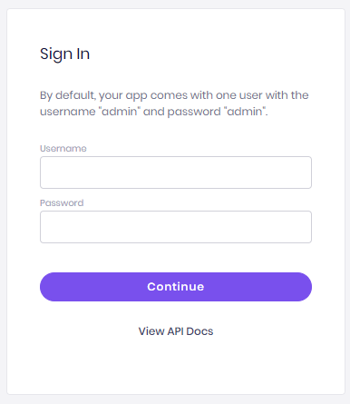

# How to deploy your app

Applications created with Amplication comprise two main components — the server that runs the API and a database.

When it comes to deployment, you can choose any of the following options:

- Deploying to the Amplication Cloud for testing and development purposes.
- Downloading the generated source code and continuing the process with your favorite IDE and local tools.
- Building a Docker container and deploying it to any cloud, datacenter, or server.

Let’s explore each of the options.

## Continuous deployment to the Amplication cloud

When working with Amplication, all your committed changes are continuously deployed to a sandbox environment on the Amplication cloud so you can easily access your application for testing and development purposes.

Click the “Preview App” link in the build panel to access the login page of your application's Admin UI.



By default, your app comes with one user with the username "admin" and password "admin". Use these credentials to access your app and create other users.

You may also to navigate to _/api_ or just click "View API Docks" to see the full swagger documentation of your API.

The sandbox environment provided by Amplication is not for production purposes (currently all existing data in the environment is purged following each deployment), but it’s a great starting point while developing your app. The sandbox environment is totally free of charge — like all other things in Amplication.

We are working to offer production-like (remember, we are still in beta) environments with data retention in an upcoming release. Stay tuned for news and updates.

## Downloading the app’s source code

Everything you create on Amplication is generated to really neat and readable TypeScript code. Whether you already have a deployment process in-place, or whether you want full control of your app, at any time you can download the source code from Amplication and continue on your own.

Please note that you can always come back and update your app on Amplication and then download an updated version.

To download the source code, click the "Download" icon in the build panel. You'll get a ZIP file with a [NestJS](https://nestjs.com/) app, that includes all your modules, services, controllers, and a [Prisma](https://www.prisma.io/) ORM client.


To use your code locally, you'll need to have [Node v14](https://nodejs.org/en/download/), npm, and [Docker](https://docs.docker.com/get-docker/) installed on your machine.

To start using your app, extract the ZIP file to a local folder and execute the following commands:

```
npm i
npm run docker:db
npm run db:init
npm start
```

## Deploy a Docker container

You can also easily build a Docker container to prepare your app for deployment. Your app is always generated with all the configuration and scripts needed to do so.

First download the source code of you app and extract the ZIP file to a local folder (same as explained in previous section).

To run your app in Docker with a functional database execute the docker-compose command

```
docker-compose up
```
