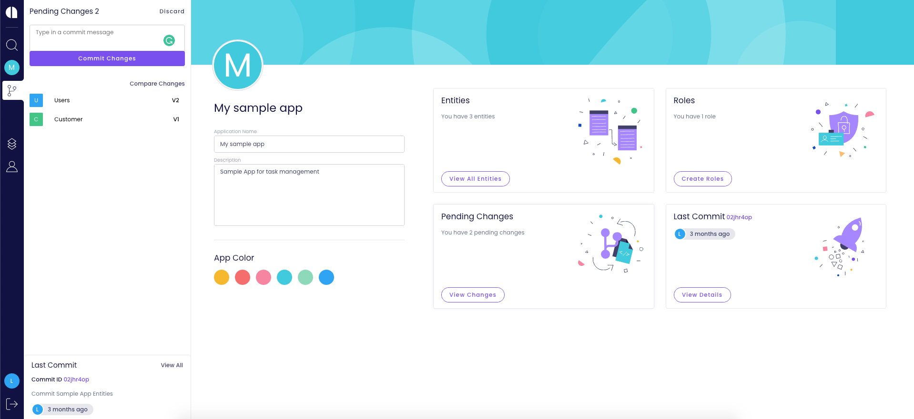

# Your first application 

Not sure how to get started? In this tutorial, you’ll walk through the steps of creating an application, adding an entity, adding roles, and setting permissions on entities.

Also, you'll see how to commit changes and manage versions, and finally how to build your app and get it ready for deployment.

Let’s get started.

## Create a New App

1. Sign in to [app.amplication.com](https://app.amplication.com). You should land on the _My Apps_ page. If you're not on the My Apps page, click the Amplication logo in the top-left corner to reach this page, as this is our starting point.
2. In the My Apps page, click **Create New App**.
3. In the _New App_ dialog, name your app “Task Management” and enter this description: “My first app for task management”.
4. Click **Create App**.

## Create an Entity

Click the Entities icon (left sidebar, a.k.a. main menu) to reach the Entities page, here you see all the entities in your application.

:::tip
Currently, there's only a “User” entity that was auto-generated when you created the new app.
:::

For the purpose of this tutorial, we'll now add another entity called “Project”.

1. Click **Create New**.
2. In the _New Entity_ dialog, type in “Project”.
3. Click **Create Entity**.

You now have a new “Project” entity. Notice that the added entity comes with auto-generated values like “Plural Display Name” and some default fields – ID, Created At, and Updated At.

## Add Entity Fields

To describe your project add some new fields. For the purpose of this tutorial, add these fields:

- Name – for saving the project name
- Description – for saving a more detailed description of the project
- Start Date – for saving the date on which this project starts
- Owner – for assigning a user to be an owner of the project

### Create the Name Field

1. In the *Entity Fields* text box (above the list of fields), type in “Name”.
2. Click **Add field** (or just press Enter). The new field is added to the list.
3. The field's property panel opens. Click the **Required Field** toggle to make the *Name* field required. 
4. Leave the defaults for the other properties (*Searchable* inactive, *Data Type* "Single Line Text", and *Max Length* "256".)

:::tip
All changes are saved automatically.
:::

### Create the Description Field

1. In the *Entity Fields* text box type “Description”.
2. Click **Add field** (or just press Enter). The new field is added to the list.
3. The field's property panel opens. Leave the defaults (*Required Field* and *Searchable* inactive, *Data Type* "Multi Line Text", and *Max Length* "1000".)

### Create the Start Date Field

1. In the *Entity Fields* text box type “Start Date”.

:::info
White spaces are supported, which is useful when you want to enter a descriptive field name. The value is saved as the field’s display name.
In addition to the display name, each field has an auto-generated *Name* that does not contain spaces or special characters. This name is later used for the API endpoint and in other places in the generated code.
If needed, you can manually change the field name in the field's properties panel.
:::

2. Click **Add field** (or just press Enter). The new field is added to the list.
3. The field's property panel opens. Leave the defaults (*Required Field* and *Searchable* inactive, *Data Type* "Date Time", and *Time Zone* "Local Time".)

### Create the Owner Field

1. In the *Entity Fields* text box type “Owner”.
2. Click **Add field** \(or just press Enter\). The new field is added to the list.
3. The field's property panel opens. Change the *Data Type* from "Single Line Text" to "Relation to another Entity".
4. In the *Related Entity Id* field select “User”.
5. Click the **Required Field** toggle to make the “Owner” field required.

:::tip
You might find it easier to first add all the fields you want, one after onother, and only afterwards set the properties of each field. 
:::

## Set Access Permissions

In order to allow users to access the entity, we need to set its permissions.

Permissions can be controlled separately for each of the following actions:

- **View**
- **Create**
- **Update**
- **Delete**
- **Search**

By default, ALL these actions are NOT permitted, so we need to decide which actions are allowed for whom.
This is where roles are handy. 

### Create Roles

Click the Roles icon (left sidebar, a.k.a. the main menu) to reach the *Roles* page, here you see all the roles in your application.

:::tip
Currently, there's only a default “User” role that was auto-generated when you created the new app.
:::

For the purpose of this tutorial, we'll now add another two roles: “Admin” and "Manager".

1. In the *Type role name* text box, type "Admin".
2. Click **Add Role** \(or just press Enter\). The new role is added to the list.
3. Repeat these steps to add the "Manager" role.

### Set Entity Permissions

1. Click the Entities icon in the main menu to open the *Entities* page.
2. Click the *Project* entity.
3. In the Project's page *Permissions* panel click the edit icon (pencil). This opens the Permissions settings.
4. Start by making sure that all actions (View, Create, Update, Delete, and Search) are enabled for all roles.
5. Fine tune permissions by changing the *Delete* permissions from "All Roles" to "Granular" and then select from the presented roles the "Admin" role.
   This ensures that only users filling the Admin role can delete projects.

:::info

You can also set special permissions for specific fields. For example, you can prevent users from editing the Due Date of a project and allowing it only to managers.

To do so, make sure to use `Granular` permissions, and click on**`+ Add Field`** below the role list.

This option is not available for the **Delete** action
:::

## Commit Your Changes

When working on Amplication your changes are saved automatically, but are not committed before you decide to do so. Only committed changes will be included in the next version of your application.

On the top right corner of the screen, you can always see how many pending changes are awaiting to be committed, in the `Pending` button.

Let's create our first commit to the changes done so far.

Click on the **`Pending`** button to navigate to the `Pending Changes` pages.

In the `Pending Changes` page, you can see that the creation of the **Project** entity is pending.

Click on **`Commit Changes`**to open the `Commit Pending Changes` dialog.

Type in a short message to describe the changes, e.g. "Create Project Entity", and click on **`Commit`**.

All the changes are now committed. You can now build the first version of our app.

## Build a New Version

From the main menu, click on **`Publish`**. If you just committed your changes, you can also find the **`Publish`** button below the success message.

On the left side of the screen, you can see a list of commits that were created in the app. This list will always show only the commits that were created since the last build. Since this is our first build, we see two commits. The first one was created automatically with your new application, and the second one we just created together.

Click on **`Build`** to open the `New Build`dialog.

For our example, we will use the suggested build number "0.0.1". For the next builds, you will be able to control the version number by selecting whether to create a major version, a minor version, or a patch.

Type in a short message to describe the new build and click on **`Build New Version.`**

On the right side of the screen, you are now able to see a log of the build process. Once it is completed, the new build is listed on the left side.

Click on the**`Download`**icon to get a **.zip** file with the code of your new application. It is now ready to be deployed anywhere you want. 🚀

## Continue Building Your App

Now that we know how to create entities, commit changes, and build new versions, let's continue to build our app. In the next part of this guide, we will create another entity, and learn how to compare changes before committing.

## Create the Task Entity

Go back to `Entities` page, and click on **`Create New`** to open the `New Entity`dialog.

Type in “Task” and click on **`Create Entity`**.

### Create Task Fields

Let's create the following fields for Task. For each line in the following table, create a new field, with the listed data type and properties.

| Field Name        | Data Type                 | Properties                                                                  |
| ----------------- | ------------------------- | --------------------------------------------------------------------------- |
| Title             | Single Line Tex           | Required                                                                    |
| Estimation (days) | Whole Number              |                                                                             |
| Start Date        | Date Time                 |                                                                             |
| Status            | Option Set                | Required <ul><li>New</li><li>Pending</li><li>Ongoing</li><li>Done</li></ul> |
| Project           | elation to Another Entity | Related to: Project                                                         |
| Assigned To       | elation to Another Entity | Related to: User                                                            |

The Task's field list should now look like this:

## Update the Project Entity

We now want to make some changes to the **Project** entity. Let's go back to the Entity list and click on the **Project** entity.

Add a new field called "Due Date" and select the **Date Time** as the data type.

Also, change the name of the "Owner" field to "Project Owner".

## Compare Pending Changes Before Commit

Click on the **`Pending`** button, which now shows indication for two changes.

In the `Pending Changes` page, we now see the two changes pending to be committed:

- The Task entity was created
- The Project entity was updated

Usually, before committing your changes it is a good practice to make sure all the changes were made intentionally. So, in order to see all the changes made to the Project entity, click on the `arrow` to expand the diff view.

We can easily see that one new field was created, and the name of another field was changed.

Since we are happy with these changes, let's click on **`Commit Changes`**.

**You are now ready to build a new version of your app. Great work!**
