# Create Your First Service

Amplication accelerates your app development by helping you build production-ready backend services. These automatically-generated backends, known as **services**, provide modern, secure, and scalable foundations for your apps.

Each service includes REST and GraphQL API support and an optional admin interface. Your service comes fully equipped with authentication, authorization, logging, git synchronization, and other critical backend management functionalities.

This guide will help you create your first service using our creation wizard.

:::info Generated Service Example
Want to see an example of what a generated service looks like? Check out the [Generated Service Sample App](https://github.com/amplication/sample-app) on GitHub.
:::

## Prerequisites

First, [sign up](https://app.amplication.com/login) for an Amplication account with GitHub or your _business_ email address.

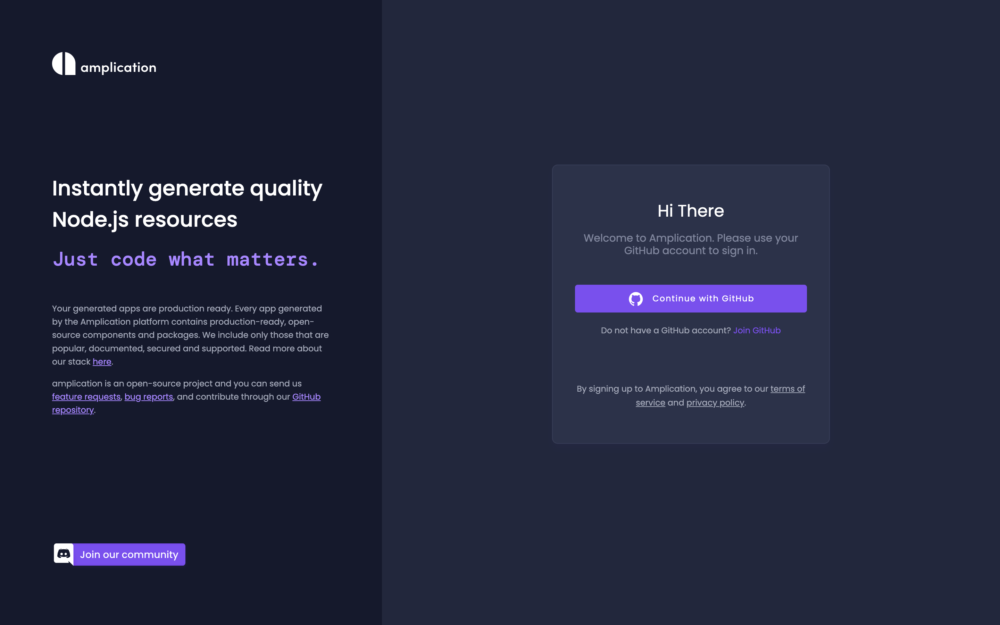

If this is your first time using Amplication, the Service Creation Wizard will automatically guide you through the process.

## Step 1: Name Your Service

When naming your service, consider its primary function. What will it do? What problem is it solving? An appropriately named service will be easier to identify and maintain.

<details>
<summary>Available Technology Stacks</summary>

Amplication supports two technology stacks for your backend services:

**Node.js**
- NestJS framework
- Prisma ORM
- GraphQL and REST APIs
- React Admin UI

**.NET**

- ASP.NET Core
- Entity Framework Core
- REST APIs

Choose the stack that best fits your team's expertise and project requirements during service creation.
</details>

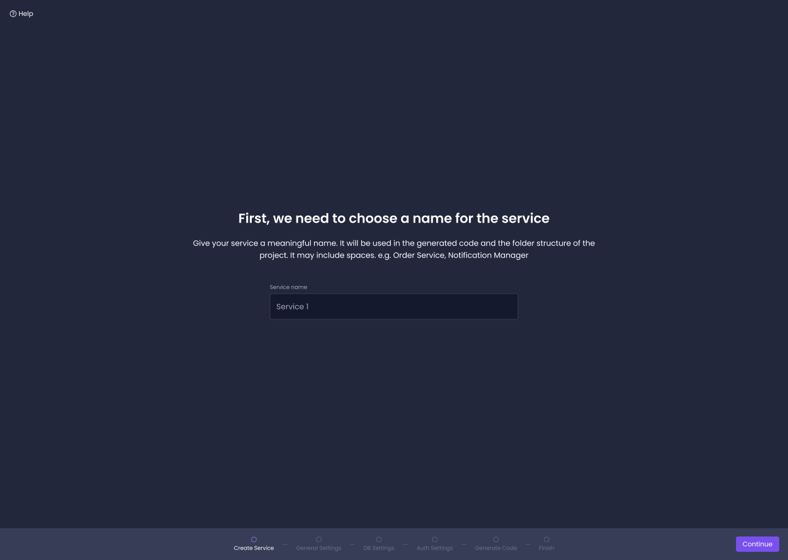

## Step 2: Connect Your GitHub Repository

Amplication will keep your generated service [synced with a GitHub](/sync-with-github/) repository that you choose.

First, install the Amplication GitHub App into your account or organization.

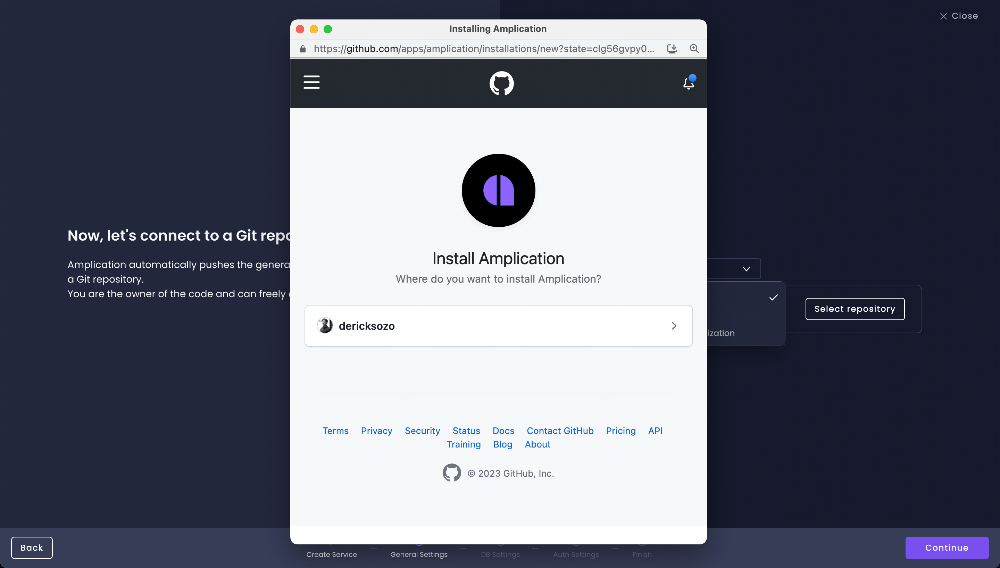

Next, select the repository to store your generated code.
You can also create a new repository by clicking on the **Create repository** button.

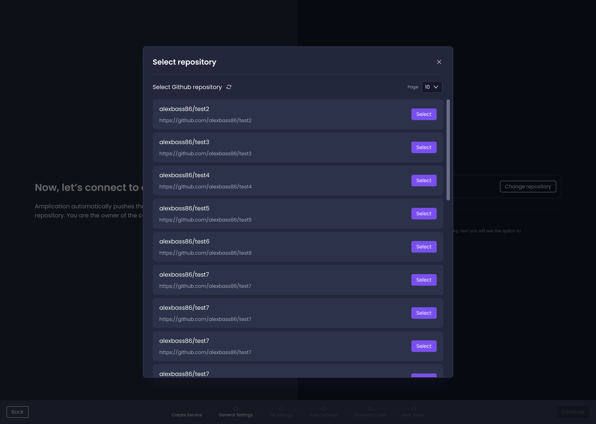

:::note Other Supported Git Providers
In addition to GitHub, Amplication also supports [Bitbucket](/sync-with-bitbucket) and [AWS CodeCommit](/sync-with-aws-codecommit) for Enterprise users.
:::

## Step 3: Customize Your Service

Amplication can generate GraphQL APIs, REST APIs, and an Admin UI for each of your services. Select the components you need for your service.

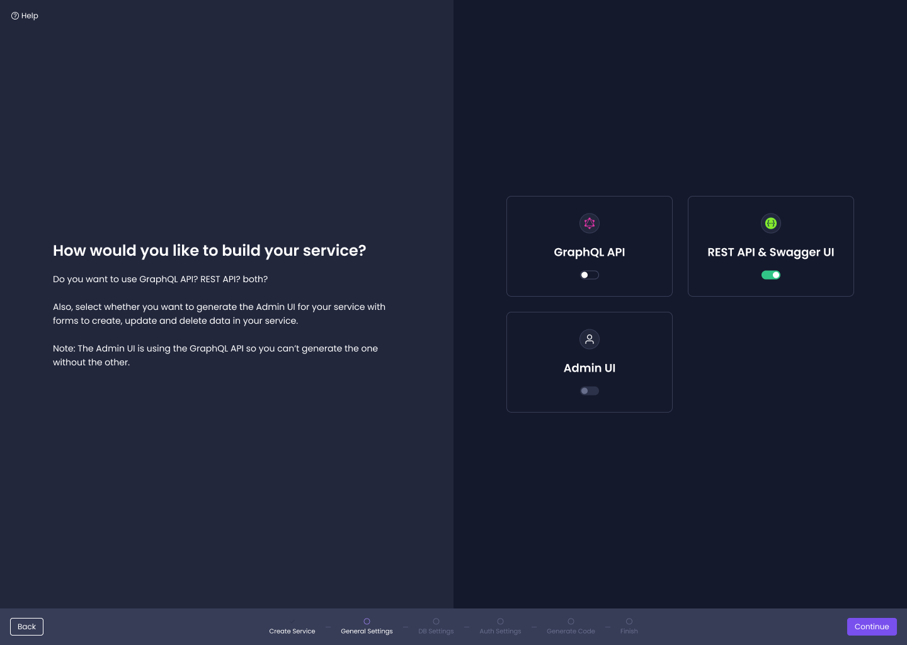

## Step 4: Select Your Repo Style 

Choose how your service will be stored in your repository: *Monorepo* or *Polyrepo*.

**Monorepo** generates a folder at the root and stores services in specified sub-folders. 

```
./apps
  - apps/my-new-service 
  - apps/my-new-service-admin
```

:::tip
Monorepo is recommended if you plan on having multiple services in a single GitHub repository
:::

**Polyrepo** stores each service in individual folders at the root of your repository.

```
- ./my-new-service
- ./my-new-service-admin
```

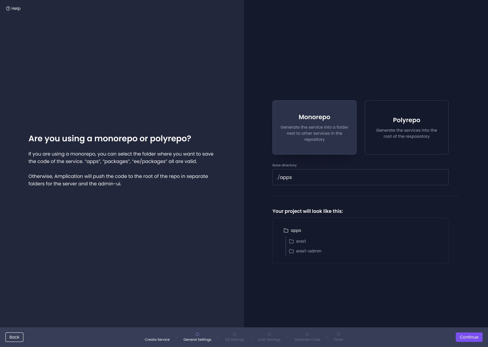

## Step 5: Choose Your Database

Amplication supports PostgreSQL, MongoDB, and MySQL out of the box. Choose the one that suits your needs.

:::tip
You're not locked into your choice - you can always [change your database type later](/plugins/guides/database/) in your project's plugin page.
:::

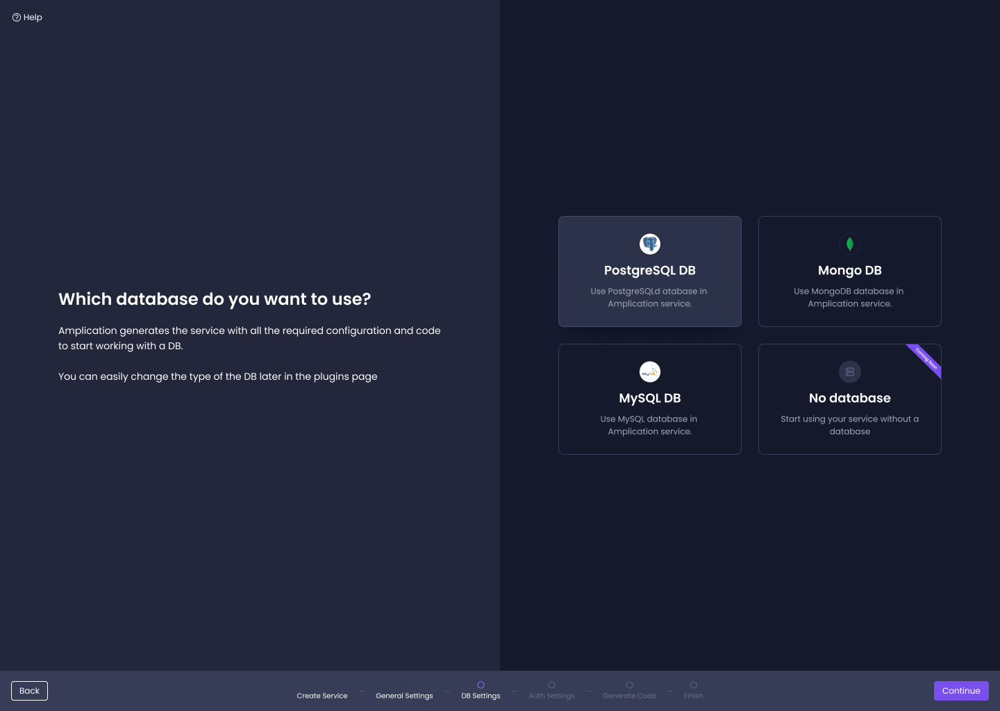

## Step 6: Define Your Data Model

Define entities and fields for your database. You can manually define your own or use a set of pre-defined entities provided by Amplication.

:::info What Are Entities?
Entities are the objects you want to keep track of in your app, like a User or a Product. They become tables in your database. Each row represents an instance of the entity.

A field is a column in that table that represents an attribute of that entity.
:::

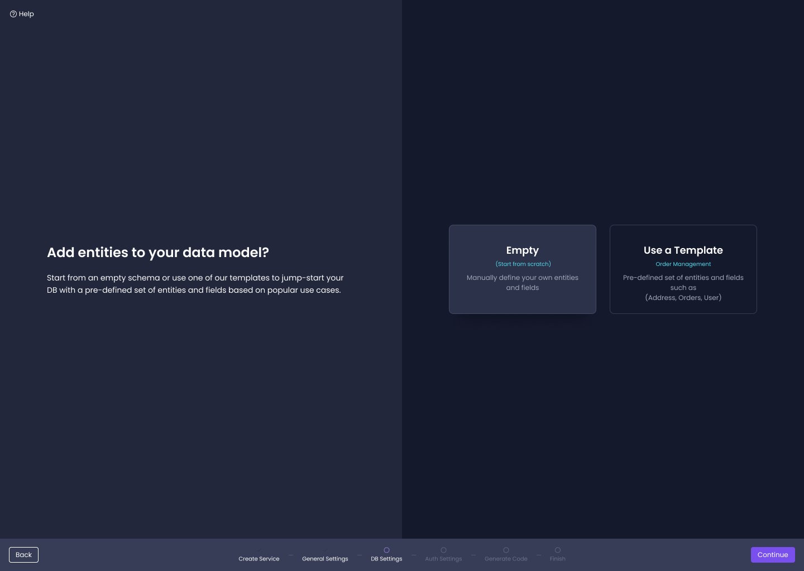

## Step 7: Include Authentication (Optional)

You can optionally choose to include all the necessary code for [authentication](/authentication/) in your service. If your service does not require authentication, select the `Skip Authentication` option.

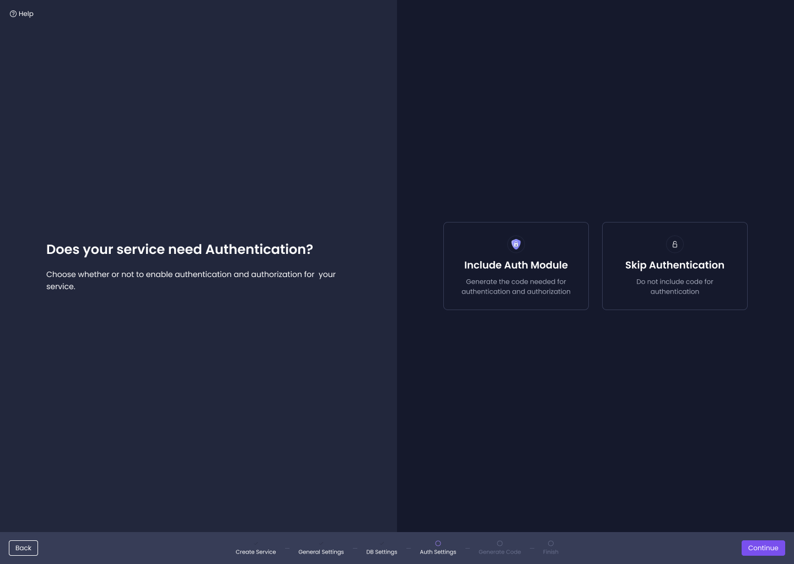

## You're Done!

Congratulations! You've successfully set up your first service on Amplication. You will now be taken to a screen where Amplication will start generating all the necessary code for your service. You can watch this happen in real time.

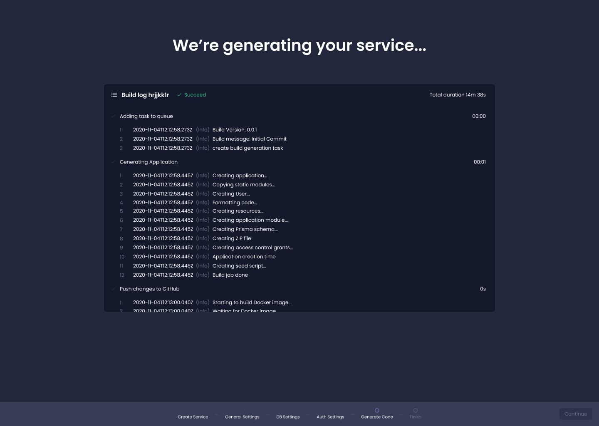

Clicking on the `View my code` button will take you to the GitHub repository you chose in Step 2. Specifically, you'll see Amplication's first commit to that repository.

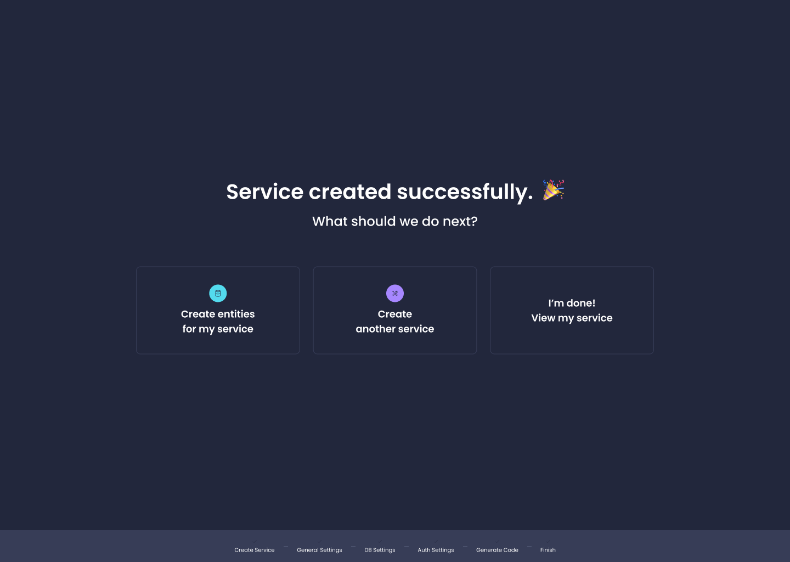

## Next Steps

After successfully creating your first service, the next steps are to create entities for your new service: [Set Up Entities, Roles, and Permissions On Your Service](/entities-roles-permissions)

You can also [learn more](/getting-started/) about the specific details, structure, and technologies that a service consists of.