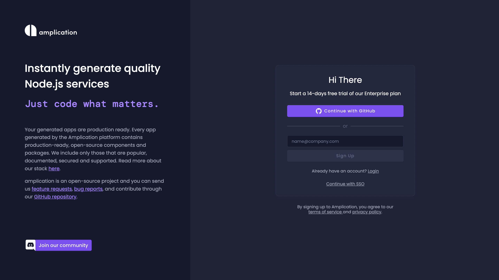

Welcome to Amplication, a platform that helps you build critical apps faster by auto-generating fully-functional apps. These automatically-generated apps are known as **services**.

[Services](/getting-started/) include components like NestJS, Prisma, a REST API, and an Admin UI. It's a full solution complete with authentication, authorization, logging, and other essential features for back-end management. [Learn more](/getting-started/) about the details, structure, and technologies of a service.

Let's get you started on creating your first service using our service creation onboarding wizard.

## Step 0: Create Your Amplication Account

First, [sign up](https://app.amplication.com/login) for an Amplication account. Next, authorize with GitHub.



If this is your first time using Amplication and you have no existing Workspaces or [Projects](/projects-resources-services#projects), the Service Creation Wizard will guide you through the process.

## Step 1: Name Your Service

When naming your service, consider its primary function. What will it do? What problem is it solving? An appropriately named service will be easier to identify and maintain.


## Step 2: Connect Your GitHub Repository

Amplication will keep your generated service [synced with a GitHub](/sync-with-github/) repository that you choose.

First, install the Amplication GitHub App into your account or organization.


Next, select the repository where the generated code will be stored.


## Step 3: Customize Your Service

Amplication can generate GraphQL APIs, REST APIs, and an Admin UI for each of your services. Select the components you need for your service.


## Step 4: Select Your Repo Style 

Choose how your service will be stored in your repository: *Monorepo* or *Polyrepo*.

**Monorepo** generates a folder at the root and stores services in specified sub-folders. 

```
./apps
  - apps/my-new-service 
  - apps/my-new-service-admin
```

:::tip
Monorepo is recommended if you plan on having multiple services in a single GitHub repository
:::

**Polyrepo** stores each service in individual folders at the root of your repository.

```
- ./my-new-service
- ./my-new-service-admin
```


## Step 5: Choose Your Database

Amplication supports PostgreSQL, MongoDB, and MySQL out of the box. Choose the one that suits your needs.

:::tip
You're not locked into your choice - you can always change your database type later in your project's plugin page.
:::


## Step 6: Define Your Data Model

Define entities and fields for your database. You can manually define your own or use a template provided by Amplication.

:::info
Entities are the objects you want to keep track of in your app, like a User or a Product. They become tables in your database. Each row represents an instance of the entity.

A field is a column in that table that represents an attribute of that entity.
:::


## Step 7: Include Authentication (Optional)

You can optionally choose to include all the necessary code for [authentication](/authentication/) in your service. If your service does not require authentication, select the `Skip Authentication` option.


## You're Done!

Congratulations! You've successfully set up your first service on Amplication. You will now be taken to a screen where Amplication will start generating all the necessary code for your service. You can watch this happen in real time.


Clicking on the `View my code` button will take you to the GitHub repository you chose in Step 2. Specifically, you'll see Amplication's first commit to that repository.

If you're curious about what the generated code for a service looks like, we have an example on GitHub for you. Check out the following repository:

[Amplication Generated Service Sample App](https://github.com/amplication/sample-app)


## Next Steps

After successfully creating your first service. [Learn more](/getting-started/) about the specific details, structure, and technologies that a service consists of.

The next steps are to add entities, roles, and permissions to your service: [Set Up Entities, Roles, and Permissions On Your Service](/entities-roles-permissions)