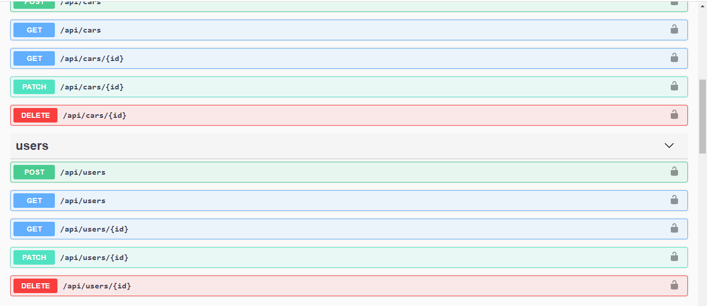

# Use Your APIs

Every application created with Amplication is generated with two types of APIs: REST, and GraphQL.

In this article you will learn how to connect, authenticate, and consume these APIs.

## Authentication

While we are working to add more authentication providers, currently your server is secured with Basic HTTP Authentication.

To send a request to the API you must provide a Basic HTTP authentication header in the form of _Authorization: Basic [credentials]_, where credentials is the Base64 encoding of a string "_username:password_".

By default, your app comes with one user with the username "admin" and password "admin".
You can use the following header to authenticate with the default user.

```
Authorization: Basic YWRtaW46YWRtaW4=
```

:::tip
You can use a tool to create the header. There are several generators [available online](https://www.google.com/search?q=http+basic+authentication+header+generator).
:::

## REST API

The REST API is available at **/api** at the root of your application.
When you navigate directly to **/api** you will see the swagger documentation of you API with a list of all resources and actions.

For development and testing purposes, you can use the [swagger UI](https://swagger.io/tools/swagger-ui/) to execute requests against the API. First, click on the "Authorize" button and enter the username and password, it will add the authorization header automatically.

@Yuval - check why the CSS of the swagger page is not loading



The REST API provide methods on all your data model. For each model, you can find five endpoints. For example, on the User model you will find the following endpoints:

- `GET /api/users` - to get a list of users
- `GET /api/users/:id` - to get a single user by its ID
- `POST /api/users` - to create a new user
- `PATCH /api/users/:id` - to update an existing user by its ID
- `DELETE /api/users/:id` - to delete a user by its ID

## GraphQL API

The GraphQL API is available at **/graphql** at the root of your application.

When you navigate directly to **/graphql** you will see the [GraphQL Playground](https://www.apollographql.com/docs/apollo-server/testing/graphql-playground/) provided by Apollo Server.

For development and testing purposes, you can use the GraphQL Playground to execute queries and mutations against the API. First, click on the "HTTP HEADERS" tab at the bottom of the screen and add the authorization header in the following format:

```
{
  "Authorization": "Basic YWRtaW46YWRtaW4="
}
```


The GraphQL API provide queries and mutations on all your data model. For each model, you can find 2 queries and 3 mutations. \
For example, for the User model you will find the following:

### Queries

- `users` - to get a list of users
- `user` - to get a single user by its ID

### Mutations

- `createUser` - to create a new user
- `updateUser` - to update an existing user by its ID
- `deleteUser` - to delete a user by its ID

Click on the DOCS tab on the right hand side to view a full documentation of all queries and mutations.
