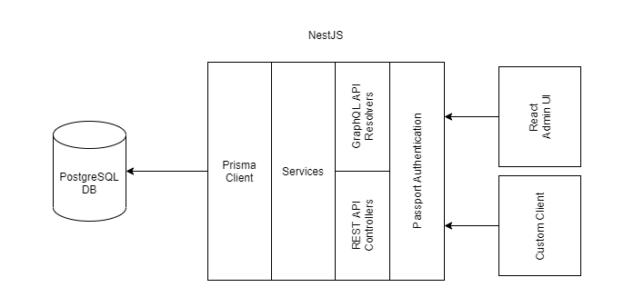

# The Generated App

Applications created with Amplication are generated as human-readable and editable TypeScript code.

In this article you'll find details on the structure of the application and the technologies it's based on.

## Technologies

The generated app is built with the following open-source technologies:

### Server-side

- [NestJS](https://nestjs.com/) 
- [Prisma](https://www.prisma.io/)
- [PostgreSQL](https://www.postgresql.org/) 
- [Passport](http://www.passportjs.org/)
- [GraphQL](https://graphql.org/)
- [Swagger UI](https://swagger.io/)
- [Jest](https://jestjs.io/) 
- [Docker](https://www.docker.com/) 

### Client-Side

- [ReactJS](https://reactjs.org/)
- [Axios](https://github.com/axios/axios)
- [Formik](https://formik.org/) 

## Projects Structure

The generated app is built from two projects, each in a separate folder

- Server - For all the server components including REST API, GraphQL, Services and more.
- Admin - For the Admin UI including forms for CRUD operations on all data models.

### Server

The server project provides all the back-end services of your application, like REST API, GraphQL API, authentication, authorization, data validation, connection to the database, and logging.

### Admin

The Admin project provides a React application with ready-made forms for creating and editing all your application's data models. The React app is configured to work with the server and already includes the boilerplate and foundation for your client: routing and navigation, authentication, permissions, menu, breadcrumbs, error handling and much more.

