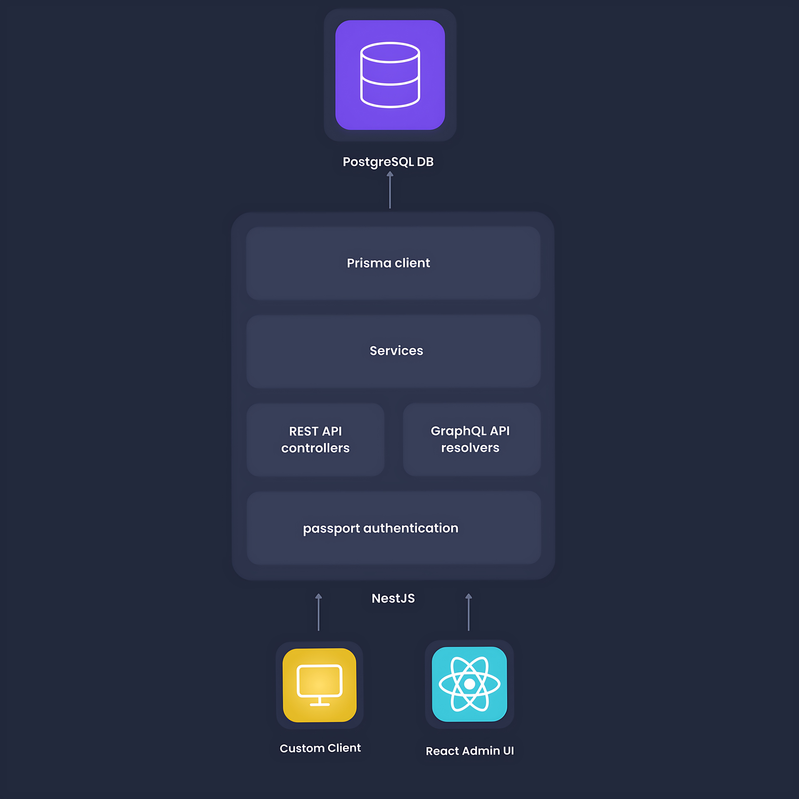

# The Generated Service

Amplication auto-generates fully functional human-readable and editable services based on TypeScript and Node.js.

The generated services include NestJS, Prisma, REST API, GraphQL API, a React admin UI, authentication, authorization, logging, and more.

In this article you can find the details on the structure of a single service and the technologies behind it.

:::note
You can see an example of a service generated with Amplication in this repository

https://github.com/amplication/sample-app
:::

## Technologies

The generated service is built with the following proven open-source technologies:

### Server-side

- [NestJS](https://nestjs.com/) - A progressive Node.js framework for building efficient, reliable and scalable server-side applications.
- [Prisma](https://www.prisma.io/) - Next-generation ORM for Node.js and TypeScript.
- [PostgreSQL](https://www.postgresql.org/) - The world's most advanced open source relational database
- [MySQL](https://www.mysql.com/) - A popular, open source database delivering high performance scalable database applications.
- [MongoDB](https://www.mongodb.com/) - A source-available, cross-platform, document-oriented, NoSQL database program. 
- [Passport](http://www.passportjs.org/) - Simple, unobtrusive authentication for Node.js
- [GraphQL](https://graphql.org/) - a query language for APIs.
- [Swagger UI](https://swagger.io/) - Visual documentation for REST API based on OpenAPI Specification.
- [Jest](https://jestjs.io/) - delightful JavaScript Testing Framework with a focus on simplicity.
- [Docker](https://www.docker.com/) - an open platform for developing, shipping, and running applications.    

### Client-Side

- [ReactJS](https://reactjs.org/) - A JavaScript library for building user interfaces.
- [React-Admin](https://reactjs.org/) - A unified admin framework using React, Material UI, React Router, Redux, and React-final-form.

## Projects Structure

The generated service is built from two projects, each in a separate folder

- Server - For all the server components including REST API, GraphQL, Services and more.
- Admin - For the Admin UI including forms for CRUD operations on all data models.

### Server

The server project provides all the back-end services of your application, like REST API, GraphQL API, authentication, authorization, logging, data validation, and connection to the database.

:::note
The following diagram shows PostgresSQL as an example. MySQL and MongoDB are also supported. 
:::

### Admin

The Admin project provide a React application with ready-made forms for creating and editing all the data models of your application. The React app is pre-configured to work with the server and comes with all the boilerplate and foundation for your client - routing and navigation, authentication, permissions, menu, breadcrumbs, error handling and much more.

## Learn more

- [How to add custom code to your application](/how-to/custom-code)
