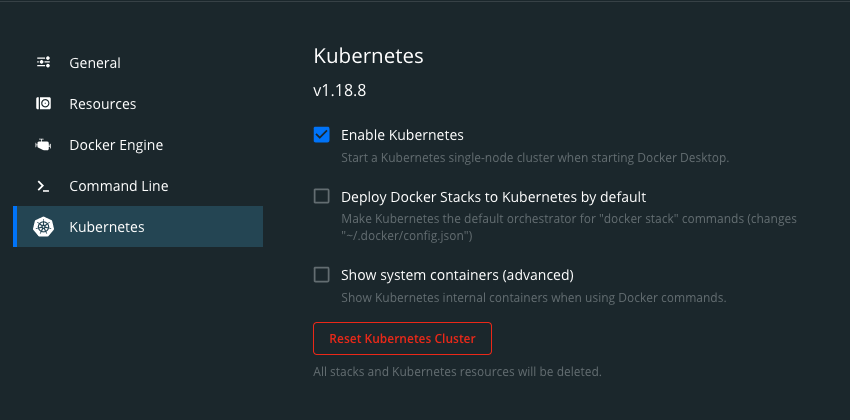

# Deploy Amplication to a Kubernetes cluster using Helm

Follow this article to deploy an Amplication server to a Kubernetes cluster using Helm.

The article focuses on deployment on a local server for testing and development purposes, but the same method can be implemented for a production environment.

## Prerequisites

Before you start you need to install the following.
1. Kubernetes Cluster (We will be using the [Docker Desktop](https://www.docker.com/products/docker-desktop) K8s implementation)
2. Helm
3. Kubectl

Below we will go through each install step individually.

### Install Kubernetes cluster

There are a few ways to install a Kubernetes cluster locally, in our example we'll be using Docker's Kubernetes Plugin ([Docker Desktop](https://www.docker.com/products/docker-desktop)). However there are a few other Open Source alternatives (e.g. _Kind_ and _Minikube_), if you prefer to install a different K8s cluster, you can reference the list here [here](https://kubernetes.io/docs/tasks/tools/). 

After you've finished installing [Docker Desktop](https://www.docker.com/products/docker-desktop) you can now enable the _Kubernetes Plugin_ by going to the _Kubernetes_ tab in the Docker Desktop settings page and check _Enable Kubernetes_



### Install Helm and Kubectl

You will also need _Helm_ and _Kubectl_ installed. 
1. [Kubectl](https://kubernetes.io/docs/tasks/tools/#kubectl)
2. [Helm](https://helm.sh/docs/intro/install/)


## Installing Amplication Helm Chart
Open the terminal and Pull down [_Amplication_](https://github.com/amplication/amplication.git) then go to `./amplication/chart/amplication` directory.

 1. `git clone  https://github.com/amplication/amplication.git`
 2. `cd amplication/chart/amplication`

The amplication chart is shipped with a set of defaults that should get you running without any additional configuration.
Run this command

```
helm install amplication . --namespace amplication --create-namespace
```

Amplication Helm chart includes:

1. bitnami/postgresql server
2. Migration job for Amplication server.
3. A Docker Registry and Docker builder using https://hub.docker.com/_/docker, and a volume for the registry (docker image storage).
4. The Amplication server and a volume for `/artifacts`
5. The amplication scheduler

You can monitor the whole list of resources by running the following:

<!-- spell-checker: disable -->

```sh
$ kubectl get all --namespace amplication

# Example output when all resources are completed and ready

NAME                                         READY   STATUS      RESTARTS   AGE
pod/amplication-app-5cb4f9d576-ldsvz         1/1     Running     0          53s
pod/amplication-app-migrate-f6xp4            0/1     Completed   0          53s
pod/amplication-docker-dd5bbd98f-5mrtj       1/1     Running     0          53s
pod/amplication-registry-5f969c6554-c4cbs    1/1     Running     0          53s
pod/amplication-scheduler-7b9557cdc5-dmjv2   1/1     Running     0          53s
pod/localpostgres-0                          1/1     Running     0          53s

NAME                             TYPE        CLUSTER-IP       EXTERNAL-IP   PORT(S)    AGE
service/amplication-app          ClusterIP   xx.xx.xx.xx     <none>        3000/TCP   53s
service/amplication-docker       ClusterIP   xx.xx.xx.xx   <none>        2375/TCP   53s
service/amplication-registry     ClusterIP   xx.xx.xx.xx   <none>        5000/TCP   53s
service/localpostgres            ClusterIP   xx.xx.xx.xx    <none>        5432/TCP   53s
service/localpostgres-headless   ClusterIP   None             <none>        5432/TCP   53s

NAME                                    READY   UP-TO-DATE   AVAILABLE   AGE
deployment.apps/amplication-app         1/1     1            1           53s
deployment.apps/amplication-docker      1/1     1            1           53s
deployment.apps/amplication-registry    1/1     1            1           53s
deployment.apps/amplication-scheduler   1/1     1            1           53s

NAME                                               DESIRED   CURRENT   READY   AGE
replicaset.apps/amplication-app-5cb4f9d576         1         1         1       53s
replicaset.apps/amplication-docker-dd5bbd98f       1         1         1       53s
replicaset.apps/amplication-registry-5f969c6554    1         1         1       53s
replicaset.apps/amplication-scheduler-7b9557cdc5   1         1         1       53s

NAME                             READY   AGE
statefulset.apps/localpostgres   1/1     53s

NAME                                COMPLETIONS   DURATION   AGE
job.batch/amplication-app-migrate   1/1           22s        53s
```

<!-- spell-checker: enable -->

## Port-Forwarding

The final step is port-forwarding the amplication-app port to your localhost so you can access it on a browser client.

```
kubectl port-forward deployment/amplication-app 3000:3000 --namespace amplication
```

Now you can access amplication locally on your browser at `http://localhost:3000` 👍
