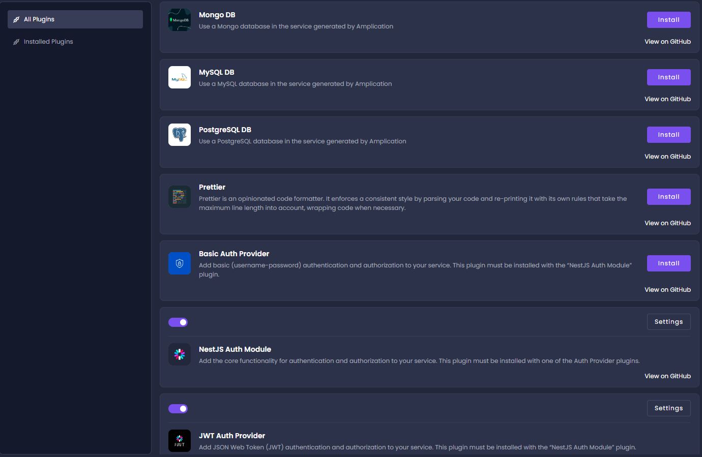
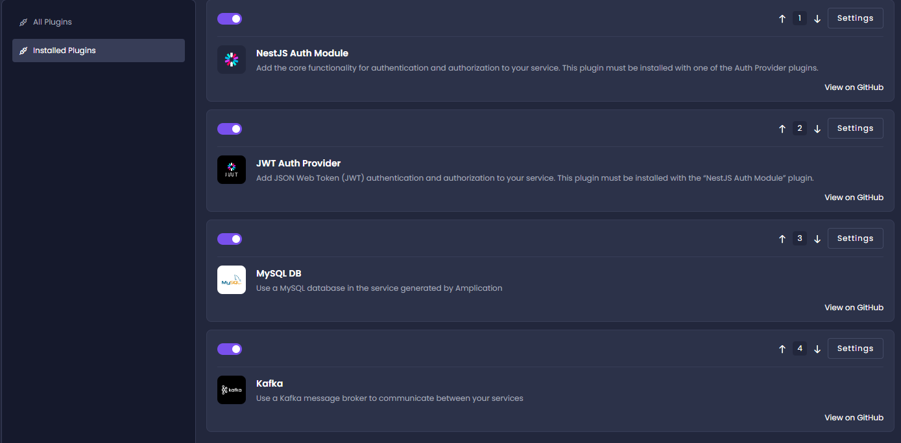

## Overview 
Use plugins to extend the functionality of your generated application.
Some plugins are included in Amplication by default. To add more functionality, you can develop your own plugins, or can use plugins developed by the community, as they become available. 

The published plugins are available on the _All Plugins_ screen.
The installed plugins are shown on the _Installed Plugins_ screen.

## Available Plugins

The following plugins are currently available. Addition plugins will be added in future releases of Amplication.  

#### MongoDB

[MongoDB](https://www.mongodb.com/) is a free and open-source cross-platform document-oriented database program. It is classified as a NoSQL database program, meaning that it does not use the traditional SQL relational database management system. Instead, it uses JSON-like documents with optional schemas to store data.

MongoDB is used to store and retrieve large amounts of data in real-time, and it is often used in situations where high performance and horizontal scaling are required.

#### PostgreSQL

[PostgreSQL](https://www.postgresql.org/) is a free and open-source relational database management system that is designed to be highly scalable, reliable, and powerful. It is known for its ability to handle large amounts of data and a high volume of queries. 

PostgreSQL can handle complex data structures and relationships. It supports a wide range of data types, including arrays, JSON, and XML, and it has robust support for stored procedures, triggers, and views.

#### MySQL

[MySQL](https://www.mysql.com/) is an open-source relational database management system that is widely used in web applications and other software platforms. It is known for its reliability, simplicity, and performance. It is a powerful tool for storing and managing data in a structured and organized way.

#### Kafka

[KafkaJS](https://kafka.js.org/) is a distributed streaming platform, used for building real-time data pipelines and streaming applications. It is a publish-subscribe messaging system that allows for the creation of high-throughput and low-latency systems.

In the Apache Kafka messaging system, processes known as producers write data to Kafka topics, and processes known as consumers read data from Kafka topics.

#### Passport JWT Authentication

[Passport](http://www.passportjs.org/) based JWT authentication involves the client sending a request to the server with a user's credentials in the form of a username and password. The server then authenticates the user and issues a JWT if the credentials are valid. This allows the client to authenticate subsequent requests to the server using the JWT.
Read more about authentication [here](https://docs.nestjs.com/security/authentication). 

#### Passport Basic Authentication

Basic authentication is a simple authentication scheme built into the HTTP protocol that involves sending a request to a server with a user's credentials in the form of a username and password. The credentials are encoded in base64 and included in the Authorization header of the request.

#### Prettier

[Prettier](https://prettier.io/) is an opinionated code formatter that automatically formats your code to ensure adherence to a consistent style. Code is automatically formatted every time it is committed.
 

## Installing plugins
 To install a plugin:
 1. In the _All Plugins_ page, click **Install** for the required plugin. 

2. Go to the _Installed Plugins_ page. The installed plugins are listed. 

3. To see the plugin on gitHub, select **View on GitHub**.

## Order of Plugin Execution

The plugins are executed when Amplication generates code, according to their order on the *Installed Plugins* page. 

If a plugin execution is a prerequisite for another plugin, it must be located earlier in the list.

- To change the order of the installed plugins, click the up or down arrow to the right of the plugin bar.
- To activate or deactivate the plugin, click the toggle switch.

## Creating Plugins

To add more functionality, you can develop your own plugins, or can use plugins developed by the community, as they become available.

See [Plugin Development Overview](https://docs.amplication.com/docs/plugins/Overview/) for more information. 

