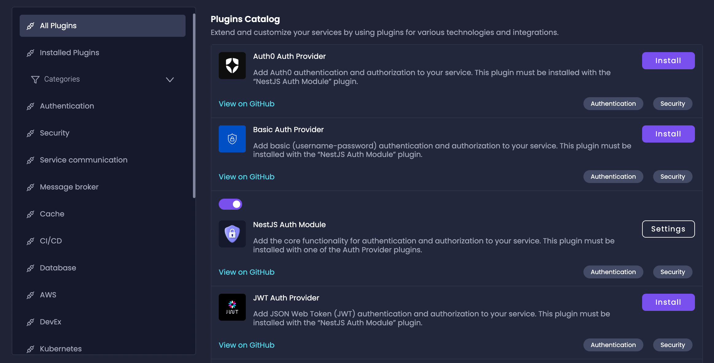
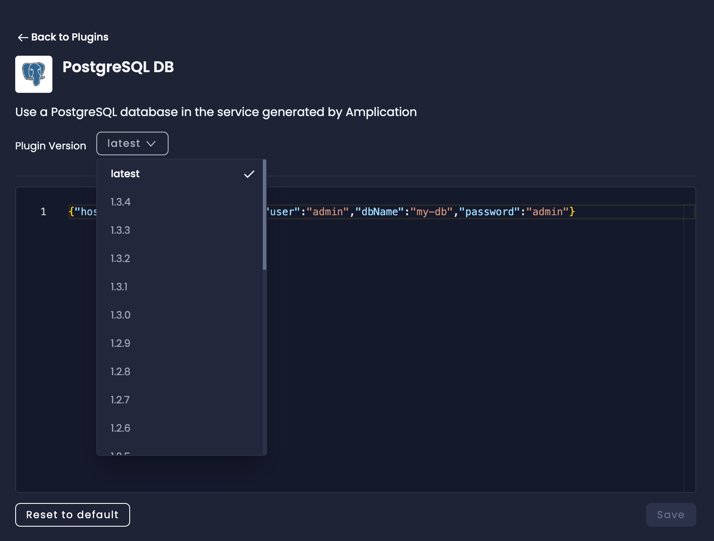

Amplication uses _Plugins_ to extend the functionality of your generated service. These software additions allow developers to customize the default behavior of [Amplication's code generation process](/plugins/plugin-architecture/), providing hooks into various stages of service creation.

Amplication offers a wide range of community plugins that are open-source and available on GitHub.
You can also [develop your own private plugins](/private-plugins/) and [community plugins](/plugins/overview/) to extend Amplication's functionality and have it meet your exact requirements.

You can enable certain plugins when you first create your service.
For example, if you choose MySQL as your database, the _MySQL DB_ plugin will be enabled.
If you choose to turn on authentication for your service, that will enable Authentication-related plugins.

:::tip
[Amplication's AI](/amplication-ai) can help you find new plugins for your service, and even install them automatically, with a single request.

Ask Jovu: `Which plugins do you recommend for adding caching capabilities to my Amplication service?`
:::

## Available Plugins

Amplication supports both Node.js and .NET for code generation. Plugins are technology-specific.

Node.js and .NET services will see a different set of available plugins, each optimized for the chosen stack.

Node.js plugins integrate seamlessly with the Node.js ecosystem and popular frameworks like NestJS. .NET plugins are designed to work with .NET Core and leverage the power of the .NET ecosystem.

## How To Install a Plugin

To see all community-created plugins, first visit the _Plugins_ tab in your Amplication dashboard.

To install an individual plugin:

1. On the left sidebar in the Plugins page, you can browse by _Plugin Categories_ categories like Database, Authentication, and more, or click on _All Plugins_ to see the complete list.
2. Click the **Install** button next to the desired plugin.
3. The plugin's toggle will switch to its _on_ state, indicating it's now active.
4. You can view all your installed plugins in the _Installed Plugins_ tab.
5. To see a plugin's source code on GitHub, select **View on GitHub** next to the installed plugin.

Plugins can be manually enabled or disabled from both the _All Plugins_ and _Installed Plugins_ tabs.

:::tip
Explore different plugin categories to discover plugins that can enhance specific parts of your service, such as database management, authentication, or API functionality.
:::

## How To Uninstall a Plugin

To uninstall, or deactivate, a plugin, click the toggle switch into its _off_ state.

## How To Modify Plugin Execution Order

The plugins are executed when Amplication generates code, according to their order on the *Installed Plugins* page.

:::tip
If a plugin execution is a prerequisite for another plugin, it must be located earlier in the list.
:::

- To change the order of the installed plugins, click the up or down arrow to the right of the plugin bar.

## How To Change a Plugin's Version

Amplication plugin developers may release several versions of a plugin over time.
Sometimes, you might need to generate a project with an earlier version of the plugin, to ensure compatibility.

By default, the latest version of the plugin will be available in the list of plugins.

1. To change the installed version of a plugin, in the **All Plugins** page, click the **Settings** icon.

   The plugin's settings page opens.

   

2. Select the required plugin version from the Plugin version drop-down list and click **Save**.

   In the next build, the code will be generated with the selected plugin version.

:::note
Each version of the Plugin has its own settings, so when you replace the version you also replace its settings.
:::

## How To View Open-Source Plugin Code

All Amplication plugins are open-source and available on GitHub.
You can find the plugin source code for each individual plugin in Amplication's [`plugins`](https://github.com/amplication/amplication-plugins) repository.

Besides the plugins created by the Amplication team and the community, you can [develop your own custom plugins](/plugins/overview/).

## How To Develop a Custom Plugin

To add more functionality, you can develop your own plugins, or can use plugins developed by the community, as they become available.

See [Plugin Development Overview](/plugins/overview/) for more information.
