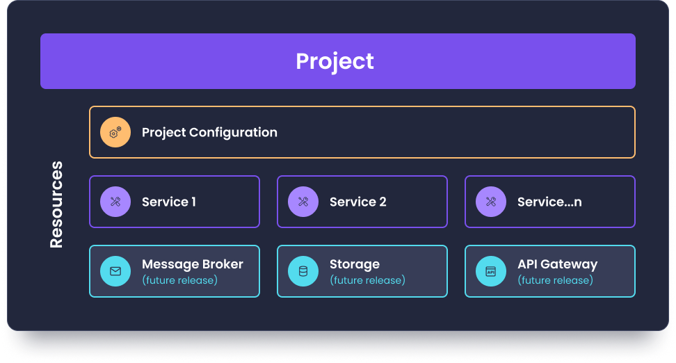

# Understanding Projects, Resources, and Services

Amplication supports for microservices through the introduction of a Project hierarchy.

This article describes **Projects**, **Resources**, and **Services** -  key concepts that drive Amplication’s workflow. 

:::tip 
Parts of the documentation still reflect the previous app-based workflow. We are working to update this.
::: 

## Project
A Project is a hierarchy that groups together multiple Resources that form the building blocks of the development process.

## Resource
A Resource is any element that goes into creating a project with Amplication, such as Project Configuration and Service.
Additional types of Resources to be added in upcoming releases include storage, API gateways, and more.

## Service

In earlier releases of Amplication, Services were known as apps, and the workflow supported the creation of individual and separate apps. Now, with the Project as the framework for the development process, each Project can contain multiple connected Services, enabling support for multiple use cases.

See [Your First Project](https://docs.amplication.com/first-app/) for more information. 
