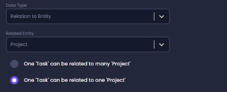

# Entity Relations

Entities in Amplication can have relations to other entities. For example, there is a relation between a **task** and a **project**, where a project can be related to many tasks, and a task can be related to a single project.

## General

Usually, at the database level, a relation is described using a Foreign Key field on one table that references a Primary Key on another table.
In Amplication a relation between entities is described using a named field on both sides of the relation. It is made to allow easy navigation from one side of the relation to the other, especially in graphQL queries.

For example, The relation between a project and its tasks is described by a **Project** field on the **Task** entity, and a **Tasks** field on the **Project** entity.

A **Tasks** field on the **Project** entity:


A **Project** field on the **Task** entity:


## Cardinality

To set the type of relationship between entities (one-to-one, one-to-many, many-to-many), you need to have it set separately on each side of the relation. Each side defines whether it can relate to a single or multiple objects on the other side.



## Creating a Relation

To create a relation you need to create a field with data-type "Relation to Entity" and select the related entity.

At this point, Amplication will automatically generate the other field at the related entity.

By default, the relationship will be created with a one-to-many relationship, and it can be altered as needed.

## Self-relation

A relation field can also self reference its own entity. By doing so, two new fields will be created on the same entity.

For example, a **User** entity can be used to describe a relationship between a manager and employees in the following way:


## Relation fields in your app

Relation fields impact several areas in the generated application:

- Creates fields in the schema.prisma file ([read more here](https://www.prisma.io/docs/concepts/components/prisma-schema/relations))

```typescript
model Task {
  id         String         @id @default(cuid())
  createdAt  DateTime       @default(now())
  updatedAt  DateTime       @updatedAt
  project    Project        @relation(fields: [projectId])
  projectId  String
  estimation Int?
  startDate  DateTime
  status     EnumTaskStatus
  title      String
}

model Project {
  id          String    @id @default(cuid())
  createdAt   DateTime  @default(now())
  updatedAt   DateTime  @updatedAt
  description String?
  dueDate     DateTime?
  name        String?
  startDate   DateTime?
  tasks       Task[]
}

```

- Creates properties in the models and DTO classes

```typescript
@ApiProperty({
  required: true,
  type: ProjectWhereUniqueInput,
})
@ValidateNested()
@Type(() => ProjectWhereUniqueInput)
project!: ProjectWhereUniqueInput;

```

- Creates lookup properties in Input Types

```typescript
@InputType()
class TaskWhereUniqueInput {
  @ApiProperty({
    required: true,
    type: String,
  })
  @IsString()
  @Field(() => String)
  id!: string;
}
```

- Creates queries in the GraphQL resolvers

```typescript
  @graphql.ResolveField(() => Project, { nullable: true })
  async project(
    @graphql.Parent() parent: Task
  ): Promise<Project | null> {
    const result = await this.service
      .findOne({ where: { id: parent.id } })
      .project();

    return result;
  }

```
