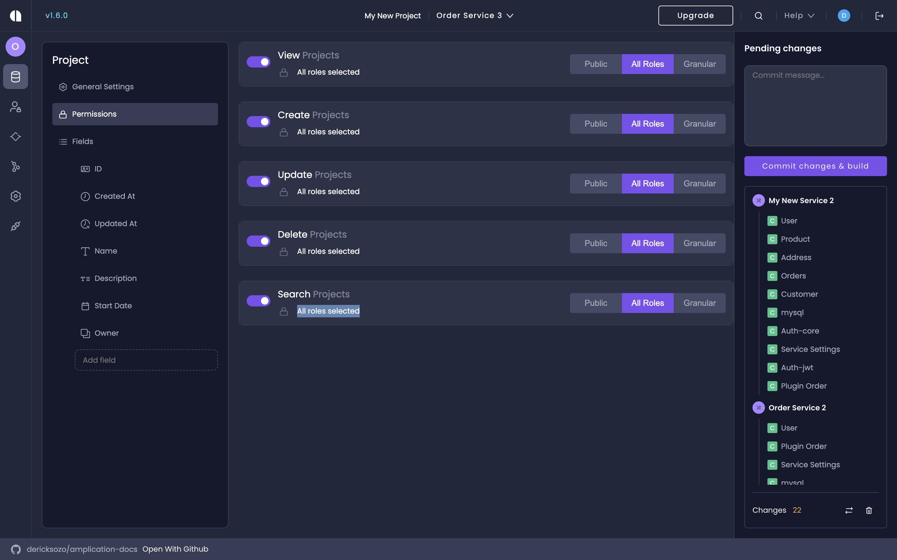
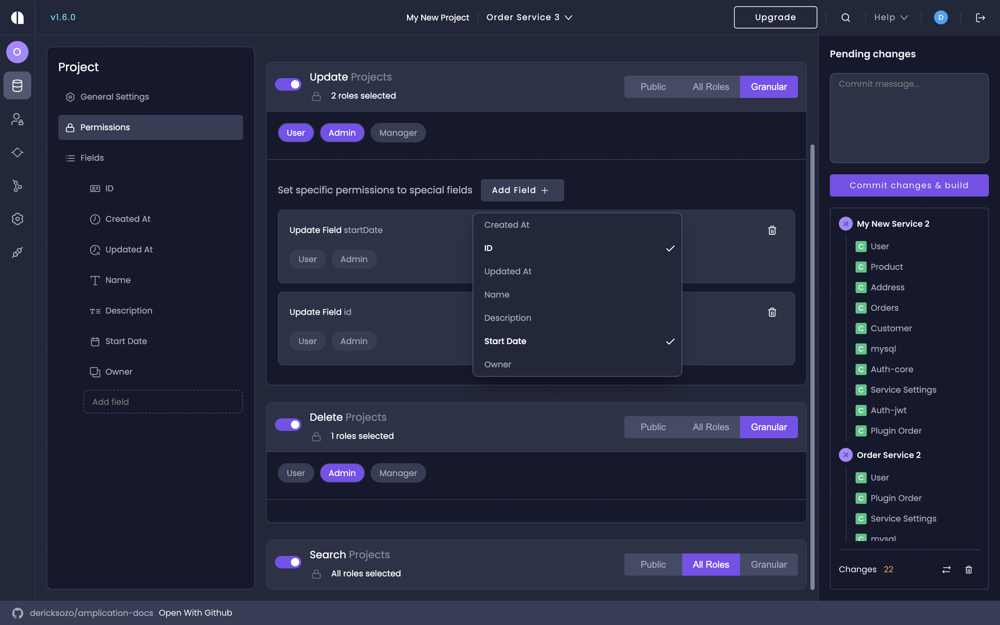
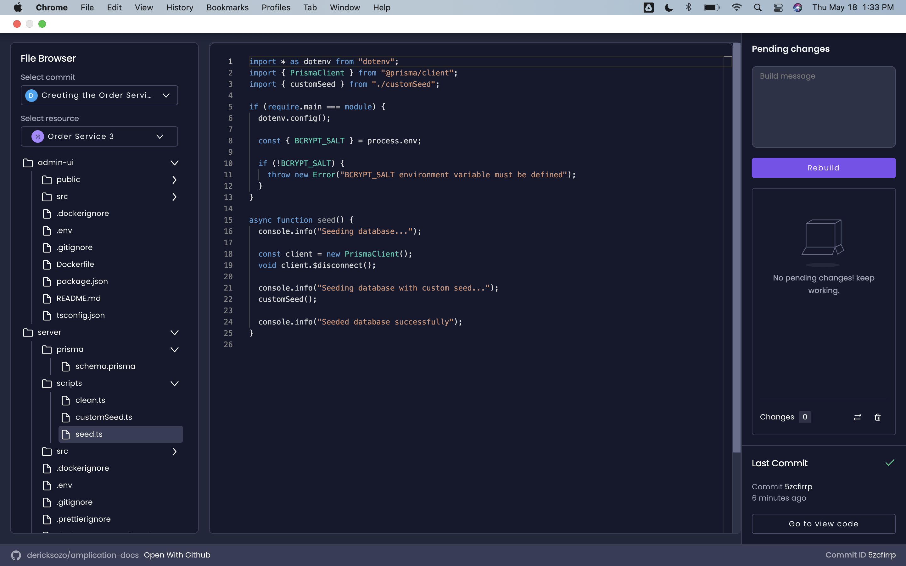
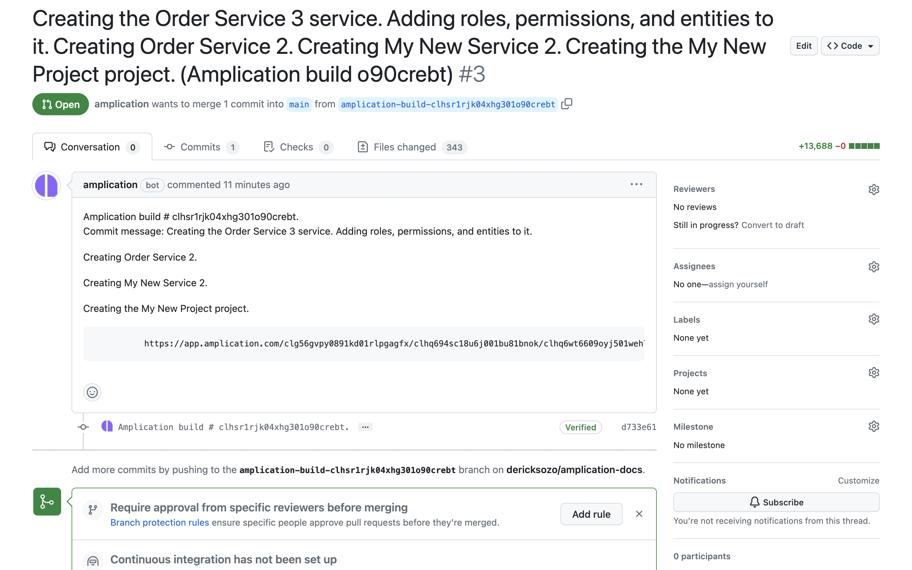

# Set Up Entities, Roles, and Permissions On Your Service

These instructions will walk you through adding entities, roles, and setting permissions on those entities for [your service](/projects-resources-services#service).

Next, you'll also see how to commit changes and manage versions. Finally, you'll learn how to build your app and download the generated source code.

Let's get started.

## Prerequisites

:::info
If you haven't set up your service yet, [create your first service](/first-service/) using our Service Creation wizard.
:::

## Step 1 - Create an Entity

1. On your Service's _Overview_ page, click **Go to Entities**, or from the main menu (left sidebar) click the **Entities** icon.

The _Entities_ page opens. Here you see all the entities in your application.

:::info
When you initially established your service using the service creation wizard, you had the choice to [incorporate entities into your data model](/first-service/#step-6-define-your-data-model) from an Amplication template, or leave it empty.

If you opted not to use a template, you'll find your Entities screen with only one entity, **User**. This entity auto-generated when you created the new service.
:::

In this example, we'll now add another entity called _Project_.

2. Click **Add Entity**.
3. In the _New Entity_ dialog, type `Project`.
4. Click **Create Entity**.

You now have a new entity named _Project_. Notice that the added entity comes with auto-generated values such as “Plural Display Name” and some default fields – **ID**, **Created At**, and **Updated At**.

## Step 2 - Add Entity Fields

To describe your project add some new fields. For this example, we will add the following fields:

- **Name** – for saving the project name
- **Description** – for saving a more detailed description of the project
- **Start Date** – for saving the date on which this project starts
- **Owner** – for assigning a user to be an owner of the project

:::tip
You might find it easier to first add all the fields you want, one after another, and only afterwards set the properties of each field.
:::

### Create the Name Field

1. In the _Entity Fields_ text box (above the list of fields), type “Name”.
2. Click **Add field** (or just press Enter). The new field is added to the list and the field's property panel opens.
3. Click the **Required Field** toggle to configure the _Name_ field as required.
4. Leave the defaults for the other properties (_Searchable_ active, _Data Type_ "Single Line Text", and _Max Length_ "1000".)

:::tip
All changes are saved automatically.
:::

### Create the Description Field

1. In the _Entity Fields_ text box type “Description”.
2. Click **Add field** (or just press Enter). The new field is added to the list and the field's property panel opens.
3. Leave the defaults (_Required Field_ inactive _Searchable_ active, _Data Type_ "Multi Line Text", and _Max Length_ "1000".)

:::info

If the **Searchable** setting is not activated, the search cannot be based on the field. The field visibility is determined by the settings on the **Permissions** tab.

For example, if the customer's email address is visible (permissions set to **All Roles** for search), but the field is not set as **Searchable** the user will be able to search for customers by name, phone, or any other field but not by email address. However, the results will still include the email address.

:::

### Create the Start Date Field

1. In the _Entity Fields_ text box type “Start Date”.

:::info
White spaces are supported, which is useful when you want to enter a descriptive field name. The value is saved as the field’s display name.
In addition to the display name, each field has an auto-generated _Name_ that does not contain spaces or special characters. This name is later used for the API endpoint and in other places in the generated code.
If needed, you can manually change the field name in the field's properties panel.
:::

2. Click **Add field** (or just press Enter). The new field is added to the list.
3. The field's property panel opens. Leave the defaults (_Required Field_ inactive, _Searchable_ active, _Data Type_ "Date Time", and _Time Zone_ "Local Time".)

### Create the Owner Field

1. In the _Entity Fields_ text box type “Owner”.
2. Click **Add field** \(or just press Enter\). The new field is added to the list and the field's property panel opens.
3. Click the **Required Field** toggle to make the _Owner_ field required.
4. Change the _Data Type_ from **Single Line Text** to **Relation to Entity**.
5. In the _Related Entity Id_ field select **User**.

After selecting User, a modal will appear telling you to create the relation to user. The opposite related field on User needs to be created to relate User back to Project.

Click on `Create` and proceed to Step 3.

## Step 3 - Create Roles

1. Click the Roles icon on the main menu (left sidebar) to reach the _Roles_ page. Here you see all the roles in your service.
1. On the _Overview_ page, click **Go to roles**, or from the main menu (left sidebar) click the **Roles** icon.

:::tip
Currently, there's only a default **User** role that was auto-generated when you created the new app.
:::

In this example, we add another two roles: _Admin_ and _Manager_.

1. In the _Type role name_ text box, type "Admin".
2. Click **Add Role** \(or just press Enter\). The new role is added to the list.
3. Repeat these steps to add the "Manager" role.

## Step 4 - Set Access Permissions

In order to allow users to access the entity, we need to set its permissions. To access your service's permissions:

1. On the _Overview_ page, click **Go to Entities**, or from the main menu (left sidebar) click the **Entities** icon.
2. Click the _Project_ entity.
3. In the _Project_ page click the _Permissions_ tab. This opens the Permissions settings.

Permissions can be controlled separately for each of the following actions:

- **View**
- **Create**
- **Update**
- **Delete**
- **Search**

These actions can be set to one of the following:

- **Public** - no authentication is required, so the action is available to all users, not only those with defined roles
- **All Roles** - all roles can perform the action
- **Granular** - only specified roles can perform the action

### Set Entity Permissions

By default, all of the actions are set as **All Roles**.

In this example, some of the actions have been changed to **Public**, while the others remain as **All Roles**

In the following example, we use the **Granular** setting to fine-tune the permissions for a role.

1. By default, all actions (_View_, _Create_, _Update_, _Delete_, and _Search_) are set to **All Roles**.
2. Fine tune permissions by changing the *Delete* permissions from **All Roles** to **Granular** and then select from the displayed roles the _Admin_ role. This ensures that only users with the _Admin_ role can delete projects.

:::tip
Once you have selected **Granular** on an action such as _Delete_, you have to select specific roles, or no one at all can use that action.
:::

### Set Field Permissions

We will now set permissions at the field level.

1.  In the **Update** action, click **+ Add Field** and select the **Start Date** and **ID** fields from the drop-down list.

2. We now select the roles to associate with each selected field.

   In this example, for the _Update_ action, apply **Admin** permissions to the **startDate**, and apply both **Admin** and **Manager** permissions to the **id** field. To do this, you first need to select **Admin** and **Manager** from the roles on this action, so you can apply those roles on the specific fields.

## Step 5 - Commit Your Changes

While working in Amplication your changes are saved automatically, but are not committed. Only committed changes will be included in the next version of your generated application.

In the _Pending Changes_ control in the right sidebar you can see the list of pending changes that are waiting to be committed.

We'll now make our first commit.

In this page, you can see that the creation of the _Project_ entity hasn't been committed.

1. In the _commit message_ dialog, write a description of the changes you're committing. For example: "Added Project Entity and Manager and Admin roles".
2. Click **Commit Changes**. All changes are committed. A build of the first version of your service is automatically created!

:::tip
Use Code View to view and explore the generated code. You can see the updated code before it is synced with GitHub. Click the [View Code](/getting-started/view-generated-code/) icon to view the generated code.
:::

3. After the build process completes, you will see a new pull request created on the GitHub repo you associated with your service. You can review the pull request and after merging the generated code will be in repo [using the folder structure you picked](#step-4-select-your-repo-style) when you created your service.

## You're Done!

Congratulations! You've successfully set up your service, added new entities, roles, and permissions to that service. You saw your generated code and the associated pull request on your repo.

## Next Steps

Now that you know how to create entities, commit changes, and build new versions, let's take it a bit further by adding another entity and learning how to compare changes before committing.

[Building New Versions of Your Service](/building-new-versions/)