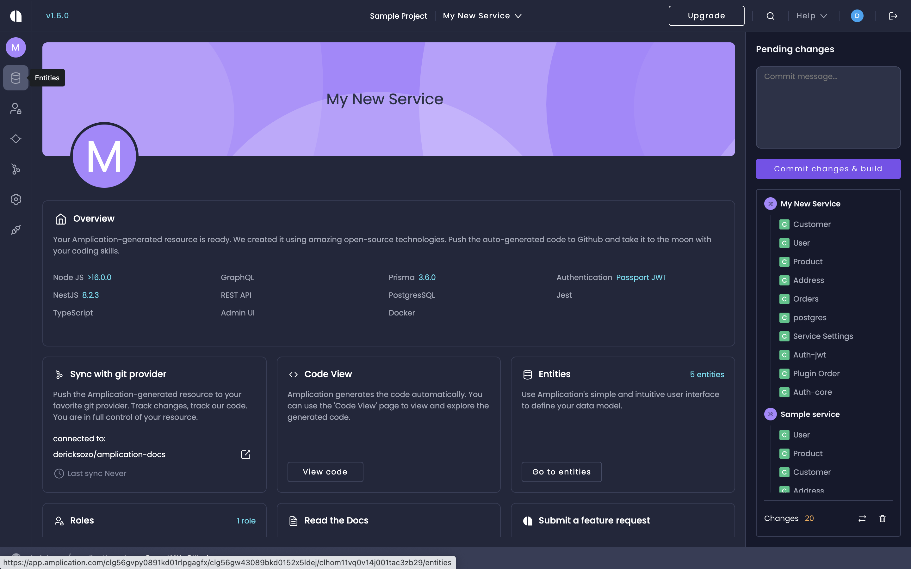
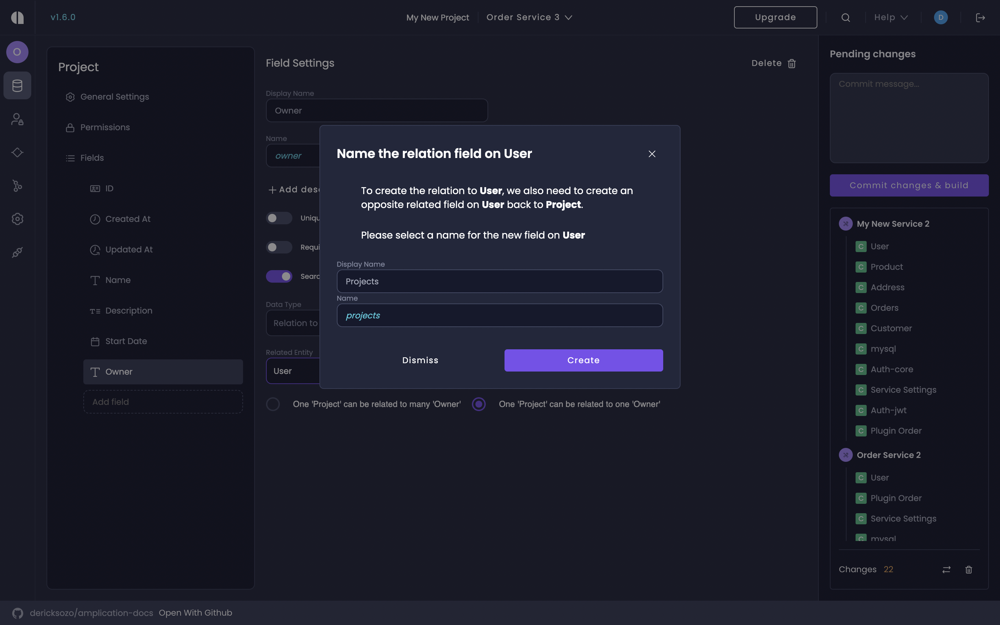

# Set Up Entities On Your Service

One of the core building blocks of Amplication is the data model, known as **Entities**, where your service's data is stored. 
Each entity has a set of fields and properties, and you can also set its relation to other entities.

This introductory guide will walk you through creating and configuring new entities for your service.

Let's get started.

## Prerequisites

:::info
If you haven't set up your service yet, [create your first service](/first-service/) using our Service Creation wizard.
:::

## Step 1: Create an Entity

1. On your Service's _Overview_ page, click **Go to Entities**, or from the main menu (left sidebar) click the **Entities** icon.

The _Entities_ page opens. Here you see all the entities in your application.

:::info
When you initially established your service using the service creation wizard, you had the choice to [incorporate entities into your data model](/first-service/#step-6-define-your-data-model) from an Amplication template, or leave it empty.

If you opted not to use a template, you'll find your Entities screen with only one entity, **User**. This entity auto-generated when you created the new service.
:::

In this example, we'll now add another entity called _Project_.

2. Click **Add Entity**.
3. In the _New Entity_ dialog, type `Project`.
4. Click **Create Entity**.

:::tip
When creating an Entity, **make sure you do not use a reserved name** for the name of the Entity or for any of its fields. Check [our list of reserved names](https://github.com/amplication/amplication/blob/master/packages/amplication-server/src/core/entity/reservedNames.ts) on GitHub.
:::

You now have a new entity named _Project_. Notice that the added entity comes with auto-generated values such as “Plural Display Name” and some default fields – **ID**, **Created At**, and **Updated At**.

## Step 2: Add Entity Fields

To describe your project add some new fields. For this example, we will add the following fields:

- **Name** – for saving the project name
- **Description** – for saving a more detailed description of the project
- **Start Date** – for saving the date on which this project starts
- **Owner** – for assigning a user to be an owner of the project

:::tip
You might find it easier to first add all the fields you want, one after another, and only afterwards set the properties of each field.
:::

### Create the Name Field

1. In the _Entity Fields_ text box (above the list of fields), type “Name”.
2. Click **Add field** (or just press Enter). The new field is added to the list and the field's property panel opens.
3. Click the **Required Field** toggle to configure the _Name_ field as required.
4. Leave the defaults for the other properties (_Searchable_ active, _Data Type_ "Single Line Text", and _Max Length_ "1000".)

:::tip
All changes are saved automatically.
:::

### Create the Description Field

1. In the _Entity Fields_ text box type “Description”.
2. Click **Add field** (or just press Enter). The new field is added to the list and the field's property panel opens.
3. Leave the defaults (_Required Field_ inactive _Searchable_ active, _Data Type_ "Multi Line Text", and _Max Length_ "1000".)

:::info

If the **Searchable** setting is not activated, the search cannot be based on the field. The field visibility is determined by the settings on the **Permissions** tab.

For example, if the customer's email address is visible (permissions set to **All Roles** for search), but the field is not set as **Searchable** the user will be able to search for customers by name, phone, or any other field but not by email address. However, the results will still include the email address.

:::

### Create the Start Date Field

1. In the _Entity Fields_ text box type “Start Date”.

:::info
White spaces are supported, which is useful when you want to enter a descriptive field name. The value is saved as the field’s display name.
In addition to the display name, each field has an auto-generated _Name_ that does not contain spaces or special characters. This name is later used for the API endpoint and in other places in the generated code.
If needed, you can manually change the field name in the field's properties panel.
:::

2. Click **Add field** (or just press Enter). The new field is added to the list.
3. The field's property panel opens. Leave the defaults (_Required Field_ inactive, _Searchable_ active, _Data Type_ "Date Time", and _Time Zone_ "Local Time".)

### Create the Owner Field

1. In the _Entity Fields_ text box type “Owner”.
2. Click **Add field** \(or just press Enter\). The new field is added to the list and the field's property panel opens.
3. Click the **Required Field** toggle to make the _Owner_ field required.
4. Change the _Data Type_ from **Single Line Text** to **Relation to Entity**.
5. In the _Related Entity Id_ field select **User**.

After selecting User, a modal will appear telling you to create the relation to user. The opposite related field on User needs to be created to relate User back to Project.

Click on `Create` and proceed to Step 3.

:::info
The **User** entity will only exist, if you opted into Authentication when you created your service.
Otherwise, you'll have to manually add authentication and create the User entity first.
:::

## Step 3: Visualize Your Entities with ERD View

After you've set up your new entities, fields, and permissions, you can visualize their relationships with [Amplication's ERD view](/erd-view-for-entities).

To activate the ERD view:

1. Navigate back to the Entities page of your service.
2. In the center, to the right of the search bar, you'll find a toggle switch.
3. Activate the toggle to enable the ERD view. 

## Next Steps

Now you know how to create database entities and fields.
Let's take this further by learning how to set roles and permissions on your various entities.

[Configure Roles and Permissions For Your Service](/configure-roles-and-permissions)

:::tip
There's an alternative to manually creating entities and entity fields.
Amplication's [**Import Prisma Schema**](/how-to/import-prisma-schema) feature lets you use your _existing_ databases for a head start on development.
:::
