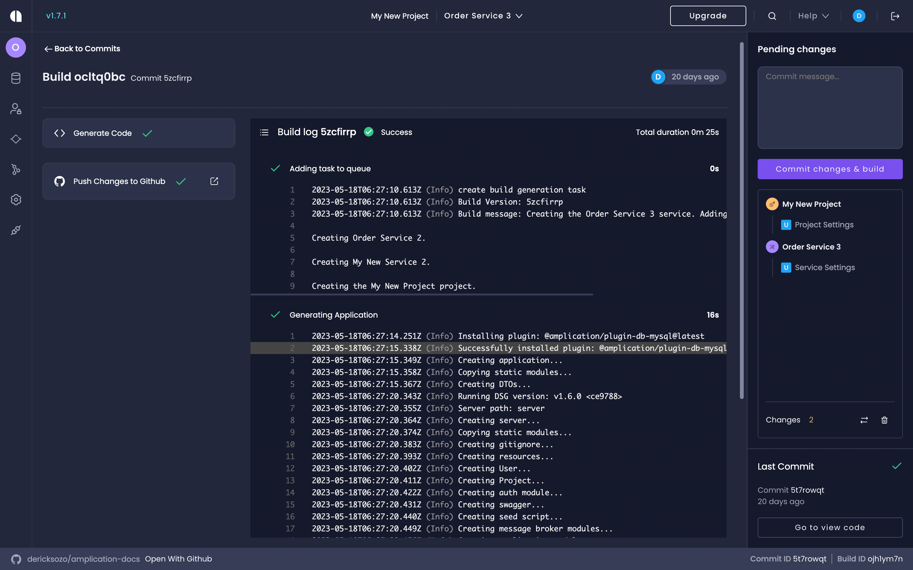

# Smart Git Sync Explained

Amplication provides a powerful feature for Pro and Enterprise plan users called Smart Git Sync (SGS). This feature streamlines the synchronization of any changes made to your preferred Git repository.

SGS does this by creating a `amplication` branch that contains all new commits generated by changes and additions on your Amplication project.

On this page, you'll learn how Amplication's _Smart Git Sync_ feature works from the Git provider's perspective. You will understand how Amplication manages your branch, creates commits, and initiates pull requests.

Let's get started.

## Advantages

The primary advantage of using Smart Git Sync is its ability to simplify the process of resolving merge conflicts on each build. This feature enhances the user experience and streamlines work with Amplication.

:::important
If you're on the [Free Plan](/sync-with-git-differences-between-plans), Amplication will create multiple `amplication` branches and pull requests for each commit. The format will be `amplication-build-{id}`.
:::

## How Smart Git Sync Works

When you perform a new build on your Amplication project, Smart Git Sync automatically triggers the creation of a commit on the `amplication` branch.

:::note
Amplication supports both [GitHub](/sync-with-github) and [Bitbucket](/sync-with-bitbucket) as git providers.
:::

This commit encompasses all the files that were added, removed, or changed since the last build.

### Step-by-step breakdown

1. You make changes in your Amplication project. This could range from adding a new resource to modifying an existing one.
2. When you're ready, you perform a new build on the project.
3. Smart Git Sync springs into action. It identifies all the files that have been altered since the last build.
4. It then creates a commit on the `amplication` branch, including all these changes.

For example, let's say you've just added a new _Task_ entity to your project. Once you build the project, Smart Git Sync will create a commit on the `amplication` branch that includes all the files related to the _Task_ entity.

This method ensures that every single change you make in your Amplication project is automatically tracked and committed to the `amplication` branch in your Git repository. You can then easily review and merge these changes through pull requests.

:::important
Do not delete the `amplication` branch from your repository. Deleting this branch will trigger its recreation, and the following pull request will result in a merge conflict. After resolving the merge conflict in the first pull request, you can proceed normally, as subsequent PRs won't create conflicts in the same area.
:::

## The `amplication` branch

Amplication integrates with your repository through a single long-lived branch named `amplication`. This branch serves as the target location for all commits made by Amplication. The creation of a new resource or a change to an existing one will trigger a corresponding commit containing these changes.

Users can merge Amplication-made changes by merging pull requests created by Amplication from the `amplication` branch to the user repository's default branch.

The SGS supports three cases for creating an 'amplication' branch in your repository:

1. **Create Repository**: When a user creates a repository, an 'amplication' branch is made from the repository's `default` branch.

2. **Select Repository**: The existence of an 'amplication' branch is checked. If the branch exists, it's reset, and a new 'amplication' branch is created from the repository's default branch. If the branch doesn't exist, an 'amplication' branch is created from the repository's default branch.

3. **Existed Repository/Deleted Branch**: If a commit is made and the repository lacks an 'amplication' branch, the 'amplication' branch is created from the repository's default branch.

:::important
Avoid modifying the `amplication` branch. This includes both creating new commits and merging changes from other branches into the 'amplication' branch. Any such action may cause bugs and behavioral inconsistencies, as Amplication will not override or modify the same areas that you changed. To fix this, you will need to delete the 'amplication' branch and resolve the merge conflict in the next PR.
:::

## The Build Log

Every time a build process is completed in Amplication, Smart Git Sync produces a build message that provides valuable insight into the actions taken during the build. These build messages are automatically included in the commit messages in your Git repository.

### Understanding Build Messages

A build message primarily indicates the nature of the changes made to the project, helping you understand the purpose of each commit. The build message is added as a commit message on the 'amplication' branch following the pattern `[Service Name]_[Commit Message]`.

For example, let's say you've added a new "Orders" service in your project and initiated a build. The resulting commit message could be something like `Orders_New service added`.

This build message allows anyone reviewing the commit to quickly grasp the significant changes that occurred during this build.

## Commit Messages and Pull Requests

Amplication handles commit messages and pull requests in a manner that promotes clarity and efficient tracking of changes.

If there isn't an open pull request from the 'amplication' branch when a commit is made, Amplication will automatically create one. The title of this pull request and the commit message both come from the input you provide in the commit message box in Amplication's pending changes section.

Additionally, the build message includes a link back to your build in Amplication, presented in a codeblock. Clicking this link will take you back to Amplication to see the build log for this specific commit, offering you a comprehensive overview of the changes that were made during the build.

## Conclusion

Smart Git Sync is a powerful feature that simplifies the integration between Amplication and your Git repository. It automatically tracks and commits changes to a dedicated `amplication` branch. This significantly reduces the manual effort and enhances productivity. Whether you're adding a new resource or making a change to an existing one, Smart Git Sync ensures that all changes are systematically tracked, committed, and easy to review.