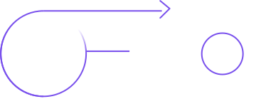
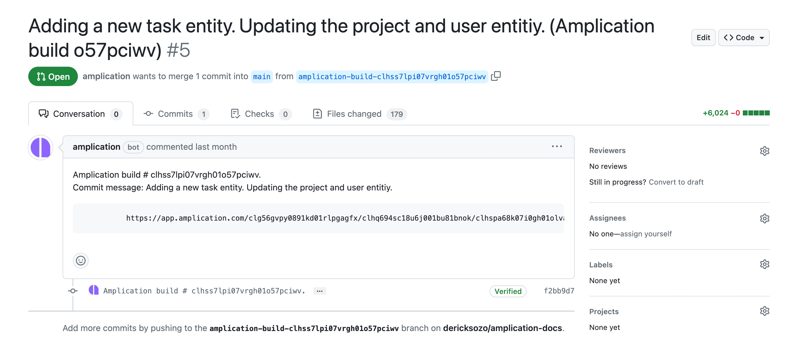

# Smart Git Sync Explained

Amplication provides a powerful feature known as _Smart Git Sync_ for syncing the code produced from your project with a git repository.

Smart Git Sync automatically synchronizes any changes made on your project to your preferred git repository.
This is achieved by creating an `amplication` branch that contains all new commits generated by changes and additions on your Amplication project.

Amplication offers _Smart Git Sync_ for everyone including Free and Enterprise plan users.

On this page, you'll learn how Smart Git Sync works.
You will understand how Amplication manages the `amplication` branch on your repo, creates commits, and initiates pull requests.

## How Smart Git Sync Works

The primary advantage of using Smart Git Sync is its ability to simplify the process of resolving merge conflicts on each build. This feature enhances the user experience and streamlines work with Amplication.

When you perform a new build on your Amplication project, Smart Git Sync automatically triggers the creation of a commit on the `amplication` branch.

:::note
Amplication supports [GitHub](/sync-with-github), [Bitbucket](/sync-with-bitbucket), [AWS CodeCommit](/sync-with-aws-codecommit), and GitLab as git providers.
:::

This commit encompasses all the files that were added, removed, or changed since the last build.

### Step-by-step breakdown

1. You make changes in your Amplication project. This could range from adding a new resource to modifying an existing one.
2. When you're ready, you perform a new build on the project.
3. Smart Git Sync springs into action. It identifies all the files that have been altered since the last build.
4. It then creates a commit on the `amplication` branch, including all these changes.

For example, let's say you've just added a new _Task_ entity to your project. Once you build the project, Smart Git Sync will create a commit on the `amplication` branch that includes all the files related to the _Task_ entity.

This method ensures that every single change you make in your Amplication project is automatically tracked and committed to the `amplication` branch in your Git repository. You can then easily review and merge these changes through pull requests.

:::warning
After the Amplication build completes, review the PR, resolve any conflicts, and merge it. **Keep the `amplication` branch and avoid deleting it**.
:::

## The `amplication` branch

Amplication integrates with your repository through the `amplication` branch.
This branch will contain all commits made by Amplication.
After clicking on **Commit Changes & Build** in the right sidebar on your project's dashboard, Amplication will trigger a commit to the amplication branch containing all your changes.

When a user creates a repository, an 'amplication' branch is made from the repository's `default` branch.

For example, Amplication will base the `amplication` branch from `main` if your default branch is `main`.

You can merge Amplication-made changes by merging pull requests created by Amplication from the `amplication` branch to your repository's default branch.

:::note
Refrain from modifying the `amplication` branch directly. Creating new commits or merging changes from other branches can introduce bugs and inconsistencies. In case of conflict, delete the `amplication` branch and resolve the merge conflict in the next PR.
:::

## Commit Messages and Pull Requests

Every time a build process is completed in Amplication, Smart Git Sync produces a build message that provides valuable insight into the actions taken during the build. These build messages are automatically included in the commit messages in your Git repository.

Amplication handles commit messages and pull requests in a manner that promotes clarity and efficient tracking of changes:

- If there isn't an open pull request from the `amplication` branch when a commit is made, Amplication will automatically create one.
- The title of this pull request and the commit message both come from the input you provide in the commit message box in Amplication's pending changes section.

:::note
Amplication will generate a default message for your commit if you don't input a message into the pending changes input box.
:::

Additionally, the first comment on the pull request includes a link back to your build in Amplication.
Visiting this link will take you back to Amplication to see the build log for this specific commit, offering you a comprehensive overview of the changes that were made during the build.

## Conclusion

Smart Git Sync is a powerful feature that simplifies the integration between Amplication and your Git repository. It automatically tracks and commits changes to a dedicated `amplication` branch. This significantly reduces manual effort and enhances productivity. Whether you're adding a new resource or making a change to an existing one, Smart Git Sync ensures that all changes are systematically tracked, committed, and easy to review.

## Next Steps

Learn how to sync your service with your preferred git provider:

- [Sync With GitHub](/sync-with-github) (Free, Enterprise)
- [Sync With Bitbucket](/sync-with-bitbucket) (Enterprise)
- [Sync With AWS CodeCommit](/sync-with-aws-codecommit) (Enterprise)