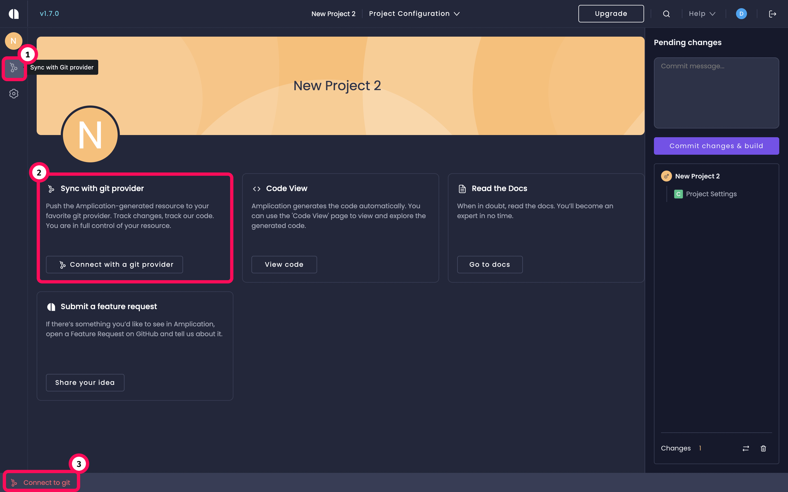
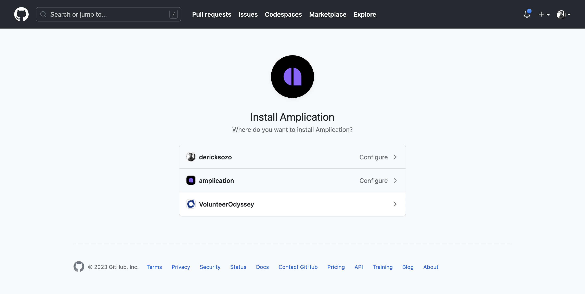
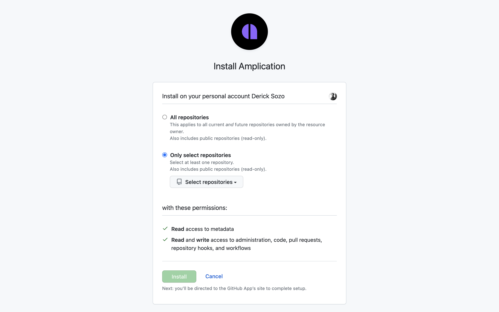
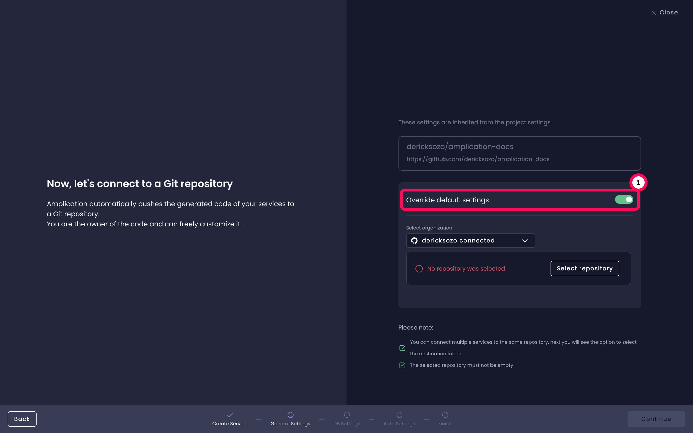
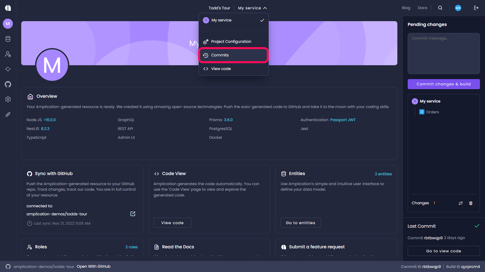
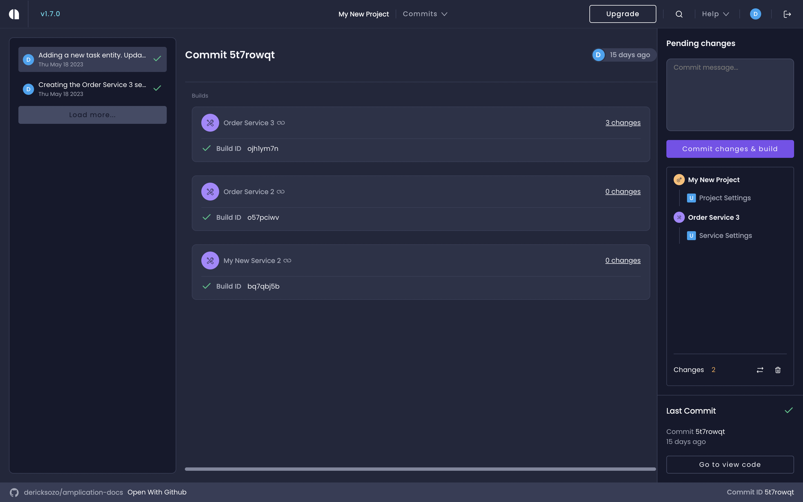
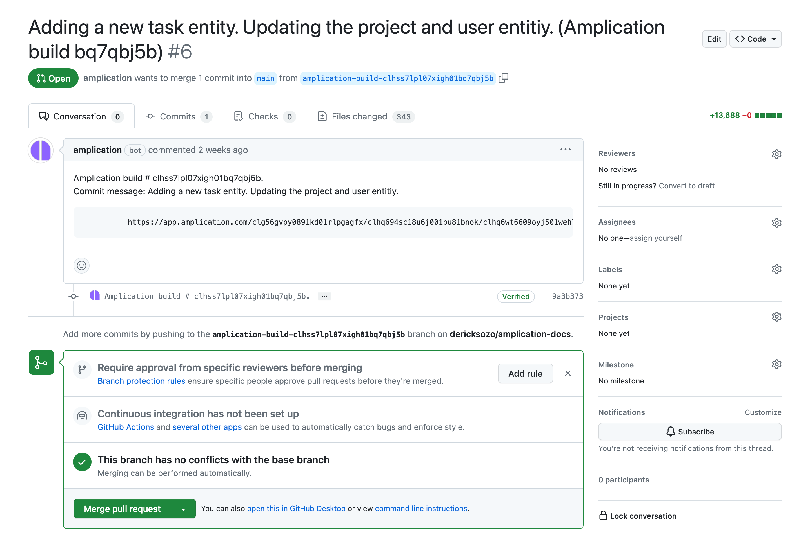
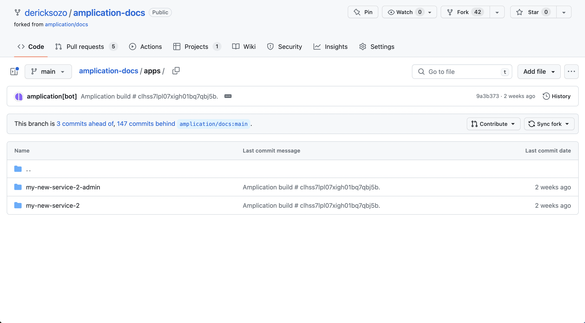

# Sync with GitHub

Amplication can seamlessly synchronize with GitHub.
Your application's auto-generated code gets pushed to a GitHub repository of your choosing.
You get full control of your project and can easily track the code generated by Amplication.

This page provides you with everything you need to work with GitHub. You'll learn how to do the following:

- [Authorize GitHub](#authorize-amplication-to-access-github)
- [Connect to a specific GitHub repository](#select-your-repository)
- [Change git providers for a specific service](#change-your-services-connected-git-provider)

You'll also learn how Amplication manages your repo from GitHub's side.

- [The _amplication_ branch](#the-amplication-branch)
- [How Amplication creates pull requests on your branch](#merging-amplications-pull-request-into-your-branch)
- [Commits and commit messages](#the-commit-message)

Let's get started.

## Prerequisites

If you are running Amplication locally, you should first read [Connect Amplication server to GitHub](/running-amplication-platform/connect-server-to-github). It'll show you how to configure the server to work with a new GitHub application.

## Authorize Amplication to access GitHub

Before you can integrate your application with GitHub, you need to authorize Amplication to get access to your GitHub account.

:::important
This is separate and distinct from logging in with GitHub on [Amplication's login page](https://app.amplication.com/login).
:::

When you [create a service](/first-service/) on a project for the first time on Amplication, you have the option of selecting your preferred git provider.

If you haven't connected a git repo to your service yet, go to your project's dashboard. You'll need to go to the _Sync with Git Provider_ page. There are 3 ways to do this:

1. Click _Sync with git provider_ on the sidebar.
2. Click on the _Sync with git provider_ tile on your project's dashboard.
3. Click _Connect to git_ on the footer at the bottom of the page.

You're now on the _Sync with Git Provider_ page.
Proceed with the following steps to connect a GitHub repository to your service:

1. Click on the `Select organization` dropdown.
2. Click on the `Add Organization` button at the bottom of the dropdown.
3. Click on the `Connect` button for GitHub that appears in the _Select Git Provider_ modal.

:::important
If you're already connected to GitHub, you can either add another GitHub organization or select an account you connected previously.

You can then go to [selecting your repository](#select-your-repository).
:::

## Install Amplication's GitHub App

Now the _Install Amplication GitHub App_ page opens.
Select your preferred account or organization on GitHub.

### Set Amplication's Configuration Settings

After selecting your preferred account or organization, you'll be led to the configuration page.
You can configure the GitHub App to only allow access specific repositories in your account, or allow Amplication to access all of your repositories.

After selecting your repositories, click on the `Next` button.
You'll be brought back to Amplication.

## Select Your Repository

You'll see a modal appear with a populated list of repositories based on your configuration settings from above.

:::note
If you connect a personal GitHub account you can only sync to existing GitHub repositories.
Only if you connect to an organization can you create a new repository via Amplication.
:::

## Change Your Service's Repository

A project can have many services.
The GitHub repository you chose when creating the initial service for the project will be set as the default repository for the project.
Each new service you create will inherit the repo settings from the project settings.

But, it's possible to override these settings for each individual service.
To do this when you're creating a service, turn on the `Override default settings` toggle [during the Git Provider selection step](/first-service/#step-2-connect-your-github-repository).

[The repository selection modal](#select-your-repository) will appear again.
You can select a new repository based on [the configuration settings](#set-amplications-configuration-settings) you set for Amplication's GitHub App.

## Change Your Service's Connected Git Provider

Besides changing your selected GitHub repository, you can change your git provider to Bitbucket. See the [Sync with Bitbucket](/sync-with-bitbucket/) page.

## Create a new Pull Request

To make a new pull request, first make a change in your application and click the `Commit changes & build` button on the right side panel.

:::tip
For an example of changes you can make to your service, see [Building New Versions of Your Service](/building-new-versions/).
:::

To view your previous commits for a project, select the drop down at the top of the page, and click `Commits`.

You'll now see a list of your commits for the project.
You can go to a specific commit by clicking on it in the sidebar.
Each commit will contain changes, if any, for all services.

Now click on the specific service that you're interested in seeing the build for.
A build contains a log of all the updates and changes that were made to that specific service during that commit.

To view the Pull Request in GitHub, select the most recent commit and click `Open With GitHub` in the footer.

You can now view the code changes generated by Amplication, and merge them.

Now let's review what happens from GitHub's side when Amplication generates a new Pull Request on your repository.

## Merging Amplication's Pull Request into your branch

Amplication triggers the creation of a commit on the changed files whenever a new build is performed on a project.
The changed files are all the files that were added, removed, or changed from the last build.

Amplication reduces the chances of user changes being overridden by interacting with the user’s repository through an `amplication` branch. This branch is created in your selected repository by Amplication's GitHub App.

:::important
If you're on the [Free Plan](/sync-with-git-differences-between-plans), Amplication will create multiple `amplication` branches and pull requests for each commit.
The format will be `amplication-build-{id}`.

If you're on the paid plan, Amplication will instead manage all commits on a single branch called `amplication`.
:::

Let's review what's happening here in its entirety.

## The `amplication` branch

Users can merge Amplication-made changes by merging pull requests created by Amplication from the `amplication` branch to the user repository's default branch.

## The commit message

The title of the pull request and the commit message will both come from the message you enter into the commit message box in Amplication's pending changes section.

Also included is a direct link to your build.
It will take you to the specific build log for this commit on Amplication.

## Merging your pull request

After clicking on `Merge`, you can safely delete this branch. You can then navigate back to your main branch where you will find your Amplication code.

## Next Steps

Now you're more familiar with how the pull request process works with Amplication and GitHub.

There are differences between the free plan and the paid plan for Amplication's Sync with GitHub feature. [Learn more](/sync-with-git-differences-between-plans) about them here.
