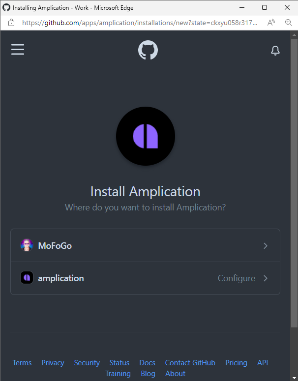
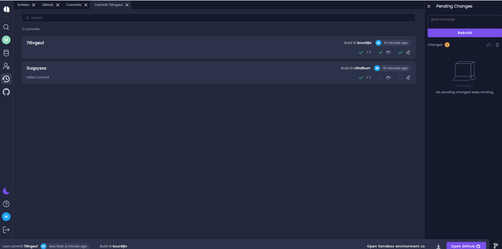

# Sync with GitHub

Amplication can push the code of your app to a GitHub repository. It will provide you with full control on your app, and will also allow you to easily track the changes and the code generated by Amplication.

## Overview

- For every commit you create in Amplication, it will push a new Pull Request to your GitHub repository with the updated code.
- You will always have the choice how and if to merge the changes to your branch.
- The pull request will be created in a new branch, with the default branch of your repository (usually **master** or **main**) as a base.
- The code from Amplication will be created relatively to the root of the selected repository.
- The selected repository must not be empty, so please create at least one file in the root folder.

If you want to create a new repository in GitHub, you can do so [here](https://github.com/new). Select **Initialize this repository with a README file** to make sure the new repository is not empty.

:::info
If you are using the hosted service on https://app.amplication.com, you can continue with this article. 

In case you are hosting a local Amplication server, you should first follow [this guide](/docs/connect-server-to-github) in order to configure the Server to work with a new GitHub application.
:::

## Authorize Amplication to access your GitHub account

Before integrating your application with GitHub, you need to authorize Amplication to get access to your GitHub account.

1. Click the **Dashboard** icon in the main menu.
2. Click the **Connect to GitHub** icon. 

:::note
If this is the first time that you have connected to GitHub, the **Connect to GitHub** button is displayed. 
If you have already connected to GitHub, you will be prompted to choose the installed organization. If several organizations are configured, you will be prompted to select the required organization. 
:::

3. Click **Connect to GitHub**
The _Install Amplication Github App_ opens. 

4. Select the GitHub account you want to use.
5. In the new window, select on which repositories you want to install the app.

:::note
Currently, only by connecting to an organization can you create a new GitHub Repository. A User can sync only with an existing repository. 
:::

## Create a new Pull Request in GitHub

Amplication will automatically push a new Pull Request to your GitHub repository, every time you commit your changes.

1. To test the process, make a change in your application and click  the **Commits** icon  to open the commit page.

2. To view the new Pull Request in GitHub, select the most recent commit and  click **Open GitHub**.

3. You can now view the code changes generated by Amplication, and merge the changes.

## Learn more

- [How to add custom code to your application](/docs/how-to/custom-code)
