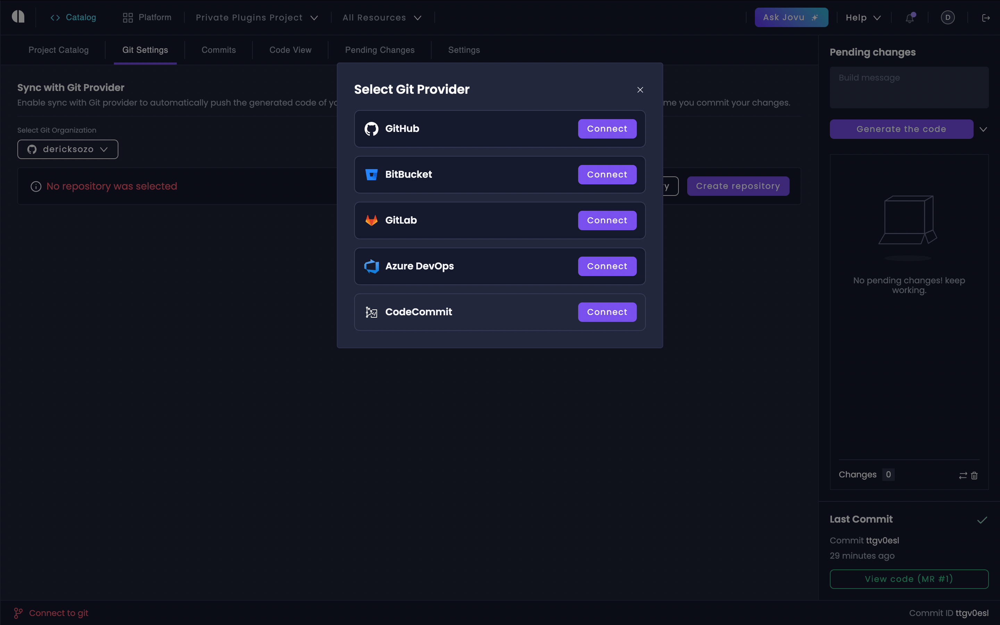
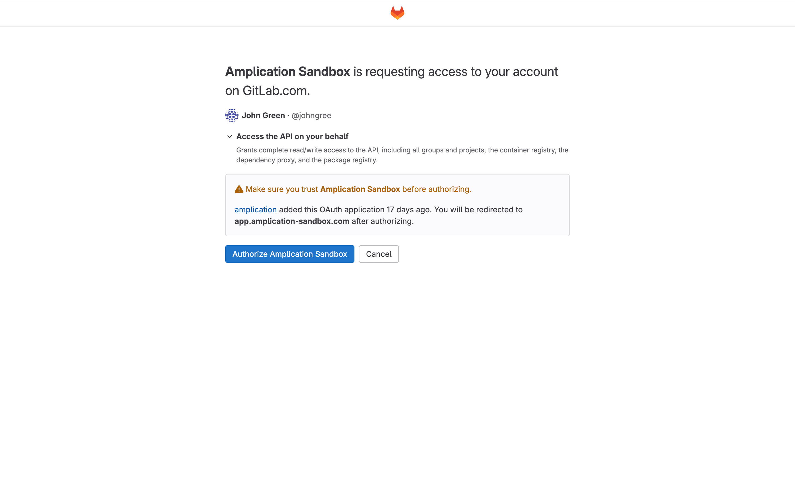
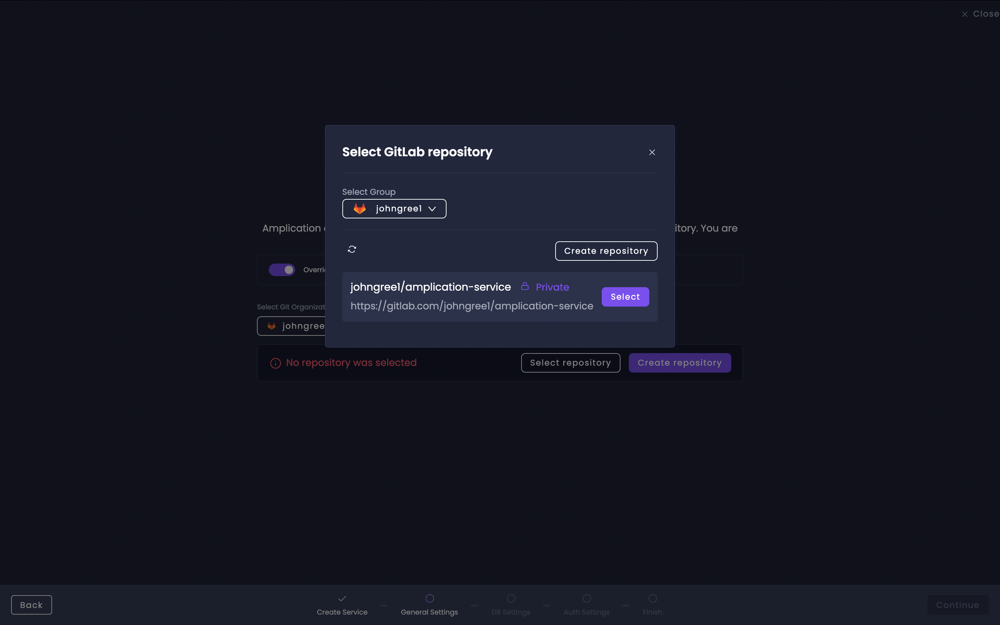
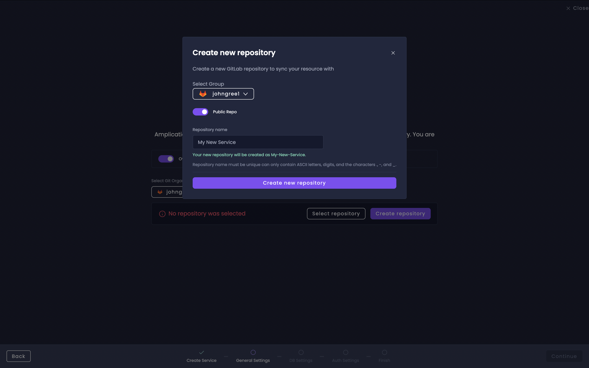
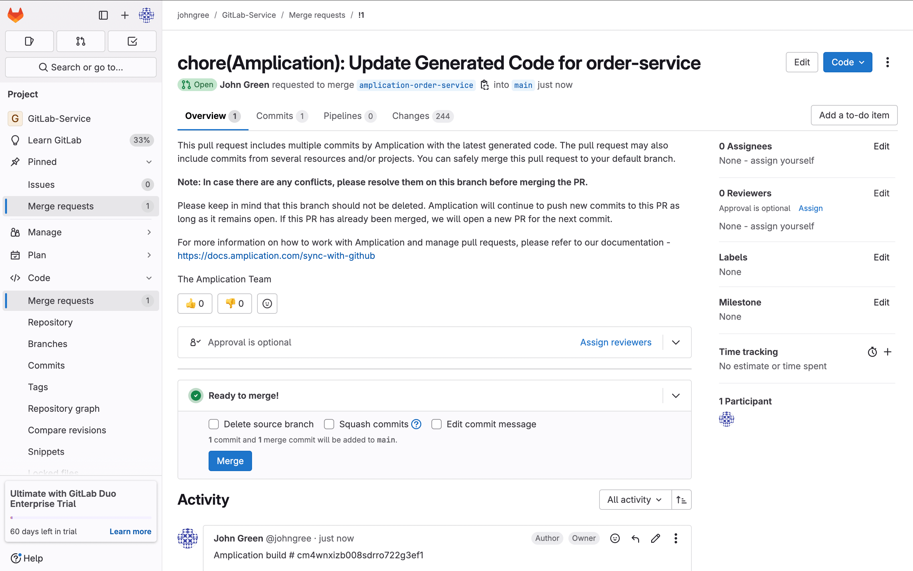
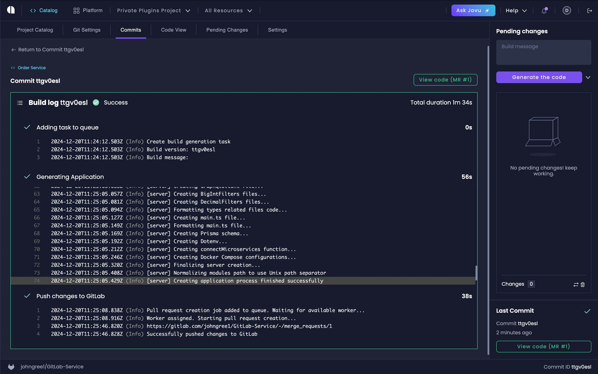

# Sync with GitLab

Amplication provides seamless integration with GitLab repositories, enabling automated code synchronization for your services. This integration allows you to maintain full control of your generated code with GitLab's version control features.

## Add GitLab Organization

Follow these steps to add your GitLab organization:

1. Navigate to the [Service Catalog](/service-catalog)
2. Select the **Git Settings** tab
3. Click **Change Repository** if a repository is already connected
4. Open the **Select Git Organization** dropdown
5. Choose **Add Organization**
6. Select GitLab from the provider list

## Authorize GitLab Access

When you select GitLab, you'll be redirected to GitLab's authorization page. Here you'll grant Amplication the necessary permissions to interact with your repositories.

## Configure Repository

After authorization, you'll have two options for repository setup:

### Option 1: Select Existing Repository

Choose from your available GitLab repositories in the repository selection modal.

### Option 2: Create New Repository

Click the "Create repository" button to set up a new GitLab repository.

## Service-Specific Repository Settings

Amplication provides two levels of Git configuration:

- **Project-level Git Settings**: Located in the Service Catalog's Git Settings tab, this controls the default repository settings for all services in your project
- **Service-level Git Settings**: Found within each individual service's settings, this allows you to override the project-level configuration for specific services when needed

When you override the project settings for a service, that service will maintain its own independent Git configuration separate from the project defaults.

To configure Git settings for a specific service:

1. Access your service from the Service Catalog
2. Navigate to the service's Git Settings page
3. Toggle **Override project settings**
4. Follow the repository setup steps to configure a service-specific repository

## Create Merge Requests

To push your changes to GitLab:

1. Make your desired changes in Amplication
2. Access the pending changes sidebar in your service catalog
3. Click "Generate the code" to initiate the build process

## View Commits and Builds

To track your changes:

1. Go to your Service Catalog
2. Click on the Commits tab
3. View all your builds and their corresponding merge requests

:::important
Do not delete the `amplication` branch. This branch is essential for Amplication's synchronization process.
:::

## Next Steps

Learn more about Amplication's Git integration features:

- Branch management strategies
- Merge request workflows
- Conflict resolution

Visit our [Smart Git Sync](/smart-git-sync) documentation for detailed information.