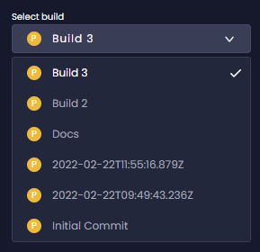
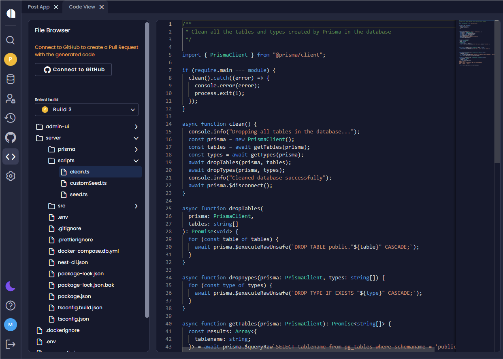

# Viewing Generated Code

Use  **Code View** to view and explore the generated code. You can see the updated code before it is synced with GitHub or downloaded. 

:::note
- Graphic files are not visible with _Code View_.
- You cannot edit files with _Code View_.
:::

On the _Overview_ page, click **View Code**, or click the **Code View** icon on the menu.

Then, select a build from the **Select build** list. 

  

:::note
- The default build is the last one you created.
- You can create a new build even if you have not made any changes.
-  _Code View_ does not support builds created in earlier Amplication versions, before the feature had been introduced. 
:::

If you navigate to the required file. The code is displayed. 

   

