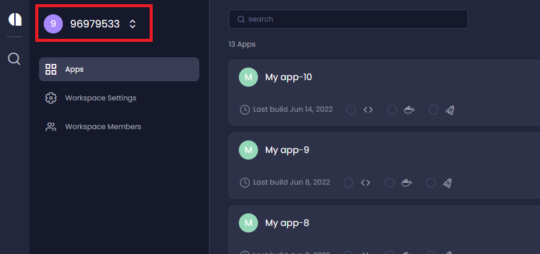
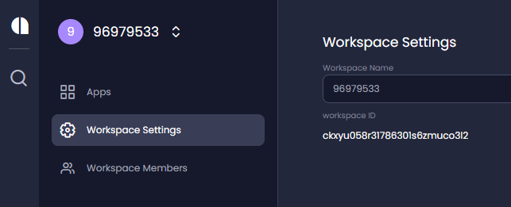
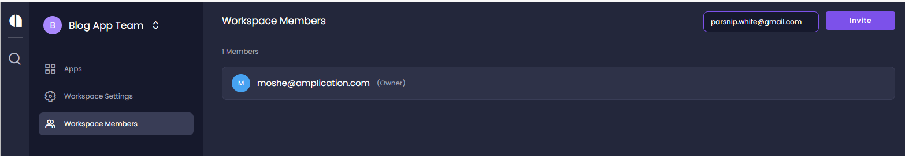
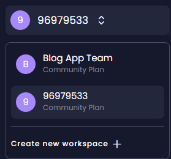
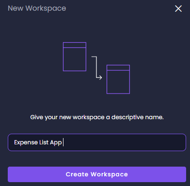

# Managing the Workspace 

## Overview

Workspaces help you manage your projects by enabling  selected team members to work on specific apps.

Every app you create in Amplication is associated with a workspace.
The name of the workspace is displayed in the top left of the workspace window. 

When you create your first app, by default it is associated with a workspace with a generated name.
Each subsequent app that you create will be associated with that same workspace, unless you add a new workspace and create the app within that new workspace. 

## Changing the title of the workspace
To change the name of the workspace, click **Workspace Settings** and type the new name in the _Workspace Name_ field. 

:::info
The _workspace ID_  cannot be edited. It is used for internal purposes only, such as when debugging the app. 
:::

## Adding and removing members from the workspace
Inviting members to the workspace gives them access to apps included in the workspace. 

#### To add a member to the workspace:

1. Select **Workspace Members**.

2. Enter the new member's email in the field next to the **Invite** button, then click **Invite**. 

    An invitation is sent to the prospective member, and the member is added to the list with the status _Pending_.

    The prospective member receives the invitation email and clicks **Accept Invitation** to confirm. 

#### To remove a member from the workspace:

Click the trashcan icon to the right of the member. 

## Creating a new workspace 
You can add more workspaces and assign different members to work on the different app projects.
When you create a new app, it will be part of the currently selected workspace. 

1. To create a new workspace, click on the current workspace name at the top left of the window, then click **Create new workspace** from the drop-down list.
 

2. Enter a name for the new workspace and click **Create Workspace**.

:::note
You cannot move apps from one workspace to another.
::: 