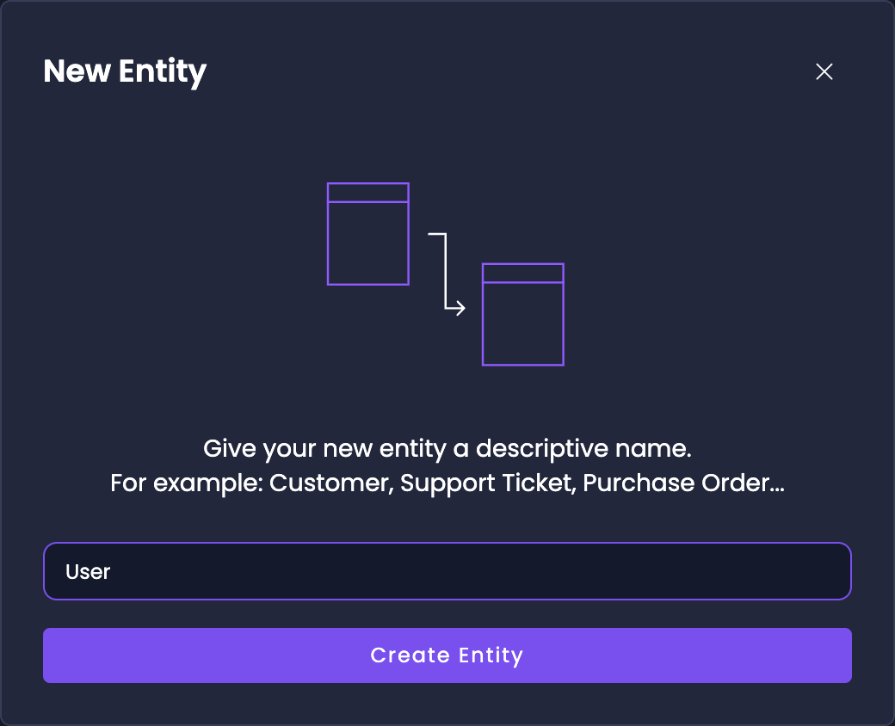
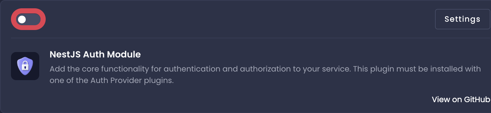
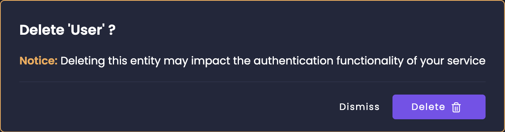
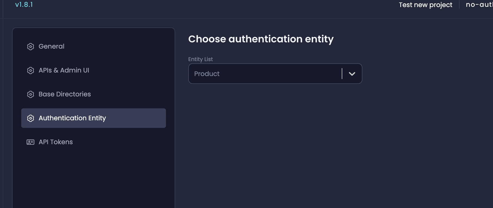

# The Authentication Entity

The _Authentication_ entity is essential for the proper functioning of the authentication plugins in Amplication. It **is required** in order for you to enable authentication on your service.

If you choose to [create a service _without_ authentication](/authentication/#how-to-create-a-service-without-authentication) then the _Authentication_ entity will not be created.

:::note
The User entity is the default Authentication entity in Amplication. Amplication automatically creates the User entity or suggests creating it with all the required fields when installing an authentication plugin.

However, you can choose to use your own custom Authentication entity as long as it has the required fields (see below).
:::

## Dependencies Between the Authentication Entity and Authentication Plugins

The authentication plugins rely on the existence of an _Authentication_ entity to handle user authentication and authorization. For Node.js services, this includes the _NestJS Auth Module_ and others. For .NET services, this includes the ASP.NET Core Identity plugin.

If the _Authentication_ entity is not defined or is missing the required fields, the build process will fail, and the authentication plugins will not function correctly.

It's important to ensure that the Authentication entity is properly defined with the necessary fields before enabling any authentication plugins in your Amplication service.

## Authentication Entity Fields

An Authentication plugin requires an Authentication entity containing the proper fields.

By default, the 'User' entity is defined as the Authentication entity, but you can [configure it](#changing-the-default-authentication-entity). If the `User` entity is created automatically, it comes with a set of default fields necessary for the authentication plugins to work correctly:

- `id` (required): An automatically created unique identifier of the entity. It is a required and unique field.
- `createdAt` (required): An automatically created field of the time the entity was created. It is a required field.
- `updatedAt` (required): An automatically created field of the last time the entity was updated. It is a required field.
- `firstName`: An automatically created field for the first name of the user. It is a searchable single-line text field.
- `lastName`: An automatically created field for the last name of the user. It is a searchable single-line text field.
- `username` (required): An automatically created field for the username of the user. It is a required, unique, and searchable field.
- `email` (required): An automatically created field for the email of the user. It is a unique and searchable field.
- `password` (required): An automatically created field for the password of the user. It is a required field.
- `roles` (required): An automatically created field for the roles of the user. It is a required field.

These default fields provide the necessary information for user authentication and authorization.

## Permissions Based on Authentication Entity Values

Amplication allows you to set up permissions for various actions related to each entity based on the user's values in the _Authentication_ entity. These permissions determine who can access and perform certain operations on the various entities.

The default permissions for each entity are as follows:

- **View Entity**: Allows users to view the list of entities. By default, this permission is granted to "All Roles".
- **Create Entity**: Allows users to create new entity instances. By default, this permission is granted to "All Roles".
- **Update Entity**: Allows users to update existing entity instances. By default, this permission is granted to "All Roles".
- **Delete Entity**: Allows users to delete entity instances. By default, this permission is granted to "All Roles".
- **Search Entity**: Allows users to search for specific entity instances. By default, this permission is granted to "All Roles".

:::note
In Amplication, "All Roles" refers to all authenticated users. This means that any user who is authenticated and logged in will have the specified permissions granted to them.
:::

These default permissions provide a starting point for managing access to various entities. You can further [customize these permissions](/how-to/set-access-permissions/#set-entity-permissions) based on your application's specific requirements by assigning different roles to each permission and more.

## Adding The User Entity

First, go to your service's _Entities_ page.
Click on the **Add Entity** button in the top right hand corner.
Type `User` into the entity name text field and then click on the **Create Entity** button.

A popup will appear and give you additional context on restoring the _User_ entity.
Click on the **Restore Default** button and the original _Authentication_ entity provided by Amplication will be restored.

:::note
For Node.js services, you have to add the _Authentication_ entity first and then enable the [_NestJS Auth Module_ plugin](/authentication/#nestjs-auth-module-mandatory).
For .NET services, the process is similar, but you'll be working with the ASP.NET Core Identit plugin instead.

If you try to install the auth plugin first without the _Authentication_ entity, **you will be offered to create it**.
:::

## Deleting The Authentication Entity

Usually, it's possible to delete any Entity that you create on your service.
But, the _Authentication_ entity is special.
In order to delete it, you must first disable the authentication plugin for your service.

For Node.js services, this means disabling the _NestJS Auth Module_ **and any other authentication plugins you installed**.

For .NET services, this involves disabling the ASP.NET Core Identity plugin from your service.

:::caution
It's possible to restore the original _Authentication_ entity provided by Amplication, but any additional fields or permissions you added will be permanently deleted.
:::

Follow these steps to delete the _Authentication_ entity:

1. Visit your service's Plugins page and disable the authentication plugin for your service type.

   - For Node.js: Toggle the _NestJS Auth Module_ to the off state. Additional Authentication Plugins also need to be disabled if any were installed.
   - For .NET: Disable the ASP.NET Core Identity plugin on your service.

2. Visit your service's _Entities_ page.
You will notice that you can now click the _Authentication_ entity's delete button. Click it and a popup will appear.

3. Click on the popup's **Delete** button. The Authentication entity is now deleted.

## Changing The Default Authentication Entity

Amplication also gives you the ability to change the default Authentication entity for each service.

Follow these steps to change the default Authentication entity:

1. Go to your service's **Settings**.
2. Go to the **Authentication Entity** page.
3. Pick the new Entity you want to be the Authentication entity from the **Entity List** dropdown.
4. You have now set a new Authentication entity.

:::note
When changing the default Authentication entity, ensure that the new entity contains all the required fields for your service type (Node.js or .NET) as outlined in the [Authentication Entity Fields](#authentication-entity-fields) section.
:::
