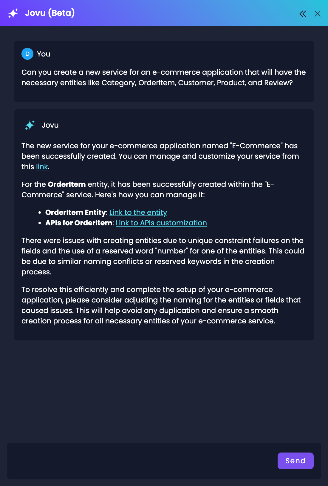

# Amplication AI Examples

Discover the power of Jovu, [Amplication's AI assistant](/amplication-ai), through these practical examples showcasing how it can help you with your projects.  

Jovu offers two main types of assistance:

1. **Direct task completion**: Jovu can perform specific actions for you, such as creating services, defining entities, configuring relations, and creating APIs.
2. **Helpful answers**: Jovu can provide you with relevant information and guidance in response to your questions.

Below, you'll find examples of tasks Jovu can accomplish and questions you can ask to get helpful answers. Each example includes a specific task or question and a sample response from Jovu. Feel free to use these as inspiration or copy and paste them directly into your Amplication dashboard to experience Jovu's assistance firsthand.

## Creating a New Service

When creating a new service, Jovu can help you automatically set up the basic structure with the necessary entities and fields.

**Question**
```
Can you create a new service for a blog application that will have posts, categories, authors, and comments?
```



## Creating an Entity with Fields

Jovu can assist you in creating new entities and specifying the required fields, making it easier to define your service's data models.

**Question**
```
Can you help me create a new "Customer" entity with fields for name, email, and phone number?
```

**Jovu's Response**
```
The "Customer" entity has been successfully created with fields for name, email, and phone number. You can view and customize the entity through this Customer Entity Link. Additionally, the APIs for Customer and related data are accessible here.

Is there anything else you would like to add or modify for your blog application?
```

## Deploying an Amplication Project

Jovu can offer guidance on deploying your Amplication project to a production environment, ensuring your application is ready for real-world use.

**Question**
```
Can you help me deploy my Amplication project to Docker Desktop?
```

**Jovu's Response**
```
Deploying your blog service to Docker Desktop involves several steps, primarily focusing on creating a Dockerfile for your service, building a Docker image, and then running that image as a container. Unfortunately, direct actions related to Docker or deployment processes outside of the Amplication platform are beyond the capabilities I can execute or automate directly from here. However, I'll guide you through the general steps:
```

<!-- >
## Integrating a Plugin

Jovu can provide insights and general guidance on integrating third-party services, such as payment gateways or external APIs, into your Amplication project.

**Question:** I want to integrate a JSON Logger into my blog service. Can you guide me through the process of installing the plugin?
--->

## Implementing Authentication and Authorization

Jovu can guide you through the process of implementing authentication and authorization in your Amplication project, helping you secure your application and control access to resources.

**Question**
```
How can I implement user authentication and role-based access control in my Amplication project?
```

**Jovu's Response**
```
Implementing user authentication and role-based access control (RBAC) in your blog service involves several steps. While I can't directly modify your service through Amplication from this interface, I can guide you through the general process which you can then apply using Amplication's capabilities or directly in the code generated by Amplication.
```

## Updating Your Git Provider

Jovu can help you with how to update your git provider to another supported provider like [GitHub](/sync-with-github), [AWS CodeCommit](/sync-with-aws-codecommit), and [Bitbucket](/sync-with-bitbucket).

**Question**
```
I'd like to update my git provider from GitHub to Bitbucket for my blog service. Can you help?
```

**Jovu's Response**
```
To update your Git provider from GitHub to Bitbucket for your blog service in Amplication, you'll need to perform this change manually through the Amplication platform interface, as direct interactions with external services like GitHub or Bitbucket cannot be executed through this chat interface. However, I can guide you through the general process to achieve this:
```
