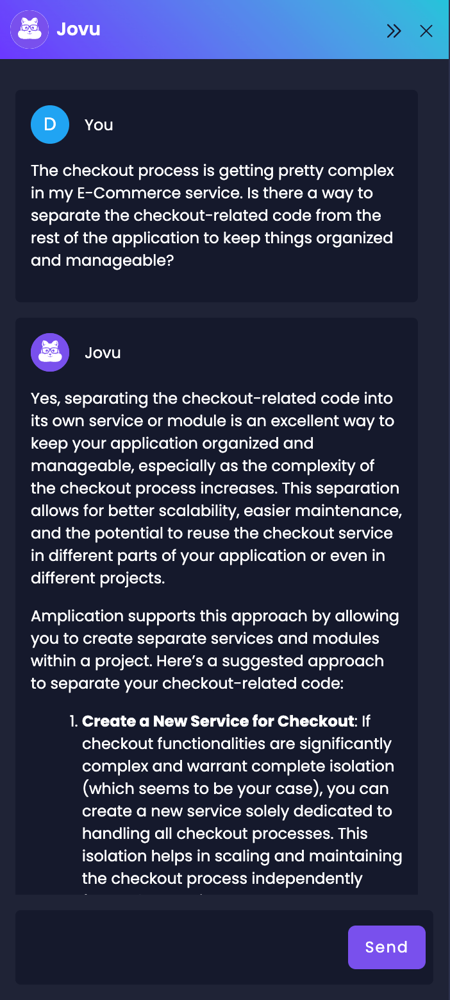

# Amplication AI Examples

Discover the power of Jovu (currently in Beta), [Amplication's AI assistant](/amplication-ai), through these practical examples showcasing how it can help you with your projects.  

Jovu offers two main types of assistance:

1. **Direct task completion**: Jovu can perform specific actions for you, such as creating services, defining entities, configuring relations, and creating APIs.
2. **Helpful answers**: Jovu can provide you with relevant information and guidance in response to your questions.

Below, you'll find examples of tasks Jovu can accomplish and questions you can ask to get helpful answers. Each example includes a specific task or question and a sample response from Jovu. Feel free to use these as inspiration or copy and paste them directly into your Amplication dashboard to experience Jovu's assistance firsthand.

## Start New Projects

Jovu can kickstart new projects by setting up the initial project structure and configuration based on your requirements.

**Question**
```
I'm starting a new twitter clone project that will contain several micro-services. Can you help me create it?
```


## Create a New Service

When [creating a new service](/first-service/), Jovu can help you automatically set up the basic structure with the necessary entities and fields.

**Question**
```
Can you create a new service for a blog application that will have posts, categories, authors, and comments?
```


## Create New Entities

Jovu can assist you in [creating new entities](/set-up-entities/) and specifying the required fields, making it easier to define your service's data models.

**Question**
```
I want to add product reviews to my E-Commerce service. Can you set up the structure for customer reviews, review ratings, and a way to link reviews to specific products?
```


## Add Fields to Existing Entities

Jovu can help you extend your existing entities by adding new fields to capture additional data exactly how you need it.

**Question**:
```
For the authors in my BlogService, can you add a short bio section, a spot for a profile picture, and a place to include links to their social media profiles?
```


## Create New Modules

Jovu can assist you in creating [new custom modules](/custom-types-and-actions#modules) for your service to help you better organize your service and encapsulate related functionality.

**Question**
```
The checkout process is getting pretty complex for my E-commerce service. Is there a way to separate the checkout-related code from the rest of the application to keep things organized and manageable?
```



## Create New Data Transfer Objects (DTOs)

Jovu can [create new DTOs](/custom-types-and-actions#dtos-and-enums) to shape the data structures used for input and output in your service's APIs.

**Question**
```
In the Checkout module, I need to define the data structure for the information required when a user initiates a payment. Could you help me create a DTO that includes the payment amount, the currecny, and the selected payment method?
```


## Create Custom Actions For Your Modules

Jovu will create [custom actions](/custom-types-and-actions#actions-1) (API endpoints) for your modules, so you can easily define the specific operations your service needs.

**Question**
```
Can you help me create an Action to handle the approval or rejection of a comment for my BlogService and any necessary DTOs?
```


## Recommend Suitable Plugins

Jovu can analyze your project's requirements and suggest appropriate [plugins](/getting-started/plugins) to enhance your application's functionality and development workflow.

**Question**
```
For my BlogService, can you recommend some plugins to use for implementing a cache?
```


## Install Multiple Plugins

Jovu can provide insights and general guidance on integrating plugins, such as caching, prettifiers, or a variety of other [available plugins](/getting-started/plugins) into your Amplication project.

**Question**
```
I want to add authentication and caching to my service. Can you install the necessary plugins?
```


## Implement Authentication and Authorization

Jovu can guide you through the process of implementing authentication and authorization in your Amplication project, helping you secure your application and control access to resources.

**Question**
```
How can I implement user authentication and role-based access control in my Amplication project?
```


## Update Your Git Provider

Jovu can help you with how to update your git provider to another supported provider like [GitHub](/sync-with-github), [AWS CodeCommit](/sync-with-aws-codecommit), and [Bitbucket](/sync-with-bitbucket).

**Question**
```
I'd like to update my git provider from GitHub to Bitbucket for my blog service. Can you help?
```


## Build And Commit Your Project's Changes

Jovu can assist you in building your project and committing the generated code changes to your version control system.

**Question**
```
I've made several changes to my service. Can you build the project, commit these changes with the message "New entities for blog service."?
```

