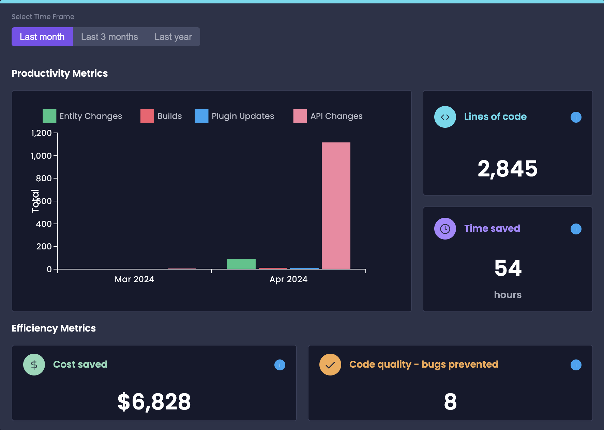

# Analytics Dashboard

Amplication's Analytics Dashboard is a powerful tool that provides developers and managers with valuable insights into their application's development process.

The dashboard highlights key metrics related to productivity, efficiency, and code quality to help you understand the impact of using Amplication on your development workflow.

To start leveraging the insights provided by the Analytics Dashboard, navigate to the Workspace Overview or Project Overview screen in your Amplication account.

## Productivity Metrics

The Productivity Metrics section provides an overview of the development activity and code generation. This lets developers and managers track their progress using the **Overtime Graph**, **Generated Lines Of Code**, and **Time Saved** sections.

### Overtime Graph

The Overtime Graph is a visual representation of the development activity over a specified period. It displays the number of builds generated and the number of entities, APIs, and plugins created or updated during the selected time frame.

Developers can customize the time range to view data from the last month, last 3 months, or last year. The default view shows data from the last year, displayed in months.

### Generated Lines of Code (LOC)

The Generated LOC metric provides developers with an overview of the volume of code generated by Amplication. It counts the number of new or updated lines of code (LOC), considering deleted LOC as updated, and calculates the total LOC generated in the chosen time frame.

This metric helps developers understand the scale of their application and the efficiency of their development process using Amplication.

### Time Saved

The Time Saved metric estimates the amount of time saved by using Amplication-generated code for your Node.js backend. Based on industry standards and considering the efficiency of Node.js backend developers, we estimate that a developer creates around 8,335 lines of code per month. This breaks down to approximately 52.05 lines of code per developer hour.

By quantifying the time saved, developers can better understand the impact of Amplication on their development velocity and make informed decisions about resource allocation and project planning.

## Efficiency Metrics

The Efficiency Metrics section highlights the business-related benefits of using Amplication, providing developers with insights into the cost savings and code quality improvements achieved through the platform.

### Cost Savings

The Cost Savings metric estimates the cost saved by using Amplication-generated code. We've calculated the cost estimate for 1,000 lines of code in your Node.js backend to be around $2,400, factoring in complexity, sensitivity, developer expenses, and potential bug resolution expenses.

By providing an estimate of the cost savings, the Analytics Dashboard helps developers demonstrate the financial benefits of using Amplication to stakeholders and decision-makers.

### Code Quality - Bugs Prevented

The Code Quality - Bugs Prevented metric estimates the number of bugs prevented by using Amplication-generated code. We've estimated it to be around 2.8 bugs per 1,000 lines of code (LOC), based on research data and the industry average experience.

By quantifying the potential bugs prevented, developers can better understand the impact of Amplication on the overall quality and reliability of their application.
