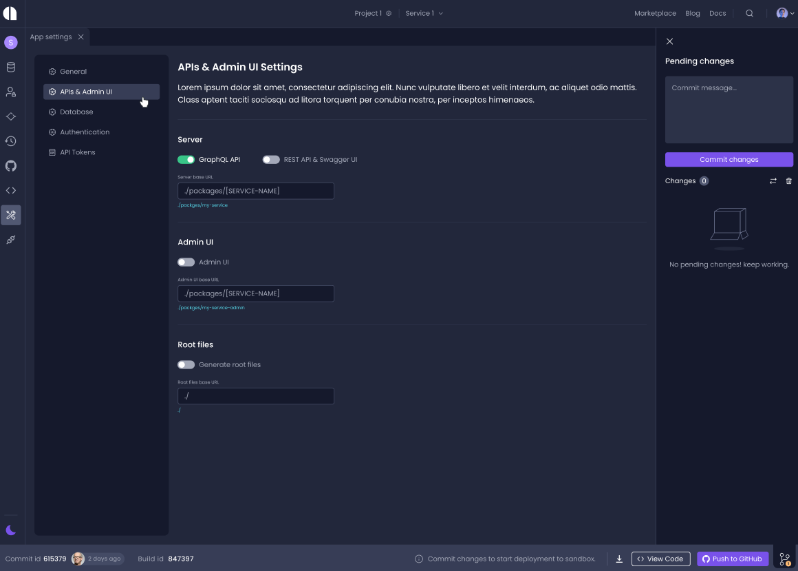

# Configure Selective Code Generation

Amplication enables you to include or exclude the following components from the generated code. 

- GraphQL API
- REST API
- Admin UI

## Selecting which components to generate

1. In **App settings**, select **APIs & Admin UI**.

2. Click the toggle switch to activate or deactivate the following:
    - **GraphQL API** 
    - **REST API & Swagger UI**
    - **Admin UI**

:::tip
**Admin UI** can be selected only if **GraphQL API** has been selected. 
::: 
