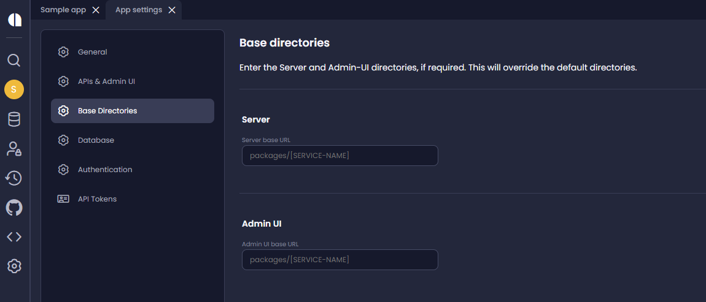

You can customize the default directories (Server and Admin UI) for generated code . This makes generated projects more modular. For example, each project can have its own docker files, README files etc.

There are two parameters for each app, enabling you to override the default directories for the Server and Admin-UI. 

The default values of the fields (if left blank) are as follows: 

Server base: `packages/[SERVICE-NAME]`

Admin UI base: `packages/[SERVICE-NAME]`

:::tip
This feature is the first step toward full support for a monorepo model, which will replace the existing monolithic structure in a future release.  Although you can sync multiple services to a single repository, for now, you should should continue to manage your favorite monorepo tool manually.
::: 

### Example - setting two separate apps to work with a monorepo in GitHub:

Lets say we have two apps, _Customer Service_ and _Order Service_, and we want all services to sync to the `./packages` directory in the same repo. To achieve that we use the following settings: 

**Customer Service**

Server base directory: `packages/customer-service`

Admin UI base directory: `packages/customer-service-admin`

**Order Service**

Server base directory: `packages/order-service`

Admin UI base directory: `packages/order-service-admin`