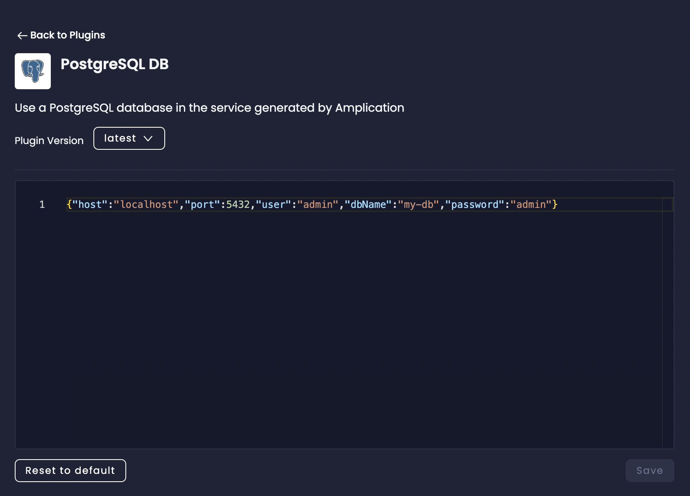
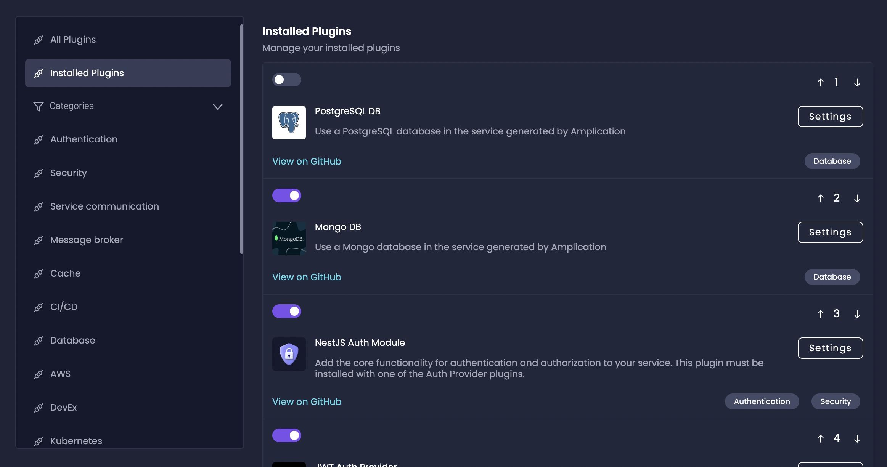

# How To Choose, Configure, and Update Your Database

One important part of setting up your Amplication service is choosing and configuring your database. Your database is a _plugin_ in Amplication, so can operate it like other plugins.

This guide will walk you through the process of selecting, configuring, and updating your database in Amplication.

:::note
Amplication's [Import Prisma Schema](/how-to/import-prisma-schema/) feature lets you use your existing databases for a head start on development.
:::

## Choosing Your Database

Amplication supports multiple database options, with PostgreSQL being the default choice. Here are the steps to choose your database:

1. When [creating a new service](/first-service/) in Amplication, you'll be required to select a database.
2. Choose from the available options, which may include:
   - PostgreSQL (default)
   - MySQL
   - Microsoft SQL Server

Consider factors such as your team's familiarity with the database, scalability needs, and specific feature requirements when making your choice.

## Configuring Your Database

Once you've chosen your database, you'll need to configure it for your Amplication project.

1. In your Amplication service's dashboard, navigate to the "Plugins" tab and click on "Installed Plugins" in the left sidebar.
2. You'll see all your installed plugins. Find your database and click on the `Settings` button to get taken to its configuration page. These JSON configuration options can include:
   - Host
   - Port
   - Database name
   - Username
   - Password

3. Replace the `host`, `port`, `user`, `dbName`, and `password` values with your specific database credentials. Click the Save button and your credentials will be applied by the plugin.

## Updating Your Database

In Amplication, updating your database is as easily as uninstalling that specific db plugin and installing another.

1. Proceed to the Installed Plugins tab. Uninstall your current database plugin.
2. Click on the Database plugin category in the left sidebar and install a new database plugin.
3. When you're ready to apply the changes click on the `Generate the code` button in the right sidebar.

## Best Practices

1. **Version Control**: Use Amplication's Git integration to track changes to your data model over time.
2. **Testing**: Always test database changes in a development or staging environment before applying them to production.
3. **Backups**: Regularly backup your database, especially before applying significant schema changes.
4. **Performance**: Monitor your database performance and optimize queries as your application grows.
