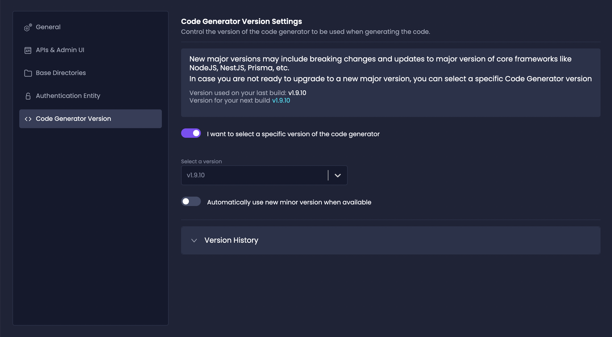

The **Code Generator Version Control** feature gives Enterprise plan users the flexibility to choose which version of the code generator they want to use.

Amplication's code generator periodically releases new versions with bug fixes, enhancements, and new features. 

While it's recommended to use the latest version, some teams may prefer having more control over when to upgrade the generated code.

:::note
Code Generator Version Control is only **available for Enterprise Plan users**.
Try it during your 7-day Enterprise plan trial for new workspaces.
:::

## Benefits

- **Avoid Breaking Changes**: Upgrade on your own schedule and don't be forced to use a version that might contain breaking changes right away.

- **Test New Versions**: Try out a new version and see how it impacts your app before rolling it out to production.

- **Lock Down Stable Versions**: Lock in a stable version and keep generating code without unexpected changes.

## How It Works

1. In your service's **Settings** page, navigate to the **Code Generator Version** tab.

2. Enable the `I want to select a specific version of the code generator` toggle into the ON state.

Every item in the dropdown is a specific version. Lock in a specific version for this service and it won't change until you manually update it.

:::tip
If you disable this toggle, Amplication will always use the latest version of the code generator.
:::

3. Click on `Version History` to view all previous code generator versions that you have used for your service.

4. Rebuild your service and commit your changes to see the new version applied.

Now whenever you generate code for your services, Amplication will use the code generator version you selected.

## Enable CodeGen Version Control

To use the **Code Generator Version Control** feature, upgrade to Amplication's Enterprise plan.

The feature will automatically become available in the settings page for each of your services.

For more details on Amplication's plans, visit our [pricing page](https://amplication.com/pricing).