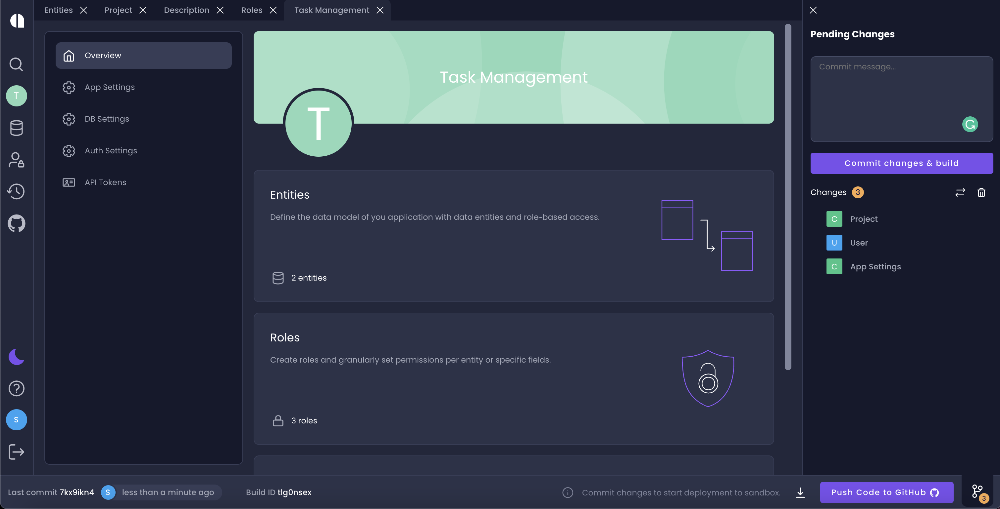

# Commit Changes

While working in Amplication your changes are saved automatically, but are not committed. Only committed changes will be included in the next version of your application.

In the _Pending Changes_ control in the main menu (left sidebar) you can see how many pending changes are waiting to be committed.

1. In the _commit message_ dialog, write a description of the changes you're committing.
2. Click **Commit Changes**. All changes are committed. A new build of your app is automatically created!
