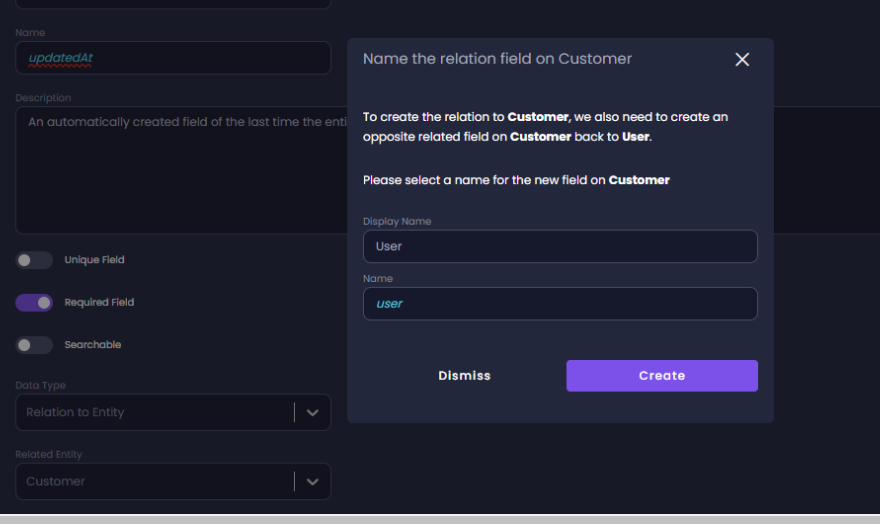
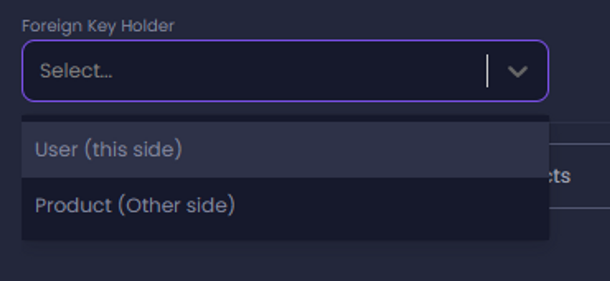

# How To Create An Entity Field

1. To create a new entity field,  navigate to the _Entity_ screen.
2. Click the **Entities** icon on the main menu (left toolbar) to reach the Entities page. Here you see all the entities in your application. 
3. Click on the Entity you want to edit, to get into the Entity's page.

4. Click **Add Field** at the bottom of the list of fields.
5. Fill the **Display Name**, and **Name** fields. 
6. Enter a description in the **Description** field. 
4. Click the toggle switch to activate or deactivate the **Unique Field**, **Required Field**, and **Searchable** settings.  
5. Select a **Data Type** from the drop-down list. 

:::info
JSON is one of the supported data types. You can create JSON fields as part of your data model when creating an entity field.
JSON enables you to create fields that store and include different kinds of data, making it easier for you to add custom fields to your applications. JSON can be used with both REST API and GraphQL. 
:::
# Create Relation to Entity

1. In the **Data Type** field, select **Relation to Entity** from the drop-down list.
2. In the **Related Entity** field, select an entity from the drop-down list.  A dialog box is displayed.
3. Fill the **Display Name**, and **Name** fields.
4. Click **Create**.

:::tip
You might find it easier to first add all the fields you want, one after another, and only afterwards set the properties of each field.
:::

:::info
White spaces are supported, which is useful when you want to enter a descriptive field name. The value is saved as the field’s display name.
In addition to the display name, each field has an auto-generated _Name_ that does not contain spaces or special characters. This name is later used for the API endpoint and in other places in the generated code.
If needed, you can manually change the field name in the field's properties panel.
:::
 
 ### Searchable Setting

 If the **Searchable** setting is not activated, the search cannot be based on the field. The field visibility is determined by the settings on the Permissions tab. 

For example, if the customer's email address is visible (permissions set to **All Roles** for search), but the field is not set as **Searchable** the user will be able to search for customers by name, phone, or any other field but not by email address. However, the results will still include the email address.

## Create Relation to Entity One-to-One

One-to-one relations refer to relations where at most **one** field can be connected on both sides of the relation. 

In the following example below, we will configure a one-to-one relation between the User and Item entities. 

1. In the Data Type field select **Relation to Entity**
2. In the **Related Entity** field enter the field to be related
3. Select **One** “**User” can be related to one “Item**”

:::tip
“User” and “Item” are used here as examples of field names. The names will reflect the names of the fields in your project.
:::

4. In the Foreign Key Holder field, select which side will hold the Foreign Key (”this side” or “other side”) 

The Foreign Key will always be located in the selected field in the generated schema. The Foreign key can be only on one side, not both. 

### Significance of the Foreign Key

If, as in the above example, we have a User and an Item entity linked, and the Foreign Key is on the side of the Item, the Item cannot be created without a User. However, a User can be created without a Product.

