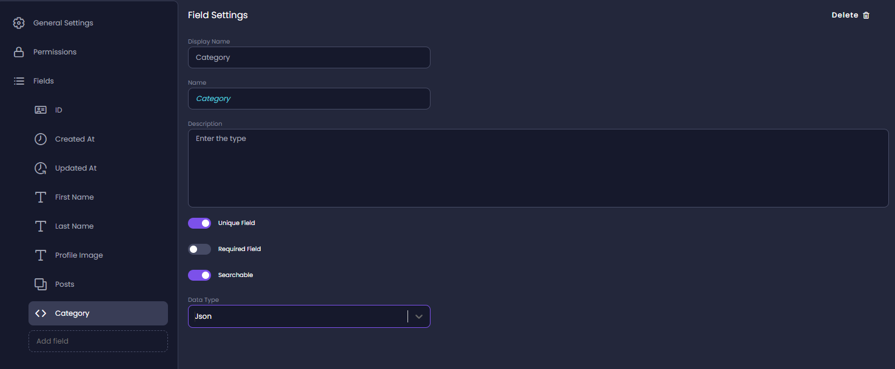
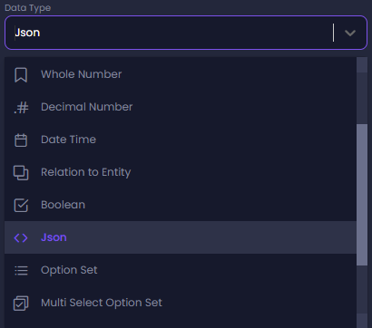

# Create a new entity field

To create a new entity field,  navigate to the _Entity_ page - click the **Entities** icon on the main menu (left toolbar) to reach the Entities page. Here you see all the entities in your application. Click on the Entity you want to edit, to get into the Entity's page.

1. Click **Add Field** at the bottom of the list of fields.
2. Fill the **Display Name**, and **Name** fields. 
3. Click **Description** and enter text to describe the field. 
4. Click the toggle switch to activate or deactivate the **Unique Field**, **Required Field**, and **Searchable** settings.  
5. Select a **Data Type** from the drop-down list. 

:::info
JSON is one of the supported data types. You can create JSON fields as part of your data model when creating an entity field.
JSON enables you to create fields that store and include different kinds of data, making it easier for you to add custom fields to your applications. JSON can be used with both REST API and GraphQL. 
:::

:::tip
You might find it easier to first add all the fields you want, one after another, and only afterwards set the properties of each field.
:::

:::info
White spaces are supported, which is useful when you want to enter a descriptive field name. The value is saved as the field’s display name.
In addition to the display name, each field has an auto-generated _Name_ that does not contain spaces or special characters. This name is later used for the API endpoint and in other places in the generated code.
If needed, you can manually change the field name in the field's properties panel.
:::
 
 ### Searchable Setting

 If the **Searchable** setting is not activated, the search cannot be based on the field. The field visibility is determined by the settings on the Permissions tab. 

For example, if the customer's email address is visible (permissions set to **All Roles** for search), but the field is not set as **Searchable** the user will be able to search for customers by name, phone, or any other field but not by email address. However, the results will still include the email address.
