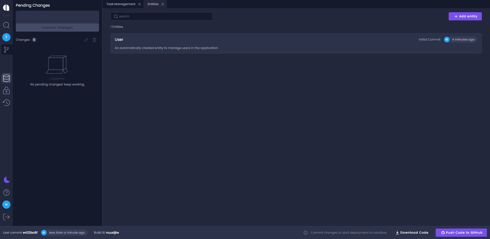

# Create a new entity

:::tip
When creating an entity, make sure you do not use a reserved name for the name of the entity or for any of its fields. Go [here](https://github.com/amplication/amplication/blob/master/packages/amplication-server/src/core/entity/reservedNames.ts) to check the list of reserved names.
:::

Click the **Entities** icon on the left sidebar (main menu) to reach the Entities page. Here you see all the entities in your application.

1. Click **Create New**.
2. In the _New Entity_ dialog, type in the name of the new Entity.
3. Click **Create Entity**.

:::tip
White spaces are supported, which is useful when you want to enter a descriptive entity name. The value is saved as the entity’s display name. In addition to the display name, each entity has an auto-generated Name that does not contain spaces or special characters. This name is later used for the API endpoint and in other places in the generated code. If needed, you can manually change the entity name in the entity's page.
:::

:::info
Notice that the added entity comes with auto-generated values like **Plural Display Name** and some default fields – ID, Created At, and Updated At.
:::
