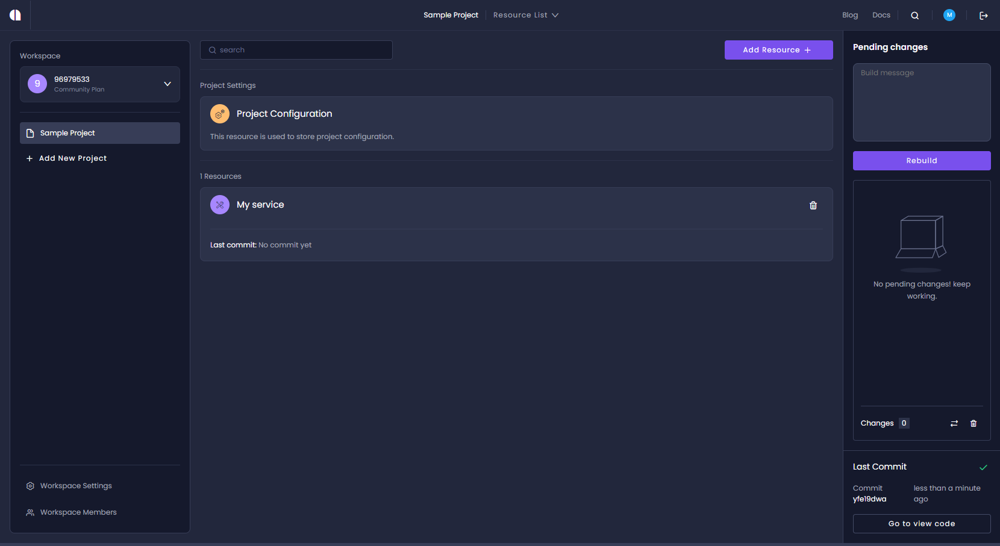
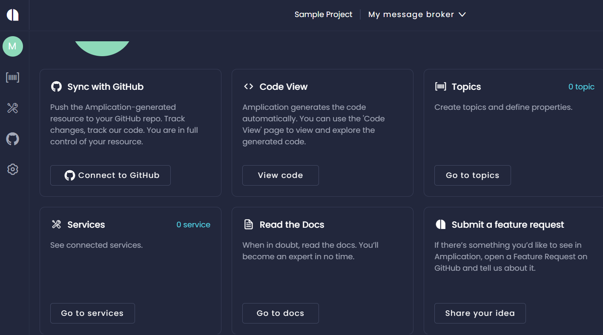
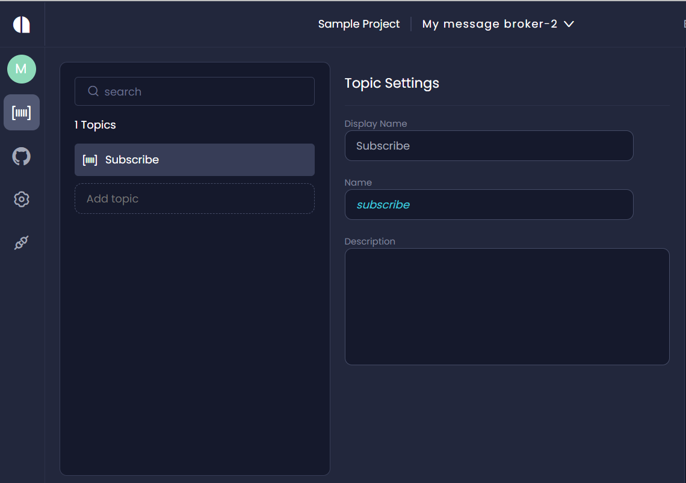

# Create a message broker

## Overview

Message brokers play a key role in supporting Amplication's microservices architecture by mediating information exchange between services.

A message broker is software that mediates communication and information exchange between services. The message broker does this by translating messages between formal messaging protocols. This means that multiple services, generated by Amplication, are able to "talk" to each other.

:::info
In messaging systems, message routing is done via topics.  You must first create one or more topics in the  message broker. A service can then be configured to publish messages to a topic and other services can be configured as subscribers to the topic. When the publisher sends a message to the topic, it will be dispatched to all the services that are subscribed to that topic.
::: 

## Creating a new message broker

To create a message broker
1. In the workspace, click **Add Resource +** and select **Message Broker** from the list.

The _Message Broker Creation Wizard_ opens. 
    
2. Click **Create Message broker** 
The configuration dashboard opens.

3. To create topics for the message broker, click the **Topics** icon on the icon bar at the left of the screen.

    

5. Enter the topic name in the **Add topic** field and click the **+** symbol.

6. Enter the **Display Name**, **Name** and **Description**.

7. To commit the changes, select **Commit changes & build**.

## Viewing and activating a message broker

1. From the **Service** dashboard, click the **Connections** icon on the left of the screen. A list of message brokers is displayed.
2. To enable the message broker, select the **enabled** toggle switch.
