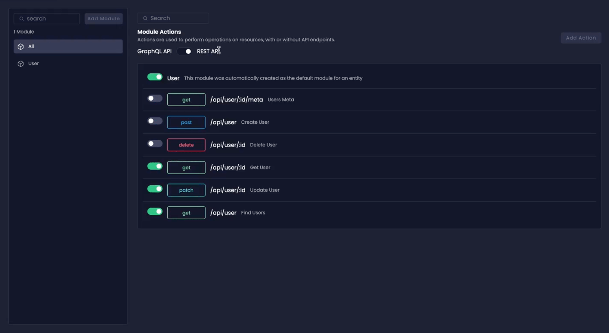

# Custom Actions Explained

Custom Actions give you the ability to enable or disable specific default API functions related to CRUD operations. This feature significantly enhances your control over the generated REST and GraphQL APIs to ensure that your API contains only the necessary code tailored to your requirements.

:::note
The Custom Actions feature is available in Amplication's **Enterprise** plan.
:::

## How To Enable Custom Actions For An Entity

To utilize Custom Actions for an entity, begin by accessing the new **Modules** tab in your Amplication dashboard. Here, each entity is associated with a _Module_, allowing you to perform _Module Actions_, operations on these entities with or without API endpoints.

1. Navigate to the **Modules** tab.
2. Select the **Entity** for which you wish to enable Custom Actions.
3. Toggle between REST or GraphQL to apply Custom Actions for the chosen API type.
4. Activate the Module for the entity by toggling on the switch next to its name.
5. Individually toggle on or off any CRUD methods as per your needs.