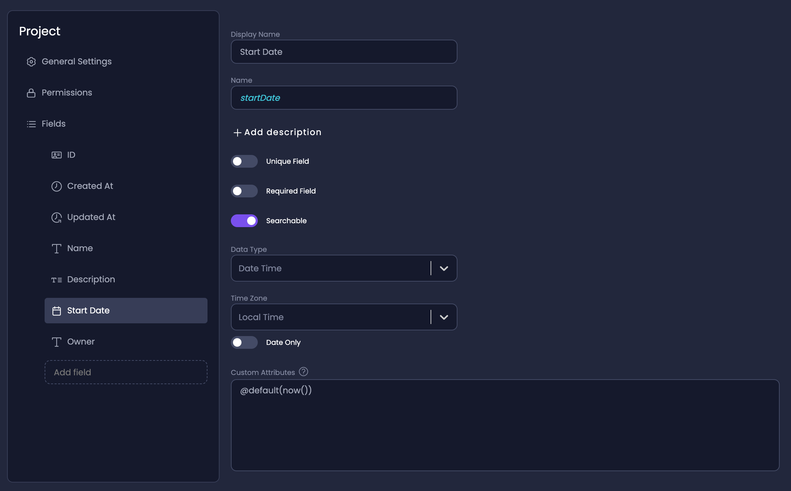

# How To Set Default Value on Entity Fields

Setting default values for your entity fields in Amplication is straightforward using the `@default()` custom Prisma attribute.
This can be helpful in scenarios where you want certain fields to have a predefined value when new records are created.

This guide will walk you through the steps to achieve this with various examples.



## Steps to Set a Default Value:

1. Navigate to your service's _Entity Overview_ page.
2. Click on the specific _Entity_ field you want to set a default value for.
3. On the Entity Field page, you will find a text box labeled **Custom Attributes**. Here, you'll enter the custom prisma @default() attribute.
4. In the Custom Attribute text field, enter the `@default()` attribute followed by the desired default value in parentheses. 
5. After entering the default value, it will be saved automatically.

## Examples

For example, to set a default string value of "DefaultText", you would enter:

```
@default("DefaultText")
```

For numeric fields, simply enter the number without quotes:

```
@default(5)
```

:::tip
Refer to [Prisma's documentation](https://www.prisma.io/docs/reference/api-reference/prisma-schema-reference#default) for a full list of the values that Prisma gives you access to for the `@default()` custom attribute.
:::