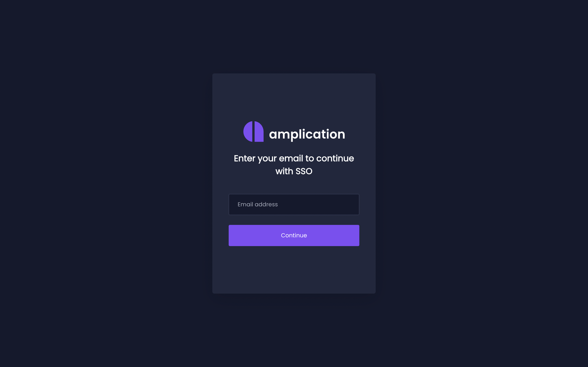

Amplication provides Single Sign-On (SSO) support for Enterprise plan users.
This makes it easier for your organization's members to access their Amplication accounts using your existing SSO provider.

:::note
SSO is **only available for Enterprise Plan users**.  
Visit the [Git Sync Plan Differences](/sync-with-git-differences-between-plans) page to learn about the differences between the Free, Pro, and Enterprise plans.
:::

## Enabling SSO

1. Make sure your account has already been upgraded to the Enterprise plan.  
2. [Contact our team](https://amplication.com/contact-us/) to help you set up SSO.
3. Our team will handle the setup and integration with your organization's SSO provider.

## Logging In via SSO

1. Visit [Amplication's login page](https://app.amplication.com/login).
2. Click on the **Continue with SSO** link.
3. Enter the email address associated with your Amplication account.
4. Click **Continue**.

