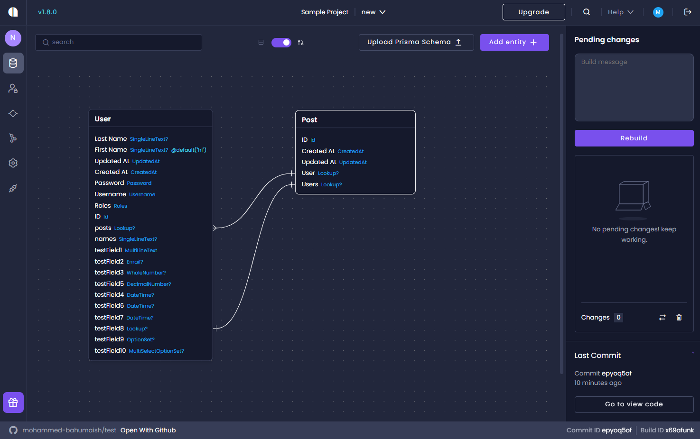

# ERD View for Amplication Entities

Amplication's ERD (Entity Relationship Diagram) view provides a complete graphical representation of how your entities relate to each other.

## How to activate ERD View

1. Navigate to the Entities page of your Amplication service.
2. In the center, to the right of the search bar, you'll find a toggle switch.
3. Toggle the switch to enable the ERD view. Slide it back to return to the traditional list view.

## Available Features

- **Zoom**: Zoom in and out using the pinch mechanism to get a clearer view of your entities.
- **Drag and Drop**: Make the relationships between your entities clearer by using the drag and drop functionality.

## Next Steps

1. The [Entity Relations](/relations) page explains how to define relationships between entities.
2. The [Create a new entity field](/how-to/create-entity-field) page covers all the options for creating fields on entities.
