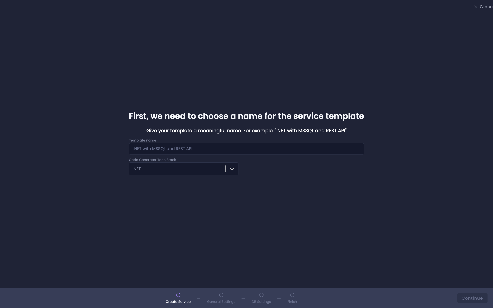
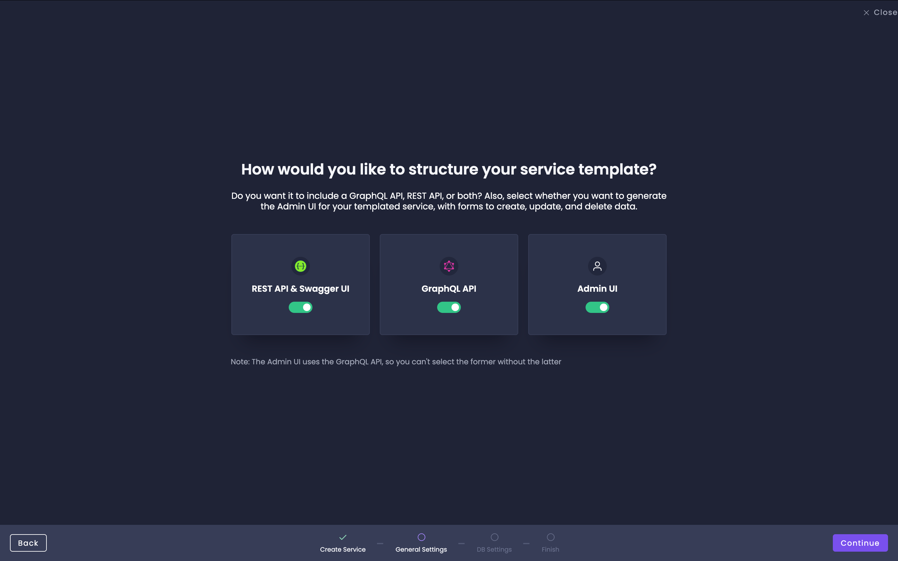
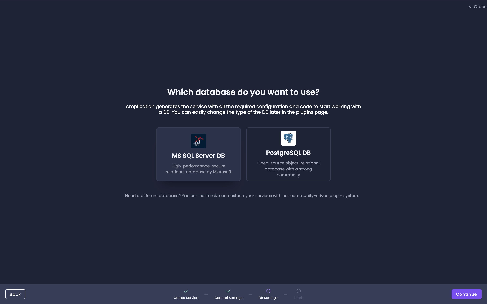
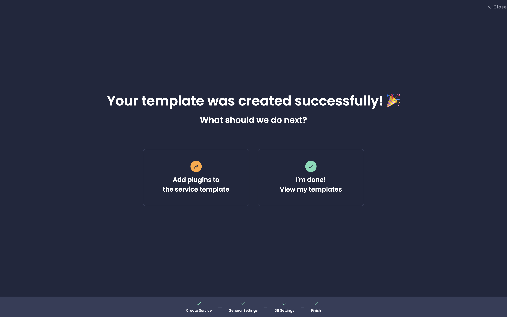
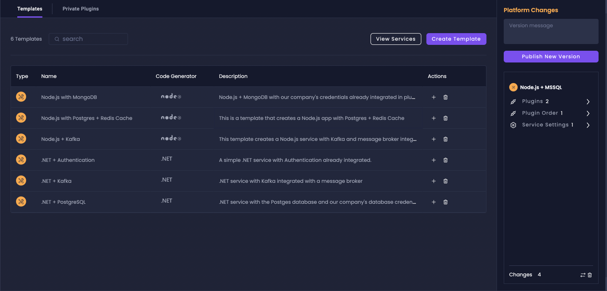
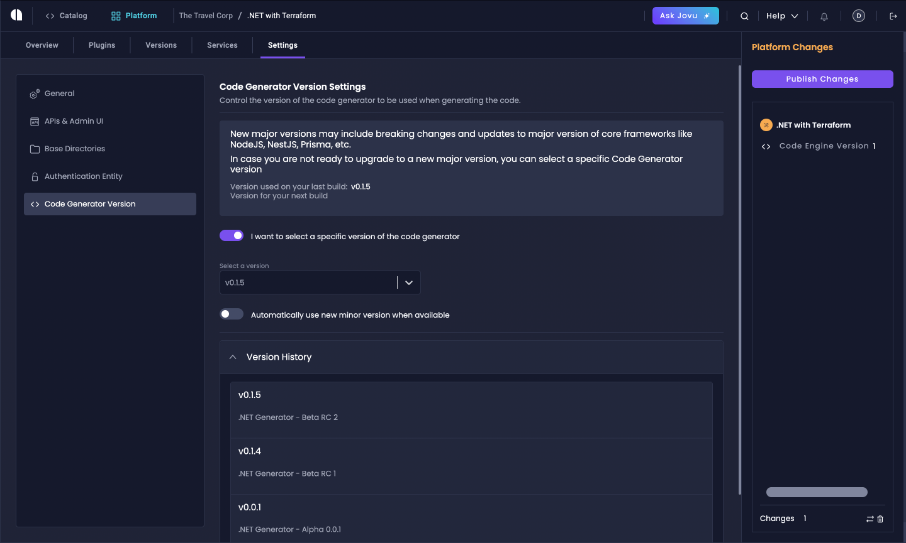
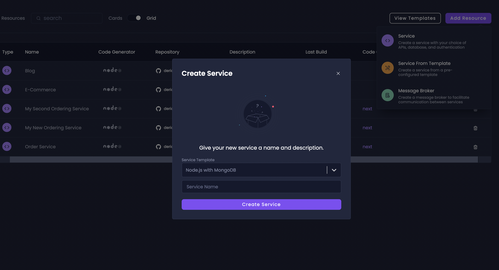
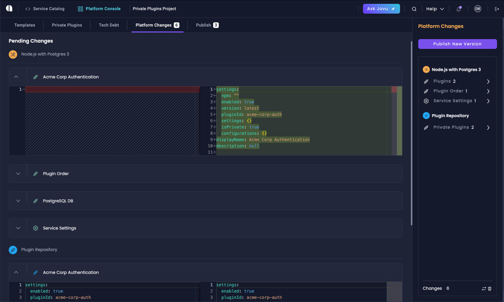

# Live Service Templates

Live Service Templates provide a centralized way to create, maintain, and enforce standardized backend services across your organization through reusable, autoupdating templates.

## Overview

Live Service Templates introduce several key components:

1. **Service Templates**: Pre-configured templates that serve as a foundation for creating and maintaining new services that follow your organization standards and best practices.
2. **Template-based Services**: New services created from existing templates, inheriting all settings, configurations and plugins.
3. **Template Management**: Tools for creating, editing, and maintaining service templates, with the ability to propagate template updates automatically to the services as pull requests with the required changes.

## Create a Service Template

Navigate to the [Platform Console](/platform-console) dashboard. Click on "Create Template".

The Service Template Creation Wizard will guide you through the process of setting up your template.

1. **Select Technologies**: Choose the name and back-end framework for your template.

2. **Choose APIs**: Select which APIs to include (REST API, GraphQL API, or both). Also, decide whether to generate an Admin UI for your templated service.

:::note
GraphQL API and Admin UI are currently not available with the .NET generator.
:::

3. **Database Selection**: Choose the database type for your template (e.g., PostgreSQL, MySQL, MongoDB, MS SQL Server).

After completing these steps, your new service template will be created and added to the Platform Console.

## Manage Service Templates

### Viewing Templates

To view and manage your templates:

1. Go to the Platform Console dashboard.
2. You'll see a list of all your service templates, including their name, description, code generator type, and more.

### Managing Plugins

To manage plugins for your template:

1. Go to the Plugins section of your service template.
2. You can view all available plugins, installed plugins, or private plugins.
3. To install a new plugin, select it from the available options and click "Install".

:::note
To learn more about Plugin Management and Private Plugins, visit the [Plugins page](/getting-started/plugins/) and [Private Plugins page](/private-plugins/).
:::

### Template Settings

The Settings tab for service templates provides various configuration options:

1. **General**: Update the template name and description.
2. **APIs and Admin**: Toggle different API types (REST, GraphQL) and Admin UI.
3. **Base Directories**: Set the root directory for code placement when using the sync with Git feature. You can use `{{SERVICE_NAME}}` as a placeholder for the service name which will be generated from the template.
4. **Code Generator Version**: Select a specific version or use the latest.

:::note
While you can customize the Base Directories, we recommend keeping the `{{SERVICE_NAME}}` placeholder for better organization and consistency.
:::

## Creating Services from Templates

To create a new service based on a template:

1. Go to the Service Catalog of your project.
2. Click "Add Resource".
3. Select "Service from Template".
4. Choose the desired template from the dropdown menu.
5. Provide a name for your new service.
6. Click "Create" to generate the new service based on the selected template.

The new service will inherit all settings and plugins from the template. You can view these inherited configurations in the Pending Changes tab.

## Update Service Templates

When you update a service template:

1. Make the desired changes (e.g., add new plugins, modify settings).
2. Click "Publish New Version" to reach the Publish screen.
3. Add a description for your changes and publish the version(s).

The template definitions will be updated, with no immediate effect on the services created from this template.

## Propagate Template Changes to Services

After updating a template, the changes can be applied to existing services through the following process:

1. You will receive in-product notifications and emails about available template updates.
2. Access the tech debt screen and use the upgrade option for the required services.
3. This will create pending changes that include all template updates, plugins, and definitions.
4. Review and apply these changes to update your services.

This process will create a new commit with all the updated template configurations, plugins, and definitions.

## Next Steps

Now that you've created an individual template, you can start building a comprehensive collection of templates and [private plugins](/private-plugins/) that reflect your organization's best practices and standards. This approach helps ensure consistency and maintainability across all your services.

:::tip
For any questions or issues related to Live Service Templates, please contact our support team or join our [Discord community](https://discord.gg/amplication) for feedback and discussions.
:::