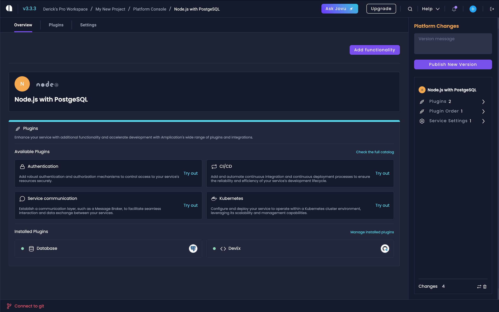
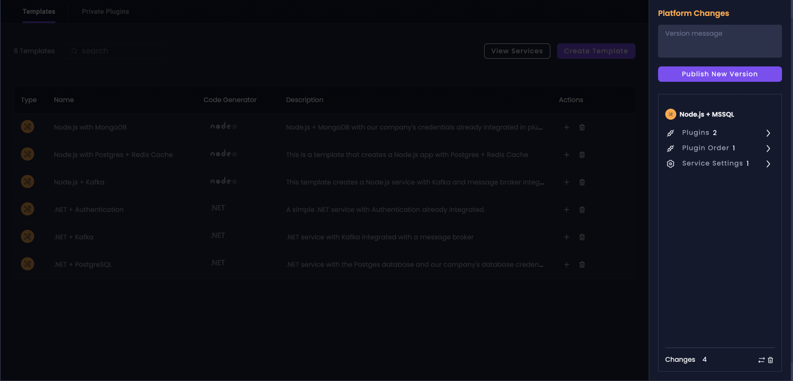

# Live Service Templates

Live Service Templates let your team define, manage, and maintain standardized templates for backend services. This feature enhances consistency across your projects and streamlines the process of creating new services.

:::note
The Live Service Templates feature is currently in beta.
:::

## Overview

Live Service Templates introduce several key components:

1. **Service Templates**: Pre-configured service blueprints that serve as a foundation for creating new services.
2. **Template-based Services**: New services created from existing templates, inheriting all settings and configurations.
3. **Template Management**: Tools for creating, editing, and maintaining service templates.

## Create a Service Template

Navigate to the [Platform Console](/platform-console) dashboard. Click on "Create Template".

The Service Template Creation Wizard will guide you through the process of setting up your template.

1. **Select Technologies**: Choose the name and back-end framework for your template.

2. **Choose APIs**: Select which APIs to include (REST API, GraphQL API, or both). Also, decide whether to generate an Admin UI for your templated service.

:::note
GraphQL API and Admin UI are currently not available with the .NET generator.
:::

3. **Database Selection**: Choose the database type for your template (e.g., PostgreSQL, MySQL, MongoDB, MS SQL Server).

After completing these steps, your new service template will be created and added to the Platform Console.

## Manage Service Templates

### Viewing Templates

To view and manage your templates:

1. Go to the Platform Console dashboard.
2. You'll see a list of all your service templates, each with its specific icon and type.

### Editing Templates

To edit a template:

1. Click on the template name in the Platform Console dashboard.
2. This will take you to the Service Template Overview page.

On this page, you can:

- View and edit the template name and description
- See the associated technology stack
- Manage installed plugins
- Access template settings

### Template Settings

The Settings tab for service templates provides various configuration options:

1. **General**: Update the template name and description.
2. **APIs and Admin**: Toggle different API types (REST, GraphQL) and Admin UI.
3. **Base Directories**: Set the root directory for code placement when using the sync with Git feature. You can use `{{SERVICE_NAME}}` as a placeholder for the service name.
4. **Authentication Entity**: Choose the authentication entity for your template.
5. **Code Generator Version**: Select a specific version or use the latest.

:::note
You can of course update your **Base Directories**, but our recommendation is keeping the placholder.
:::

### Managing Plugins

To manage plugins for your template:

1. Go to the Plugins section of your service template.
2. You can view all available plugins, installed plugins, or private plugins.
3. To install a new plugin, select it from the available options and click "Install".

:::note
To learn more about specifics about Plugin Management, visit the [Plugins page](/getting-started/plugins/).
:::

## Creating Services from Templates

To create a new service based on a template:

1. Go to your workspace and click on the Services button for your project.
2. Click "Add Resource".
3. Select "Service from Template".
4. Choose the desired template from the dropdown menu.
5. Provide a name for your new service.
6. Click "Create" to generate the new service based on the selected template.

The new service will inherit all settings and plugins from the template. You can view these inherited configurations in the Pending Changes sidebar.

## Update Service Templates

When you update a service template:

1. Make the desired changes (e.g., add new plugins, modify settings).
2. In the Platform Changes sidebar, provide a description of your changes.
3. Click "Publish New Version".

These changes will be stored within Amplication but not synced to your Git repository.

## Propagate Template Changes to Services

After updating a template, you can apply these changes to existing services:

1. Go to the service created from the template.
2. You'll see the available updates in the Pending Changes sidebar.
3. Review the changes and click "Generate Code" to apply them.

This process will create a new commit with the updated configurations.

## Next Steps

Now that you've created an individual template you can start creating a collection of templates to standardize your organization's best practices.

:::tip
For any questions or issues related to Live Service Templates, please contact our support team or share your feedback in our [GitHub discussions](https://github.com/amplication/amplication/discussions).
:::