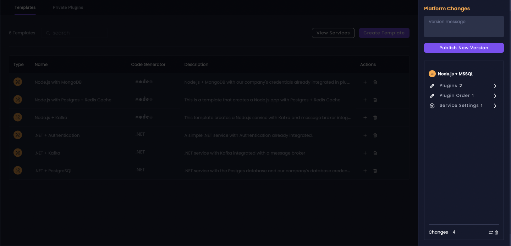

# Platform Console

The **Platform Console** is a powerful feature in Amplication that provides a centralized hub for managing platform-wide features and configurations. It allows your team to oversee and maintain standardized practices across your projects.

:::note
Some Platform Console features are currently in beta.
:::

## Overview

The Platform Console introduces several key components:

1. [**Live Service Templates**](/live-service-templates): Pre-configured service templates that serve as a blueprint for creating new services.
2. **Private Plugins**: Custom plugins visible only to your organization that can be added to templates or services to extend functionality and/or keep your organization's best practices and standards.

These components are managed through a dedicated Platform Console dashboard, separate from the existing services view.

## Benefits

- **Standardization**: Ensure all services follow organizational best practices and configurations with [Live Service Templates](/live-service-templates).
- **Efficiency**: Quickly create new services based on your templates.
- **Customization**: Create and use Private Plugins to tailor services to your organization's specific needs.
- **Smooth Maintenance**: Update multiple services from a single location. When you update a template, all services using that template can automatically get a PR with the required changes.
- **Technical Debt Prevention**: Implement organization-wide best practices across all services through templates and private plugins, creating a scalable architecture that resists the accumulation of technical debt as your project grows.

## Platform Console Features

### Live Service Templates

Live Service Templates is a powerful feature that allows you to create, manage, and use standardized templates for your backend services. Key aspects include:

- **Template Creation**: Define reusable service blueprints with pre-configured settings and plugins.
- **Service Generation**: Quickly create new services based on your defined templates.
- **Template Management**: Edit and update templates, with the ability to propagate changes to services.

For detailed information on creating and using Live Service Templates, please refer to our [Live Service Templates](/live-service-templates) documentation.

### Private Plugins

Private plugins allow you to create custom functionality specific to your organization's needs. These can be added to services or used in templates.

:::note
Creating and managing private plugins requires an Enterprise plan.
:::

To create a private plugin:

1. In the Platform Console dashboard, navigate to the "Private Plugins" section.
2. Click on "Create Private Repository".
3. Connect to your plugin repository and add your existing private plugins to the project.

## Platform Changes Sidebar

The Platform Console introduces a new **Platform Changes** sidebar that shows changes made to platform-wide settings and configurations. This is separate from the **Pending Changes** sidebar, which shows service-level changes.

:::note
Platform changes are _separate_ from service-level changes and are not committed to your git repo. Make sure to review and commit platform changes separately from service changes.
:::

## Conclusion

The Platform Console is designed to enhance the maintainability of your backend services, ensure organizational standardization, reduce technical debt, and streamline collaboration between platform and development teams.

As this feature is currently in beta, we encourage you to explore its capabilities and share your feedback to help us further improve and refine it.

:::tip
For any questions or issues related to the Platform Console, please contact us or write your feedback on our [GitHub discussion](https://github.com/amplication/amplication/discussions/8979).
:::
